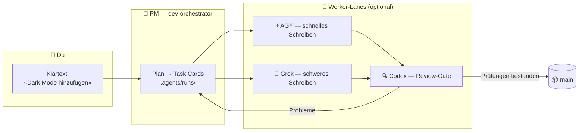

<div align="center">


# 🏭 Claude Lane Stack

### Eine kleine KI-Coding-Fabrik für eine Person

**Multi-Agenten-Orchestrierung für Claude Code** — statt fünf KI-Agenten einzeln zu steuern, sprichst du mit einem KI-Projektmanager,
er verteilt optionale Worker (AGY / Grok / Codex), prüft deren Output
und **mergt fertigen Code nach `main`**. Keine fünf Chats. Keine manuellen Merges.

[](LICENSE)
[](https://github.com/VKirill/claude-lane-stack/releases)
[](https://docs.anthropic.com/en/docs/claude-code)
[](docs/BEGINNER.de.md)
[](https://t.me/pomogay_marketing)

🌍 **README:** [English](README.md) · [Русский](README.ru.md) · [简体中文](README.zh-CN.md) · [日本語](README.ja.md) · [Español](README.es.md) · [Français](README.fr.md) · [한국어](README.ko.md) · [Português](README.pt-BR.md)
🐣 **Einsteiger-Guide:** [EN](docs/BEGINNER.md) · [RU](docs/BEGINNER.ru.md) · [中文](docs/BEGINNER.zh-CN.md) · [日本語](docs/BEGINNER.ja.md) · [ES](docs/BEGINNER.es.md) · [FR](docs/BEGINNER.fr.md) · [KO](docs/BEGINNER.ko.md) · [PT](docs/BEGINNER.pt-BR.md)

</div>

---

## 📌 Inhaltsverzeichnis

- [Warum es das gibt](#-warum-es-das-gibt) · [Für wen es ist](#-für-wen-es-ist) · [Wie es funktioniert](#-wie-es-funktioniert)
- [Schnellstart](#-schnellstart-3-befehle) · [Task Cards](#-task-cards-wie-worker-in-ihrer-lane-bleiben) · [Du mergst nie](#-du-mergst-nie--das-macht-der-pm)
- [Spickzettel](#-befehls-spickzettel) · [Profile](#-capability-profile) · [FAQ](#-faq) · [Docs](#-dokumentations-übersicht)

<!-- v1.3.0-whats-new -->

---

## 🆕 Neu in v1.3.0 (aktueller Stand)

| Fähigkeit | Inhalt |
|-----------|--------|
| 🧭 **Onboard 2.0** | **minimal / full** + Tiefe **fast / deep** (full → deep forensisch) |
| 🔬 Deep | Entrypoints, Flows, Wiki↔Code, echte Tests, Deploy, Secrets (nur Namen) |
| 🏃 **lane-bg / lane-wait** | Claude killt Foreground-Bash ~2 Min → lange Lanes immer detach |
| 🔥 **lane-session** | AGY/Grok setzen pro Run dieselbe Conversation fort; bis zu 3 parallele Slots |
| ⚡ **lane-poll / progressive** | Accept each task as it finishes — no join-wait on the slowest |
| ⏱️ **lane-exec** | Aktivitäts-Idle + hartes Max auf dem detached Prozess |
| 🧠 Modelle | Nur GPT-**5.6** Sol / Terra / Luna (kein 5.5). Dateien Englisch |
| 🚀 Befehle | `/project-onboard` · `/project-onboard deep` |

[ONBOARD-SCENARIOS.md](docs/ONBOARD-SCENARIOS.md) · [LANE-EXEC.md](docs/LANE-EXEC.md) · [Release](https://github.com/VKirill/claude-lane-stack/releases/tag/v1.3.0)


---

## 💡 Warum es das gibt

Die Arbeit mit KI-Coding-Tools sieht meist so aus: fünf Chat-Fenster, kopierte Snippets, Branches, die du um Mitternacht von Hand mergst, und niemand prüft irgendjemandes Arbeit.

**Claude Lane Stack macht daraus ein Fließband:**

| 😩 Fünf Chats | 🏭 Lane Stack |
|---------------|---------------|
| Du erklärst jedem Modell den Kontext neu | Ein PM hält den Kontext, Worker bekommen **Task Cards** |
| Modelle überschreiben gegenseitig ihre Dateien | Jede Karte listet **eigene Pfade** — Worker bleiben in ihrer Lane |
| Niemand reviewt den Code der KI | Eine eigene **Review-Lane** (Codex) kontrolliert jeden Merge |
| Du mergst Branches von Hand | Der PM mergt nach **`main`**, sobald die Prüfungen bestehen |
| Am nächsten Morgen: „Was haben wir gemacht?“ | `/resume-project` — Now / Blocked / Next in Sekunden |

Keine Task-Datenbank. Kein zwingender Cloud-Dienst. **Einfache Dateien + einfaches git** — alles ist in deinem Repo einsehbar.

---

## 👥 Für wen es ist

- 🧑‍💻 **Solo-Entwickler**, die echte Projekte per agentic coding ausliefern und parallele KI-Worker ohne Chat-Chaos wollen
- 🚀 **Indie-Hacker**, die lieber Features beschreiben als Branches zu babysitten
- 🧠 **Vibe-Coder** — du weißt, *was* du willst; die Fabrik kümmert sich um das *Wie*
- 🏢 **Eine Ein-Personen-Agentur**, die mehrere Kundenprojekte mit derselben Disziplin betreibt

> [!TIP]
> Noch nie das Wort „Orchestrierung“ gehört? Beginne mit dem **[Einsteiger-Guide](docs/BEGINNER.de.md)** — er erklärt alles als kleine Fabrik, ganz ohne Fachjargon.

---

## 🧩 Wie es funktioniert

<div align="center">

</div>

Du sprichst mit **einem Agenten** — `dev-orchestrator`, dem Projektmanager. Er verteilt die Arbeit über die Lanes:



| Rolle | Wer | Was sie tun |
|------|-----|--------------|
| 👑 Eigentümer | **Du** | Sagst, *was* du willst — in jeder Sprache |
| 🤖 Projektmanager | Claude-Code-Agent `dev-orchestrator` | Plant, verteilt, verifiziert, **mergt** |
| ⚡🔧 Write-Lanes | AGY, Grok *(optional)* | Setzen Task Cards um |
| 🔍 Review-Lane | Codex *(optional)* | Unabhängiges Qualitäts-Gate |
| 🗂️ Task Cards | YAML-Dateien in `.agents/runs/` | Die Werkshalle — vollständig einsehbar |
| 📦 Offizieller Code | Git-Branch **`main`** | Wo jeder erfolgreiche Job endet |

> [!NOTE]
> **Nur Claude Code ist erforderlich.** Fehlende Worker sind kein Problem — `agents-doctor` erkennt, was installiert ist, und der PM passt sich an, bis hin zum reinen `claude-only`-Modus.

---

## 🚀 Schnellstart (3 Befehle)

```bash
# 1️⃣  Stack installieren — einmal pro Computer
git clone https://github.com/VKirill/claude-lane-stack.git
cd claude-lane-stack && ./install.sh
export PATH="$HOME/.agents/bin:$PATH"        # oder ein neues Terminal öffnen

# 2️⃣  In DEINEM Projekt — verfügbare Worker erkennen, einmal pro Repo
cd /path/to/your-project
agents-doctor --apply .

# 3️⃣  Den PM starten und ganz normal reden
claude --agent dev-orchestrator
```

Beim ersten Mal in einem Projekt, im Chat: **`/project-onboard`** — schreibt den Ausweis des Repos (`CLAUDE.md`, Start-Dokumente).
Wenn du nach einer Pause zurückkommst: **`/resume-project`** — Now / Blocked / Next.

> [!IMPORTANT]
> `/resume-project` ist ein *„Willkommen zurück“*-Befehl für spätere Sitzungen — **kein** Installationsschritt.

📖 Vollständige Anleitung in Klartext: **[docs/BEGINNER.de.md](docs/BEGINNER.de.md)**

---

## 📋 Task Cards: Wie Worker in ihrer Lane bleiben

<div align="center">

</div>

Jeder Job ist ein kleiner **YAML-Vertrag** in `.agents/runs/` — vom PM erstellt, von den Workern befolgt:

```yaml
task: add-dark-mode
goal: Dark-Mode-Umschalter auf der Einstellungsseite
owns_paths:            # 🔒 die EINZIGEN Dateien, die dieser Worker anfassen darf
  - src/settings/**
  - src/theme.css
verify:
  - npm test
  - npm run lint
lane: agy-implementer  # wer ausführt
review: codex-reviewer # wer den Merge kontrolliert
```

- 🔒 `owns_paths` — parallele Worker **können nicht kollidieren**: `check-owns-paths` lässt die Aufgabe scheitern, wenn ein Worker ausschert
- ✅ `verify` — der Merge ist blockiert, bis die Prüfungen bestehen
- 📜 Karten bleiben in der git-History — eine vollständige Audit-Spur darüber, was jeder Agent getan hat und warum

Details: [docs/FILE-CONTRACT.md](docs/FILE-CONTRACT.md)

---

## 📦 Du mergst nie — das macht der PM

<div align="center">

</div>

Das Ende jedes erfolgreichen Jobs ist dasselbe: **verifizierter Code landet auf `main`**, gemergt vom Orchestrator via `wt-merge-main` nach Review und Prüfungen. Worker bauen in isolierten **git-Worktrees**, sodass parallele Jobs sich nie in die Quere kommen.

> [!WARNING]
> Wenn ein Agent jemals *dich* bittet, Branches aufzulösen — das ist ein Fehler im Ablauf, keine Aufgabe für dich. Sag dem PM: *«Mergen ist dein Job»*.

Regeln der Solo-Orchestrierung: [docs/SOLO-ORCHESTRATION.md](docs/SOLO-ORCHESTRATION.md)

---

## 🧾 Befehls-Spickzettel

### Das tippst du

| Befehl / Ausdruck | Was es ist | Wann |
|------------------|------------|------|
| `./install.sh` | Das Fabrik-Kit nach `~/.agents` installieren | Einmal pro Computer |
| `agents-doctor --apply .` | CLIs erkennen → Routing-Profil schreiben | Einmal pro Projekt |
| `claude --agent dev-orchestrator` | Den **einzigen Chat öffnen, den du brauchst** | Jede Sitzung |
| `/project-onboard` | Repo-Ausweis via Codex (CLAUDE.md + Dokumente) | Beim ersten Mal in einem Repo |
| *«Dark Mode zu den Einstellungen hinzufügen»* | Eine Arbeitsanfrage — jede Sprache | Features & Fixes |
| `/resume-project` | Now / Blocked / Next | Nach einer Pause |
| *«Es hängt»* | PM prüft stumme Worker | Lange Stille |

<details>
<summary>🤖 <b>Das tippt normalerweise nur der PM</b></summary>

| Befehl | Was es ist |
|---------|------------|
| `run-board` | Die Job-Anzeigetafel aktualisieren |
| `wt-create` / `wt-merge-main` | Isolierter Worktree + **Merge nach `main`** |
| `check-owns-paths` | Ist der Worker in seiner Dateiliste geblieben? |
| `lane-heartbeat` / `lane-stall-check` | Lebt der Worker noch? Wer ist verstummt? |
| `project-memory-init` | PROGRESS-/LESSONS-Gedächtnisdateien anlegen |
| `night-audit` | Geplante Aufräumarbeiten über Runs & Dokumente |

</details>

---

## 🚦 Capability-Profile

`agents-doctor` schreibt eines von fünf Profilen, je nachdem, welche CLIs es findet — der PM routet entsprechend:

| Profil | Du hast | Write-Lane | Review-Lane |
|---------|----------|------------|-------------|
| `full` | AGY + Grok + Codex | AGY / Grok | Codex |
| `claude-agy` | AGY | AGY | Claude |
| `claude-grok` | Grok | Grok | Claude |
| `claude-codex` | Codex | Codex | Codex |
| `claude-only` | nur Claude Code | Claude-Subagenten | Claude-Subagenten |

```bash
agents-doctor            # Erkennungsbericht anzeigen
agents-doctor --apply .  # das Profil im Projekt speichern
```

Mehr: [profiles/README.md](profiles/README.md) · [docs/ROUTING.md](docs/ROUTING.md)

---

## 🧱 Was drin ist

```text
claude-lane-stack/
├── agents/        # Agentendefinitionen: claude-PM + agy- / grok- / codex-Lanes
├── bin/           # 11 CLI-Tools: agents-doctor, run-board, wt-merge-main, …
├── skills/        # 11 Skills: Orchestrierung, Verträge, Projektgedächtnis, Onboarding
├── profiles/      # 5 Routing-Profile (full → claude-only)
├── hooks/         # Sicherheits-Hooks: Shell-Guard, Code-Quality-Guard, Session-Ledger
├── templates/     # Vorlagen für PROGRESS / LESSONS / decisions / session-log
├── docs/          # Einsteiger-Guide + Vertiefungen (diese Tabelle ↓)
└── install.sh     # legt alles in ~/.agents ab
```

Und in **deinem** Projekt nach dem Onboarding:

```text
your-app/
├── CLAUDE.md          # kurze, immer aktive Projektregeln
├── AGENTS.md          # „read CLAUDE.md“-Verweis für andere Tools
├── .agents/runs/      # 🏭 Werkshalle — Task Cards, Berichte, Merge-Notizen
└── docs/plans/        # 🧠 Strategiedokumente (nicht die Werkshalle)
```

---

## ❓ FAQ

<details>
<summary><b>Muss ich AGY, Grok und Codex alle installiert haben?</b></summary>

Nein — **nur Claude Code ist erforderlich**. Alles andere ist ein optionaler Worker. `agents-doctor` erkennt dein Setup und der PM passt sich an, bis hin zum `claude-only`-Modus.

</details>

<details>
<summary><b>Wie unterscheidet sich das von reinem Claude Code?</b></summary>

Reines Claude Code ist ein Worker in einem Chat — selbst mit Subagenten bleibt alles in einer einzigen Session. Lane Stack fügt die **Management-Ebene** hinzu: Task Cards mit Dateibesitz, parallele Lanes von verschiedenen Anbietern, ein unabhängiges Review-Gate, automatischer Merge nach `main` und Wiederaufnahme nach dem Kaltstart. Du machst Strategie; es macht Logistik.

</details>

<details>
<summary><b>Braucht es eine Datenbank oder einen Cloud-Dienst?</b></summary>

Nein. Der Zustand liegt in **einfachen Dateien in deinem Repo** (`.agents/runs/`) und in git. Du kannst alles lesen, diffen und prüfen.

</details>

<details>
<summary><b>Funktioniert es mit meinem bestehenden Projekt?</b></summary>

Ja. `cd your-project && agents-doctor --apply .`, dann schreibt `/project-onboard` den Ausweis rund um deinen bestehenden Code. Ohne Aufgabe wird nichts umgeschrieben.

</details>

<details>
<summary><b>Was, wenn ein Worker mitten in der Aufgabe verstummt?</b></summary>

Der Stack bringt `lane-heartbeat` / `lane-stall-check` mit — der PM erkennt Hänger und verteilt neu. Du kannst jederzeit sagen: *«Es hängt»*.

</details>

<details>
<summary><b>Ist mein Code sicher?</b></summary>

Jedes CLI spricht nur mit seinem eigenen Anbieter, genau wie im Alleinbetrieb — der Stack fügt **keine zusätzlichen Server** hinzu. Secrets gehören nicht in Task-Dateien; sensible Bereiche (Auth, Zahlungen) verdienen die Review-Lane. Siehe [SECURITY.md](SECURITY.md).

</details>

---

## 📚 Dokumentations-Übersicht

| Thema | Dokument |
|-------|-----|
| 🐣 Anleitung in Klartext | [docs/BEGINNER.de.md](docs/BEGINNER.de.md) |
| ⚖️ Vergleich mit Alternativen | [docs/COMPARISON.md](docs/COMPARISON.md) |
| 🧑‍✈️ Solo-Regeln — warum du nie mergst | [docs/SOLO-ORCHESTRATION.md](docs/SOLO-ORCHESTRATION.md) |
| 🗂️ Anatomie der Task-Card-YAML | [docs/FILE-CONTRACT.md](docs/FILE-CONTRACT.md) |
| 🔀 Wer schreibt / wer reviewt | [docs/ROUTING.md](docs/ROUTING.md) |
| 🛡️ Sicherheits-Hooks | [docs/HOOKS.md](docs/HOOKS.md) |
| 🧠 Projektgedächtnis (PROGRESS / LESSONS) | [docs/PROJECT-MEMORY.md](docs/PROJECT-MEMORY.md) |
| 📝 Ideen-Backlog | [docs/TODOS.md](docs/TODOS.md) |<!-- guardian: allow — link to existing docs/TODOS.md file, not a new TODO marker -->
| 🔌 MCP-Setups (lean / hybrid) | [docs/MCP-LEAN.md](docs/MCP-LEAN.md) · [docs/MCP-HYBRID.md](docs/MCP-HYBRID.md) |
| 🤝 Mitwirken | [CONTRIBUTING.md](CONTRIBUTING.md) |
| 🔐 Sicherheitsrichtlinie | [SECURITY.md](SECURITY.md) |

---

## 📜 Lizenz

MIT — [LICENSE](LICENSE). Nutze es, forke es, bau deine eigene Fabrik.

---

<div align="center">

<a href="https://github.com/VKirill"></a>

**Кирилл Вечкасов** · [@VKirill](https://github.com/VKirill) · Telegram: [Помогающий маркетолог](https://t.me/pomogay_marketing)

*Ich baue funktionierende Fließbänder, nicht noch einen Chat mit einem LLM.*

⭐ **Wenn die Fließband-Idee zündet — gib dem Repo einen Stern.** Das hilft Solo-Buildern wirklich, es zu finden.

</div>
