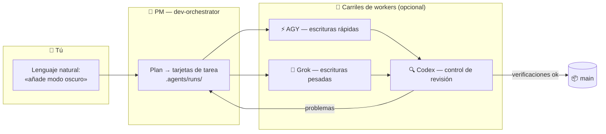

<div align="center">


# 🏭 Claude Lane Stack

### Una pequeña fábrica de código con IA para una sola persona

**Orquestación multi-agente para Claude Code** — hablas con un único jefe de proyecto de IA,
que despacha workers opcionales (AGY / Grok / Codex), revisa su salida
y **fusiona el código terminado en `main`**. Sin cinco chats. Sin merges manuales.

[](LICENSE)
[](https://github.com/VKirill/claude-lane-stack/releases)
[](https://docs.anthropic.com/en/docs/claude-code)
[](docs/BEGINNER.es.md)
[](https://t.me/pomogay_marketing)

🌍 **README:** [English](README.md) · [Русский](README.ru.md) · [简体中文](README.zh-CN.md) · [日本語](README.ja.md) · [Deutsch](README.de.md) · [Français](README.fr.md) · [한국어](README.ko.md) · [Português](README.pt-BR.md)
🐣 **Guía para principiantes:** [EN](docs/BEGINNER.md) · [RU](docs/BEGINNER.ru.md) · [中文](docs/BEGINNER.zh-CN.md) · [日本語](docs/BEGINNER.ja.md) · [DE](docs/BEGINNER.de.md) · [FR](docs/BEGINNER.fr.md) · [KO](docs/BEGINNER.ko.md) · [PT](docs/BEGINNER.pt-BR.md)

</div>

---

## 📌 Tabla de contenidos

- [Por qué existe](#-por-qué-existe) · [Para quién es](#-para-quién-es) · [Cómo funciona](#-cómo-funciona)
- [Inicio rápido](#-inicio-rápido-3-comandos) · [Tarjetas de tarea](#-tarjetas-de-tarea-cómo-cada-worker-se-mantiene-en-su-carril) · [Tú nunca haces merge](#-tú-nunca-haces-merge--lo-hace-el-pm)
- [Referencia rápida](#-referencia-rápida-de-comandos) · [Perfiles](#-perfiles-de-capacidad) · [Preguntas frecuentes](#-preguntas-frecuentes) · [Docs](#-mapa-de-documentación)

---

## 💡 Por qué existe

Trabajar con herramientas de programación con IA suele verse así: cinco ventanas de chat, fragmentos copiados y pegados, ramas que fusionas a mano a medianoche y nadie revisando el trabajo de nadie.

**Claude Lane Stack convierte eso en una cinta transportadora:**

| 😩 Cinco chats | 🏭 Lane Stack |
|---------------|---------------|
| Le vuelves a explicar el contexto a cada modelo | Un solo PM guarda el contexto; los workers reciben **tarjetas de tarea** |
| Los modelos sobrescriben los archivos de los demás | Cada tarjeta lista sus **rutas propias** — cada worker se queda en su carril |
| Nadie revisa el código de la IA | Un **carril de revisión** dedicado (Codex) controla cada merge |
| Fusionas las ramas a mano | El PM fusiona a **`main`** cuando pasan las verificaciones |
| A la mañana siguiente: «¿qué estábamos haciendo?» | `/resume-project` — Ahora / Bloqueado / Siguiente en segundos |

Sin base de datos de tareas. Sin servicio en la nube obligatorio. **Archivos simples + git simple** — todo es inspeccionable en tu repositorio.

---

## 👥 Para quién es

- 🧑‍💻 **Desarrolladores en solitario** que sacan proyectos reales y quieren workers de IA en paralelo sin el caos de los chats
- 🚀 **Indie hackers** que prefieren describir funcionalidades antes que cuidar ramas
- 🧠 **Vibe-coders** — sabes *qué* quieres; la fábrica se encarga del *cómo*
- 🏢 **Una agencia unipersonal** que lleva varios repos de clientes con la misma disciplina

> [!TIP]
> ¿Nunca habías oído la palabra «orquestación»? Empieza por la **[guía para principiantes](docs/BEGINNER.es.md)** — lo explica todo como una pequeña fábrica, sin jerga.

---

## 🧩 Cómo funciona

<div align="center">

</div>

Hablas con **un solo agente** — `dev-orchestrator`, el jefe de proyecto. Reparte el trabajo entre los carriles:



| Rol | Quién | Qué hace |
|------|-----|--------------|
| 👑 Propietario | **Tú** | Dices *qué* quieres, en cualquier idioma |
| 🤖 Jefe de proyecto | Agente de Claude Code `dev-orchestrator` | Planifica, despacha, verifica, **fusiona** |
| ⚡🔧 Carriles de escritura | AGY, Grok *(opcional)* | Implementan las tarjetas de tarea |
| 🔍 Carril de revisión | Codex *(opcional)* | Control de calidad independiente |
| 🗂️ Tarjetas de tarea | Archivos YAML en `.agents/runs/` | La planta de la fábrica — totalmente inspeccionable |
| 📦 Código oficial | Rama de Git **`main`** | Donde termina cada trabajo exitoso |

> [!NOTE]
> **Solo Claude Code es obligatorio.** Que falten workers no es problema — `agents-doctor` detecta lo que hay instalado y el PM se adapta, hasta un modo puro `claude-only`.

---

## 🚀 Inicio rápido (3 comandos)

```bash
# 1️⃣  Instala el stack — una vez por equipo
git clone https://github.com/VKirill/claude-lane-stack.git
cd claude-lane-stack && ./install.sh
export PATH="$HOME/.agents/bin:$PATH"        # o abre una terminal nueva

# 2️⃣  En TU proyecto — detecta los workers disponibles, una vez por repo
cd /path/to/your-project
agents-doctor --apply .

# 3️⃣  Arranca el PM y habla con normalidad
claude --agent dev-orchestrator
```

La primera vez en un proyecto, dentro del chat: **`/project-onboard`** — escribe el pasaporte del repo (`CLAUDE.md`, documentos iniciales).
Al volver tras una pausa: **`/resume-project`** — Ahora / Bloqueado / Siguiente.

> [!IMPORTANT]
> `/resume-project` es un comando de *«bienvenido de nuevo»* para sesiones posteriores — **no** un paso de instalación.

📖 Recorrido completo en lenguaje sencillo: **[docs/BEGINNER.es.md](docs/BEGINNER.es.md)**

---

## 📋 Tarjetas de tarea: cómo cada worker se mantiene en su carril

<div align="center">

</div>

Cada trabajo es un pequeño **contrato YAML** en `.agents/runs/` — creado por el PM, obedecido por los workers:

```yaml
task: add-dark-mode
goal: Interruptor de tema oscuro en la página de ajustes
owns_paths:            # 🔒 los ÚNICOS archivos que este worker puede tocar
  - src/settings/**
  - src/theme.css
verify:
  - npm test
  - npm run lint
lane: agy-implementer  # quién ejecuta
review: codex-reviewer # quién controla el merge
```

- 🔒 `owns_paths` — los workers en paralelo **no pueden colisionar**: `check-owns-paths` hace fallar la tarea si un worker se sale
- ✅ `verify` — el merge queda bloqueado hasta que pasan las verificaciones
- 📜 Las tarjetas quedan en el historial de git — un rastro de auditoría completo de qué hizo cada agente y por qué

Detalles: [docs/FILE-CONTRACT.md](docs/FILE-CONTRACT.md)

---

## 📦 Tú nunca haces merge — lo hace el PM

<div align="center">

</div>

El final de cada trabajo exitoso es el mismo: **el código verificado llega a `main`**, fusionado por el orquestador mediante `wt-merge-main` tras la revisión y las verificaciones. Los workers construyen en **git worktrees** aislados, así los trabajos en paralelo nunca se pisan entre sí.

> [!WARNING]
> Si alguna vez un agente te pide a *ti* que resuelvas ramas — eso es un fallo del flujo, no una tarea tuya. Dile al PM: *«hacer merge es tu trabajo»*.

Reglas de orquestación en solitario: [docs/SOLO-ORCHESTRATION.md](docs/SOLO-ORCHESTRATION.md)

---

## 🧾 Referencia rápida de comandos

### Estos los escribes tú

| Comando / frase | Qué es | Cuándo |
|------------------|------------|------|
| `./install.sh` | Instala el kit de fábrica en `~/.agents` | Una vez por equipo |
| `agents-doctor --apply .` | Detecta los CLI → escribe el perfil de enrutamiento | Una vez por proyecto |
| `claude --agent dev-orchestrator` | Abre el **único chat que necesitas** | Cada sesión |
| `/project-onboard` | Pasaporte del repo vía Codex (CLAUDE.md + docs) | La primera vez en un repo |
| *«Añade modo oscuro a los ajustes»* | Una petición de trabajo — cualquier idioma | Funcionalidades y arreglos |
| `/resume-project` | Ahora / Bloqueado / Siguiente | Tras una pausa |
| *«Está atascado»* | El PM revisa los workers en silencio | Silencio prolongado |

<details>
<summary>🤖 <b>Normalmente solo el PM escribe estos</b></summary>

| Comando | Qué es |
|---------|------------|
| `run-board` | Actualiza el marcador de trabajos |
| `wt-create` / `wt-merge-main` | Worktree aislado + **merge en `main`** |
| `check-owns-paths` | ¿El worker se quedó dentro de su lista de archivos? |
| `lane-heartbeat` / `lane-stall-check` | ¿El worker sigue vivo? ¿Quién se quedó en silencio? |
| `project-memory-init` | Crea los archivos de memoria PROGRESS / LESSONS |
| `night-audit` | Mantenimiento programado sobre runs y docs |

</details>

---

## 🚦 Perfiles de capacidad

`agents-doctor` escribe uno de cinco perfiles según los CLI que encuentre — el PM enruta en consecuencia:

| Perfil | Lo que tienes | Carril de escritura | Carril de revisión |
|---------|----------|------------|-------------|
| `full` | AGY + Grok + Codex | AGY / Grok | Codex |
| `claude-agy` | AGY | AGY | Claude |
| `claude-grok` | Grok | Grok | Claude |
| `claude-codex` | Codex | Codex | Codex |
| `claude-only` | solo Claude Code | Subagentes de Claude | Subagentes de Claude |

```bash
agents-doctor            # muestra el informe de detección
agents-doctor --apply .  # guarda el perfil en el proyecto
```

Más: [profiles/README.md](profiles/README.md) · [docs/ROUTING.md](docs/ROUTING.md)

---

## 🧱 Qué hay en la caja

```text
claude-lane-stack/
├── agents/        # definiciones de agentes: PM claude + carriles agy / grok / codex
├── bin/           # 11 herramientas CLI: agents-doctor, run-board, wt-merge-main, …
├── skills/        # 11 skills: orquestación, contratos, memoria de proyecto, onboarding
├── profiles/      # 5 perfiles de enrutamiento (full → claude-only)
├── hooks/         # hooks de seguridad: shell guard, code-quality guard, session ledger
├── templates/     # plantillas PROGRESS / LESSONS / decisions / session-log
├── docs/          # guía para principiantes + análisis a fondo (esta tabla ↓)
└── install.sh     # lo pone todo en ~/.agents
```

Y dentro de **tu** proyecto tras el onboarding:

```text
your-app/
├── CLAUDE.md          # reglas de proyecto breves y siempre activas
├── AGENTS.md          # puntero «lee CLAUDE.md» para otras herramientas
├── .agents/runs/      # 🏭 planta de la fábrica — tarjetas de tarea, informes, notas de merge
└── docs/plans/        # 🧠 documentos de estrategia (no la planta de la fábrica)
```

---

## ❓ Preguntas frecuentes

<details>
<summary><b>¿Necesito tener AGY, Grok y Codex instalados a la vez?</b></summary>

No — **solo Claude Code es obligatorio**. Todo lo demás es un worker opcional. `agents-doctor` detecta tu configuración y el PM se adapta, hasta el modo `claude-only`.

</details>

<details>
<summary><b>¿En qué se diferencia de Claude Code a secas?</b></summary>

Claude Code a secas es un worker en un chat. Lane Stack añade la **capa de gestión**: tarjetas de tarea con propiedad de archivos, carriles en paralelo de distintos proveedores, un control de revisión independiente, merge automático a `main` y recuperación en arranque en frío. Tú haces la estrategia; él hace la logística.

</details>

<details>
<summary><b>¿Necesita una base de datos o un servicio en la nube?</b></summary>

No. El estado vive en **archivos simples dentro de tu repo** (`.agents/runs/`) y en git. Puedes leer, comparar y auditar todo.

</details>

<details>
<summary><b>¿Funcionará en mi proyecto ya existente?</b></summary>

Sí. `cd your-project && agents-doctor --apply .`, y luego `/project-onboard` escribe el pasaporte alrededor de tu código existente. Nada se reescribe sin una tarea.

</details>

<details>
<summary><b>¿Y si un worker se queda en silencio a mitad de tarea?</b></summary>

El stack incluye `lane-heartbeat` / `lane-stall-check` — el PM detecta los atascos y vuelve a despachar. Siempre puedes decir *«está atascado»*.

</details>

<details>
<summary><b>¿Está seguro mi código?</b></summary>

Cada CLI habla únicamente con su propio proveedor, exactamente igual que si funcionara por su cuenta — el stack **no añade servidores extra**. Los secretos no van en los archivos de tarea; las áreas sensibles (auth, pagos) merecen el carril de revisión. Consulta [SECURITY.md](SECURITY.md).

</details>

---

## 📚 Mapa de documentación

| Tema | Documento |
|-------|-----|
| 🐣 Recorrido en lenguaje sencillo | [docs/BEGINNER.es.md](docs/BEGINNER.es.md) |
| 🧑‍✈️ Reglas del modo en solitario — por qué nunca haces merge | [docs/SOLO-ORCHESTRATION.md](docs/SOLO-ORCHESTRATION.md) |
| 🗂️ Anatomía YAML de la tarjeta de tarea | [docs/FILE-CONTRACT.md](docs/FILE-CONTRACT.md) |
| 🔀 Quién escribe / quién revisa | [docs/ROUTING.md](docs/ROUTING.md) |
| 🛡️ Hooks de seguridad | [docs/HOOKS.md](docs/HOOKS.md) |
| 🧠 Memoria de proyecto (PROGRESS / LESSONS) | [docs/PROJECT-MEMORY.md](docs/PROJECT-MEMORY.md) |
| 📝 Backlog de ideas | [docs/TODOS.md](docs/TODOS.md) |<!-- guardian: allow — link to existing docs/TODOS.md file, not a new TODO marker -->
| 🔌 Configuraciones de MCP (lean / hybrid) | [docs/MCP-LEAN.md](docs/MCP-LEAN.md) · [docs/MCP-HYBRID.md](docs/MCP-HYBRID.md) |
| 🤝 Cómo contribuir | [CONTRIBUTING.md](CONTRIBUTING.md) |
| 🔐 Política de seguridad | [SECURITY.md](SECURITY.md) |

---

## 📜 Licencia

MIT — [LICENSE](LICENSE). Úsalo, haz un fork, construye tu propia fábrica.

---

<div align="center">

<a href="https://github.com/VKirill"></a>

**Кирилл Вечкасов** · [@VKirill](https://github.com/VKirill) · Telegram: [Помогающий маркетолог](https://t.me/pomogay_marketing)

*Construyo cintas transportadoras que funcionan, no otro chat con un LLM.*

⭐ **Si te encaja la idea de la cinta transportadora, dale una estrella al repo.** De verdad ayuda a que otros creadores en solitario lo encuentren.

</div>
