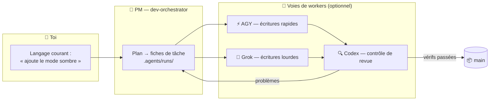

<div align="center">


# 🏭 Claude Lane Stack

### Une petite usine de code IA pour une seule personne

**Orchestration multi-agents pour Claude Code** — tu parles à un seul chef de projet qui orchestre tes agents IA,
il dépêche des workers optionnels (AGY / Grok / Codex), relit leur travail
et **fusionne le code terminé vers `main`**. Fini les cinq chats. Fini les fusions manuelles.

[](LICENSE)
[](https://github.com/VKirill/claude-lane-stack/releases)
[](https://docs.anthropic.com/en/docs/claude-code)
[](docs/BEGINNER.fr.md)
[](https://t.me/pomogay_marketing)

🌍 **README :** [English](README.md) · [Русский](README.ru.md) · [简体中文](README.zh-CN.md) · [日本語](README.ja.md) · [Español](README.es.md) · [Deutsch](README.de.md) · [한국어](README.ko.md) · [Português](README.pt-BR.md)
🐣 **Guide du débutant :** [EN](docs/BEGINNER.md) · [RU](docs/BEGINNER.ru.md) · [中文](docs/BEGINNER.zh-CN.md) · [日本語](docs/BEGINNER.ja.md) · [ES](docs/BEGINNER.es.md) · [DE](docs/BEGINNER.de.md) · [KO](docs/BEGINNER.ko.md) · [PT](docs/BEGINNER.pt-BR.md)

</div>

---

## 📌 Table des matières

- [Pourquoi ça existe](#-pourquoi-ça-existe) · [Pour qui c'est fait](#-pour-qui-cest-fait) · [Comment ça marche](#-comment-ça-marche)
- [Démarrage rapide](#-démarrage-rapide-3-commandes) · [Fiches de tâche](#-fiches-de-tâche--comment-les-workers-restent-dans-leur-voie) · [Tu ne fusionnes jamais](#-tu-ne-fusionnes-jamais--cest-le-pm-qui-le-fait)
- [Aide-mémoire](#-aide-mémoire-des-commandes) · [Profils](#-profils-de-capacité) · [FAQ](#-faq) · [Docs](#-carte-de-la-documentation)

<!-- v1.1.0-whats-new -->

---

## 🆕 Nouveautés v1.1.0 (état actuel)

| Capacité | Contenu |
|----------|---------|
| 🧭 **Onboard 2.0** | Scénarios **minimal / full** + profondeur **fast / deep** (full → deep) |
| 🔬 Deep | Entrypoints, flux, wiki↔code, vrais tests, deploy, secrets (noms seuls) |
| 🏃 **lane-bg / lane-wait** | Bash foreground Claude meurt ~2 min → les lanes longues se détachent |
| 🔥 **lane-session** | AGY/Grok reprennent la conversation du run ; jusqu’à 3 slots parallèles |
| ⏱️ **lane-exec** | idle activité + max absolu sur le processus détaché |
| 🧠 Modèles | GPT-**5.6** Sol / Terra / Luna uniquement (pas de 5.5). Fichiers en anglais |
| 🚀 Commandes | `/project-onboard` · `/project-onboard deep` |

[ONBOARD-SCENARIOS.md](docs/ONBOARD-SCENARIOS.md) · [LANE-EXEC.md](docs/LANE-EXEC.md) · [Release](https://github.com/VKirill/claude-lane-stack/releases/tag/v1.1.0)


---

## 💡 Pourquoi ça existe

Travailler avec des outils de code IA, ça ressemble en général à ça : cinq fenêtres de chat, des bouts de code copiés-collés, des branches que tu fusionnes à la main à minuit, et personne pour relire le travail des autres.

**Claude Lane Stack transforme tout ça en un convoyeur :**

| 😩 Cinq chats | 🏭 Lane Stack |
|---------------|---------------|
| Tu réexpliques le contexte à chaque modèle | Un seul PM garde le contexte, les workers reçoivent des **fiches de tâche** |
| Les modèles écrasent les fichiers des autres | Chaque fiche liste ses **chemins réservés** — chaque worker reste dans sa voie |
| Personne ne relit le code de l'IA | Une **voie de revue** dédiée (Codex) contrôle chaque fusion |
| Tu fusionnes les branches à la main | Le PM fusionne vers **`main`** une fois les vérifications passées |
| Le lendemain matin : « on en était où ? » | `/resume-project` — Maintenant / Bloqué / Ensuite en quelques secondes |

Pas de base de données de tâches. Aucun service cloud obligatoire. **De simples fichiers + un simple git** — tout est inspectable dans ton dépôt.

---

## 👥 Pour qui c'est fait

- 🧑‍💻 **Les développeurs solo** qui font du codage agentique sur de vrais projets et veulent des workers IA en parallèle, sans le chaos des chats
- 🚀 **Les indie hackers** qui préfèrent décrire des fonctionnalités plutôt que surveiller des branches
- 🧠 **Les vibe-codeurs** — tu sais *ce que* tu veux ; l'usine s'occupe du *comment*
- 🏢 **Une agence d'une seule personne** qui gère plusieurs dépôts clients avec la même discipline

> [!TIP]
> Jamais entendu le mot « orchestration » ? Commence par le **[Guide du débutant](docs/BEGINNER.fr.md)** — il explique tout comme une petite usine, zéro jargon.

---

## 🧩 Comment ça marche

<div align="center">

</div>

Tu parles à **un seul agent** — `dev-orchestrator`, le chef de projet. Il répartit le travail entre les voies :



| Rôle | Qui | Ce qu'il fait |
|------|-----|--------------|
| 👑 Propriétaire | **Toi** | Dis *ce que* tu veux, dans n'importe quelle langue |
| 🤖 Chef de projet | Agent Claude Code `dev-orchestrator` | Planifie, dépêche, vérifie, **fusionne** |
| ⚡🔧 Voies d'écriture | AGY, Grok *(optionnel)* | Implémentent les fiches de tâche |
| 🔍 Voie de revue | Codex *(optionnel)* | Contrôle qualité indépendant |
| 🗂️ Fiches de tâche | Fichiers YAML dans `.agents/runs/` | L'atelier — entièrement inspectable |
| 📦 Code officiel | Branche Git **`main`** | Là où finit chaque tâche réussie |

> [!NOTE]
> **Seul Claude Code est requis.** Les workers manquants ne posent aucun problème — `agents-doctor` détecte ce qui est installé et le PM s'adapte, jusqu'à un mode `claude-only` pur.

---

## 🚀 Démarrage rapide (3 commandes)

```bash
# 1️⃣  Installe le stack — une fois par ordinateur
git clone https://github.com/VKirill/claude-lane-stack.git
cd claude-lane-stack && ./install.sh
export PATH="$HOME/.agents/bin:$PATH"        # ou ouvre un nouveau terminal

# 2️⃣  Dans TON projet — détecte les workers disponibles, une fois par dépôt
cd /path/to/your-project
agents-doctor --apply .

# 3️⃣  Lance le PM et parle normalement
claude --agent dev-orchestrator
```

Première fois sur un projet, dans le chat : **`/project-onboard`** — écrit le passeport du dépôt (`CLAUDE.md`, docs de départ).
Tu reviens après une pause : **`/resume-project`** — Maintenant / Bloqué / Ensuite.

> [!IMPORTANT]
> `/resume-project` est une commande de *« bon retour »* pour les sessions suivantes — **pas** une étape d'installation.

📖 Guide complet en langage clair : **[docs/BEGINNER.fr.md](docs/BEGINNER.fr.md)**

---

## 📋 Fiches de tâche : comment les workers restent dans leur voie

<div align="center">

</div>

Chaque tâche est un petit **contrat YAML** dans `.agents/runs/` — créé par le PM, respecté par les workers :

```yaml
task: add-dark-mode
goal: Bascule de thème sombre sur la page des réglages
owns_paths:            # 🔒 les SEULS fichiers que ce worker peut toucher
  - src/settings/**
  - src/theme.css
verify:
  - npm test
  - npm run lint
lane: agy-implementer  # qui exécute
review: codex-reviewer # qui contrôle la fusion
```

- 🔒 `owns_paths` — les workers en parallèle **ne peuvent pas se marcher dessus** : `check-owns-paths` fait échouer la tâche si un worker déborde
- ✅ `verify` — la fusion est bloquée tant que les vérifications ne passent pas
- 📜 Les fiches restent dans l'historique git — une piste d'audit complète de ce que chaque agent a fait et pourquoi

Détails : [docs/FILE-CONTRACT.md](docs/FILE-CONTRACT.md)

---

## 📦 Tu ne fusionnes jamais — c'est le PM qui le fait

<div align="center">

</div>

La fin de chaque tâche réussie est la même : **le code vérifié arrive sur `main`**, fusionné par l'orchestrateur via `wt-merge-main` après la revue et les vérifications. Les workers construisent dans des **git worktrees** isolés, pour que les tâches en parallèle ne s'écrasent jamais entre elles.

> [!WARNING]
> Si un agent te demande un jour de *résoudre* des branches — c'est un bug dans le flux, pas une corvée pour toi. Dis au PM : *« fusionner, c'est ton boulot »*.

Règles de l'orchestration solo : [docs/SOLO-ORCHESTRATION.md](docs/SOLO-ORCHESTRATION.md)

---

## 🧾 Aide-mémoire des commandes

### Ce que tu tapes, toi

| Commande / phrase | Ce que c'est | Quand |
|------------------|------------|------|
| `./install.sh` | Installe le kit d'usine dans `~/.agents` | Une fois par ordinateur |
| `agents-doctor --apply .` | Détecte les CLI → écrit le profil de routage | Une fois par projet |
| `claude --agent dev-orchestrator` | Ouvre le **seul chat dont tu as besoin** | À chaque session |
| `/project-onboard` | Passeport du dépôt via Codex (CLAUDE.md + docs) | Première fois sur un dépôt |
| *« Ajoute le mode sombre aux réglages »* | Une demande de travail — n'importe quelle langue | Fonctionnalités et corrections |
| `/resume-project` | Maintenant / Bloqué / Ensuite | Après une pause |
| *« Ça coince »* | Le PM vérifie les workers silencieux | Long silence |

<details>
<summary>🤖 <b>En général, seul le PM tape celles-ci</b></summary>

| Commande | Ce que c'est |
|---------|------------|
| `run-board` | Rafraîchit le tableau de bord des tâches |
| `wt-create` / `wt-merge-main` | Worktree isolé + **fusion dans `main`** |
| `check-owns-paths` | Le worker est-il resté dans sa liste de fichiers ? |
| `lane-heartbeat` / `lane-stall-check` | Le worker est-il en vie ? Qui est devenu silencieux ? |
| `project-memory-init` | Crée les fichiers mémoire PROGRESS / LESSONS |
| `night-audit` | Ménage planifié sur les runs et les docs |

</details>

---

## 🚦 Profils de capacité

`agents-doctor` écrit l'un des cinq profils selon les CLI qu'il trouve — le PM route en conséquence :

| Profil | Ce que tu as | Voie d'écriture | Voie de revue |
|---------|----------|------------|-------------|
| `full` | AGY + Grok + Codex | AGY / Grok | Codex |
| `claude-agy` | AGY | AGY | Claude |
| `claude-grok` | Grok | Grok | Claude |
| `claude-codex` | Codex | Codex | Codex |
| `claude-only` | juste Claude Code | Sous-agents Claude | Sous-agents Claude |

```bash
agents-doctor            # affiche le rapport de détection
agents-doctor --apply .  # enregistre le profil dans le projet
```

Plus : [profiles/README.md](profiles/README.md) · [docs/ROUTING.md](docs/ROUTING.md)

---

## 🧱 Ce qu'il y a dans la boîte

```text
claude-lane-stack/
├── agents/        # définitions d'agents : PM claude + voies agy / grok / codex
├── bin/           # 11 outils CLI : agents-doctor, run-board, wt-merge-main, …
├── skills/        # 11 skills : orchestration, contrats, mémoire de projet, onboarding
├── profiles/      # 5 profils de routage (full → claude-only)
├── hooks/         # hooks de sécurité : garde shell, garde qualité de code, registre de session
├── templates/     # modèles PROGRESS / LESSONS / decisions / session-log
├── docs/          # guide du débutant + plongées en profondeur (ce tableau ↓)
└── install.sh     # met tout dans ~/.agents
```

Et dans **ton** projet après l'onboarding :

```text
your-app/
├── CLAUDE.md          # règles de projet courtes, toujours actives
├── AGENTS.md          # pointeur « lis CLAUDE.md » pour les autres outils
├── .agents/runs/      # 🏭 l'atelier — fiches de tâche, rapports, notes de fusion
└── docs/plans/        # 🧠 documents de stratégie (pas l'atelier)
```

---

## ❓ FAQ

<details>
<summary><b>Dois-je installer AGY, Grok et Codex, tous les trois ?</b></summary>

Non — **seul Claude Code est requis**. Tout le reste est un worker optionnel. `agents-doctor` détecte ta configuration et le PM s'adapte, jusqu'au mode `claude-only`.

</details>

<details>
<summary><b>En quoi est-ce différent de Claude Code tout seul ?</b></summary>

Claude Code tout seul, c'est un seul chat où tu diriges les sous-agents toi-même. Lane Stack ajoute la **couche de gestion** : fiches de tâche avec propriété des fichiers, voies parallèles issues de différents fournisseurs, un contrôle de revue indépendant, la fusion automatique vers `main`, et la reprise à froid. Toi, tu fais la stratégie ; lui, la logistique.

</details>

<details>
<summary><b>A-t-il besoin d'une base de données ou d'un service cloud ?</b></summary>

Non. L'état vit dans de **simples fichiers à l'intérieur de ton dépôt** (`.agents/runs/`) et dans git. Tu peux tout lire, comparer et auditer.

</details>

<details>
<summary><b>Est-ce que ça marchera sur mon projet existant ?</b></summary>

Oui. `cd your-project && agents-doctor --apply .`, puis `/project-onboard` écrit le passeport autour de ton code existant. Rien n'est réécrit sans une tâche.

</details>

<details>
<summary><b>Et si un worker devient silencieux en pleine tâche ?</b></summary>

Le stack fournit `lane-heartbeat` / `lane-stall-check` — le PM détecte les blocages et redéploie. Tu peux toujours dire *« ça coince »*.

</details>

<details>
<summary><b>Mon code est-il en sécurité ?</b></summary>

Chaque CLI ne parle qu'à son propre fournisseur, exactement comme s'il était seul — le stack n'ajoute **aucun serveur supplémentaire**. Les secrets n'ont pas leur place dans les fichiers de tâche ; les zones sensibles (auth, paiements) méritent la voie de revue. Voir [SECURITY.md](SECURITY.md).

</details>

---

## 📚 Carte de la documentation

| Sujet | Doc |
|-------|-----|
| 🐣 Guide en langage clair | [docs/BEGINNER.fr.md](docs/BEGINNER.fr.md) |
| ⚖️ Comparatif avec les alternatives | [docs/COMPARISON.md](docs/COMPARISON.md) |
| 🧑‍✈️ Règles solo — pourquoi tu ne fusionnes jamais | [docs/SOLO-ORCHESTRATION.md](docs/SOLO-ORCHESTRATION.md) |
| 🗂️ Anatomie YAML d'une fiche de tâche | [docs/FILE-CONTRACT.md](docs/FILE-CONTRACT.md) |
| 🔀 Qui écrit / qui relit | [docs/ROUTING.md](docs/ROUTING.md) |
| 🛡️ Hooks de sécurité | [docs/HOOKS.md](docs/HOOKS.md) |
| 🧠 Mémoire de projet (PROGRESS / LESSONS) | [docs/PROJECT-MEMORY.md](docs/PROJECT-MEMORY.md) |
| 📝 Backlog d'idées | [docs/TODOS.md](docs/TODOS.md) |<!-- guardian: allow — link to existing docs/TODOS.md file, not a new TODO marker -->
| 🔌 Configurations MCP (lean / hybrid) | [docs/MCP-LEAN.md](docs/MCP-LEAN.md) · [docs/MCP-HYBRID.md](docs/MCP-HYBRID.md) |
| 🤝 Contribuer | [CONTRIBUTING.md](CONTRIBUTING.md) |
| 🔐 Politique de sécurité | [SECURITY.md](SECURITY.md) |

---

## 📜 Licence

MIT — [LICENSE](LICENSE). Utilise-le, fork-le, construis ta propre usine.

---

<div align="center">

<a href="https://github.com/VKirill"></a>

**Кирилл Вечкасов** · [@VKirill](https://github.com/VKirill) · Telegram : [Помогающий маркетолог](https://t.me/pomogay_marketing)

*Je construis des convoyeurs qui marchent, pas un énième chat avec un LLM.*

⭐ **Si l'idée du convoyeur te parle — mets une étoile au dépôt.** Ça aide vraiment les créateurs solo à le trouver.

</div>
