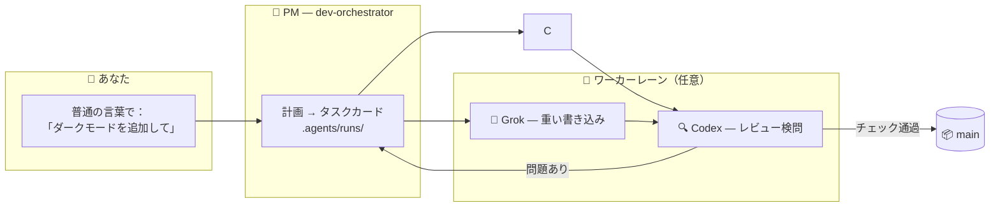

<div align="center">


# 🏭 Claude Lane Stack

### 一人のための小さな AI コーディング工場

**Claude Code のためのマルチエージェント・オーケストレーション** — 複数の AIエージェントを束ね、あなたは1人の AI プロジェクトマネージャーと話すだけ。
マネージャーが任意のワーカー（Grok / Codex）に作業を割り振り、その成果をレビューして
**完成したコードを `main` にマージ**します。5つのチャットは不要。手動マージも不要。

[](LICENSE)
[](https://github.com/VKirill/claude-lane-stack/releases)
[](https://docs.anthropic.com/en/docs/claude-code)
[](docs/BEGINNER.ja.md)
[](https://t.me/pomogay_marketing)

🌍 **README:** [English](README.md) · [Русский](README.ru.md) · [简体中文](README.zh-CN.md) · [Español](README.es.md) · [Deutsch](README.de.md) · [Français](README.fr.md) · [한국어](README.ko.md) · [Português](README.pt-BR.md)
🐣 **初心者ガイド:** [EN](docs/BEGINNER.md) · [RU](docs/BEGINNER.ru.md) · [中文](docs/BEGINNER.zh-CN.md) · [ES](docs/BEGINNER.es.md) · [DE](docs/BEGINNER.de.md) · [FR](docs/BEGINNER.fr.md) · [KO](docs/BEGINNER.ko.md) · [PT](docs/BEGINNER.pt-BR.md)

</div>

---

## 📌 目次

- なぜ存在するのか · 対象ユーザー · 仕組み
- クイックスタート · タスクカード · あなたはマージしない
- チートシート · プロファイル · FAQ · ドキュメント

<!-- v1.3.0-whats-new -->

---

## 🆕 v1.3.0 の現状（重要）

| 機能 | 内容 |
|------|------|
| 🧭 **Onboard 2.0** | **minimal / full** シナリオ + **fast / deep** 深度を自動判定（成熟リポは deep） |
| 🔬 Deep | エントリポイント・フロー・wiki↔コード差分・実テスト・デプロイ・シークレット名のみ |
| 🏃 **lane-bg / lane-wait** | Claude の foreground Bash は約2分で殺される → 長時間レーンは必ず detach |
| 🔥 **lane-session** | Grok は run ごとの会話を再開し、最大3スロットで並列実行 |
| ⚡ **lane-poll / progressive** | Accept each task as it finishes — no join-wait on the slowest |
| ⏱️ **lane-exec** | 活動ベース idle + 絶対 max（detach 後の子プロセス向け） |
| 🧠 モデル | GPT-**5.6** Sol / Terra / Luna のみ（5.5 なし）。ファイルは英語 |
| 🚀 コマンド | `/project-onboard` · `/project-onboard deep` |

[ONBOARD-SCENARIOS.md](docs/ONBOARD-SCENARIOS.md) · [LANE-EXEC.md](docs/LANE-EXEC.md) · [Release](https://github.com/VKirill/claude-lane-stack/releases/tag/v1.3.0)

---

## 💡 なぜ存在するのか

AI コーディングツールを使う作業は、たいていこんな感じです。5つのチャットウィンドウ、コピペしたスニペット、深夜に手作業でマージするブランチ、そして誰も互いの作業をチェックしない。

**Claude Lane Stack はそれをコンベアに変えます。**

| 😩 5つのチャット | 🏭 Lane Stack |
|---------------|---------------|
| モデルごとに毎回コンテキストを説明し直す | 1人の PM がコンテキストを保持し、ワーカーは**タスクカード**を受け取る |
| モデルどうしが互いのファイルを上書きする | 各カードに**所有パス**が明記され、ワーカーは自分のレーンから外れない |
| 誰も AI のコードをレビューしない | 専任の**レビューレーン**（Codex）がすべてのマージを検問する |
| ブランチを手動でマージする | チェックが通ったら PM が **`main`** にマージする |
| 翌朝：「何をやっていたんだっけ？」 | `/resume-project` — Now / Blocked / Next を数秒で |

タスクデータベースなし。必須のクラウドサービスなし。**プレーンファイル + プレーンな git** — すべてがあなたのリポジトリで確認できます。

---

## 👥 対象ユーザー

- 🧑‍💻 **ソロ開発者** — 実際のプロジェクトを出荷し、チャットの混沌なしにエージェンティックコーディングを並列で回したい人
- 🚀 **インディーハッカー** — ブランチのお守りより、機能を説明することに時間を使いたい人
- 🧠 **バイブコーダー** — *何を*作りたいかは分かっている。*どうやって*は工場に任せる人
- 🏢 **一人代理店** — 複数のクライアントリポジトリを同じ規律で回す人

> [!TIP]
> 「オーケストレーション」という言葉を聞いたことがない？ **[初心者ガイド](docs/BEGINNER.ja.md)** から始めましょう — すべてを小さな工場にたとえ、専門用語ゼロで説明します。

---

## 🧩 仕組み

<div align="center">

</div>

あなたが話すのは**1人のエージェント**だけ — プロジェクトマネージャーの `dev-orchestrator` です。それが各レーンに作業を振り分けます。



| ロール | 誰が | 何をするか |
|------|-----|--------------|
| 👑 オーナー | **あなた** | *何を*望むかを、どんな言語でも伝える |
| 🤖 プロジェクトマネージャー | Claude Code エージェント `dev-orchestrator` | 計画・割り振り・検証・**マージ** |
| ⚡🔧 書き込みレーン |, Grok *(任意)* | タスクカードを実装する |
| 🔍 レビューレーン | Codex *(任意)* | 独立した品質ゲート |
| 🗂️ タスクカード | `.agents/runs/` 内の YAML ファイル | 工場のフロア — 完全に確認可能 |
| 📦 公式コード | Git ブランチ **`main`** | すべての成功したジョブが行き着く先 |

> [!NOTE]
> **必須なのは Claude Code だけ。** ワーカーが足りなくても大丈夫 — `agents-doctor` が何がインストールされているかを検出し、PM が適応します。純粋な `claude-only` モードまで対応します。

---

## 🚀 クイックスタート（3コマンド）

```bash
# 1️⃣  スタックをインストール — コンピュータごとに一度
git clone https://github.com/VKirill/claude-lane-stack.git
cd claude-lane-stack && ./install.sh
export PATH="$HOME/.agents/bin:$PATH" # または新しいターミナルを開く

# 2️⃣  あなたのプロジェクトで — 利用可能なワーカーを検出、リポジトリごとに一度
cd /path/to/your-project
agents-doctor --apply .

# 3️⃣  PM を起動して普通に話す
claude --agent dev-orchestrator
```

プロジェクトで初めてのときは、チャットの中で：**`/project-onboard`** — リポジトリのパスポート（`CLAUDE.md`、スタータードキュメント）を書き出します。
しばらくぶりに戻ってきたら：**`/resume-project`** — Now / Blocked / Next。

> [!IMPORTANT]
> `/resume-project` は後のセッションで使う *「おかえりなさい」* コマンドです — インストール手順では**ありません**。

📖 プレーンな言葉での完全なウォークスルー：**[docs/BEGINNER.ja.md](docs/BEGINNER.ja.md)**

---

## 📋 タスクカード：ワーカーはこうしてレーンを守る

<div align="center">

</div>

すべてのジョブは `.agents/runs/` に置かれる小さな **YAML 契約**です — PM が作成し、ワーカーが従います。

```yaml
task: add-dark-mode
goal: 設定ページのダークテーマ切り替えトグル
owns_paths: # 🔒 このワーカーが触れてよい唯一のファイル
  - src/settings/**
  - src/theme.css
verify:
  - npm test
  - npm run lint
lane: grok-implementer # 誰が実行するか
review: codex-reviewer # 誰がマージを検問するか
```

- 🔒 `owns_paths` — 並列ワーカーは**衝突できません**：ワーカーが逸脱すると `check-owns-paths` がタスクを失敗させます
- ✅ `verify` — チェックが通るまでマージはブロックされます
- 📜 カードは git 履歴に残る — どのエージェントが何をなぜ行ったかの完全な監査証跡

詳細：[docs/FILE-CONTRACT.md](docs/FILE-CONTRACT.md)

---

## 📦 あなたはマージしない — PM がやる

<div align="center">

</div>

すべての成功したジョブの終わりは同じです。**検証済みのコードが `main` に着地**し、レビューとチェックの後にオーケストレーターが `wt-merge-main` でマージします。ワーカーは隔離された **git worktree** の中で作業するので、並列ジョブが互いを踏みつけることはありません。

> [!WARNING]
> もしエージェントが*あなた*にブランチの解決を求めてきたら — それはフローのバグであって、あなたの雑用ではありません。PM にこう伝えましょう：*「マージは君の仕事だ」*。

ソロオーケストレーションのルール：[docs/SOLO-ORCHESTRATION.md](docs/SOLO-ORCHESTRATION.md)

---

## 🧾 コマンド・チートシート

### あなたが入力するもの

| コマンド / フレーズ | 何か | いつ |
|------------------|------------|------|
| `./install.sh` | 工場キットを `~/.agents` にインストール | コンピュータごとに一度 |
| `agents-doctor --apply .` | CLI を検出 → ルーティングプロファイルを書き出す | プロジェクトごとに一度 |
| `claude --agent dev-orchestrator` | **必要な唯一のチャット**を開く | 毎セッション |
| `/project-onboard` | Codex によるリポジトリのパスポート（CLAUDE.md + ドキュメント） | リポジトリで初めてのとき |
| *「設定にダークモードを追加して」* | 作業リクエスト — どんな言語でも | 機能と修正 |
| `/resume-project` | Now / Blocked / Next | 休憩のあと |
| *「止まってる」* | PM が沈黙したワーカーを確認 | 長い沈黙のとき |

<details>
<summary>🤖 <b>ふつうは PM だけが入力するもの</b></summary>

| コマンド | 何か |
|---------|------------|
| `run-board` | ジョブのスコアボードを更新 |
| `wt-create` / `wt-merge-main` | 隔離された worktree + **`main` へのマージ** |
| `check-owns-paths` | ワーカーは自分のファイルリスト内に留まったか？ |
| `lane-heartbeat` / `lane-stall-check` | ワーカーは生きているか？ 誰が沈黙したか？ |
| `project-memory-init` | PROGRESS / LESSONS メモリファイルを作成 |
| `night-audit` | runs とドキュメントに対する定期的なハウスキーピング |

</details>

---

## 🚦 能力プロファイル

`agents-doctor` は、見つかった CLI に応じて5つのプロファイルのいずれかを書き出します — PM はそれに従ってルーティングします。

| プロファイル | あなたが持っているもの | 書き込みレーン | レビューレーン |
|---------|----------|------------|-------------|
| `full` | Grok + Codex | Grok | Codex |
| `claude-` |  |  | Claude |
| `claude-grok` | Grok | Grok | Claude |
| `claude-codex` | Codex | Codex | Codex |
| `claude-only` | Claude Code のみ | Claude サブエージェント | Claude サブエージェント |

```bash
agents-doctor # 検出レポートを表示
agents-doctor --apply . # プロファイルをプロジェクトに保存
```

さらに詳しく：[profiles/README.md](profiles/README.md) · [docs/ROUTING.md](docs/ROUTING.md)

---

## 🧱 箱の中身

```text
claude-lane-stack/
├── agents/ # エージェント定義：claude PM + grok/codex レーン
├── bin/ # 11個の CLI ツール：agents-doctor, run-board, wt-merge-main, …
├── skills/ # 11個のスキル：オーケストレーション、契約、プロジェクトメモリ、オンボーディング
├── profiles/ # 5つのルーティングプロファイル（full → claude-only）
├── hooks/ # 安全フック：シェルガード、コード品質ガード、セッション台帳
├── templates/ # PROGRESS / LESSONS / decisions / session-log テンプレート
├── docs/ # 初心者ガイド + 詳細解説（下の表 ↓）
└── install.sh # すべてを ~/.agents に配置
```

そしてオンボーディング後の**あなたの**プロジェクトの中：

```text
your-app/
├── CLAUDE.md # 常時オンの短いプロジェクトルール
├── AGENTS.md # 他ツール向けの「CLAUDE.md を読め」ポインタ
├── .agents/runs/ # 🏭 工場のフロア — タスクカード、レポート、マージノート
└── docs/plans/ # 🧠 戦略ドキュメント（工場のフロアではない）
```

---

## ❓ FAQ

<details>
<summary><b>、Grok、Codex をすべてインストールする必要がありますか？</b></summary>

いいえ — **必須なのは Claude Code だけ**です。それ以外はすべて任意のワーカーです。`agents-doctor` があなたの環境を検出し、PM が適応します。`claude-only` モードまで対応します。

</details>

<details>
<summary><b>ふつうの Claude Code と何が違うのですか？</b></summary>

ふつうの Claude Code は、1つのチャットの中で完結し、並列化したければあなた自身がサブエージェントを手動で動かすことになります。Lane Stack は**管理レイヤー**を追加します：ファイル所有権を持つタスクカード、異なるベンダーからの並列レーン、独立したレビューゲート、`main` への自動マージ、そしてコールドスタートからの復帰。あなたは戦略を、工場はロジスティクスを担当します。

</details>

<details>
<summary><b>データベースやクラウドサービスが必要ですか？</b></summary>

いいえ。状態は**あなたのリポジトリ内のプレーンファイル**（`.agents/runs/`）と git に存在します。すべてを読み、差分を取り、監査できます。

</details>

<details>
<summary><b>既存のプロジェクトで動きますか？</b></summary>

はい。`cd your-project && agents-doctor --apply .` の後、`/project-onboard` が既存のコードの周りにパスポートを書き出します。タスクなしに書き換えられるものは何もありません。

</details>

<details>
<summary><b>ワーカーがタスクの途中で沈黙したら？</b></summary>

スタックには `lane-heartbeat` / `lane-stall-check` が付属します — PM が停滞を検出して再割り振りします。いつでも*「止まってる」*と言えます。

</details>

<details>
<summary><b>私のコードは安全ですか？</b></summary>

各 CLI は、単独で使うときとまったく同じように、自分のベンダーとだけ通信します — スタックは**追加のサーバーを一切足しません**。シークレットはタスクファイルに入れるべきではありません。機微な領域（認証、決済）はレビューレーンに値します。[SECURITY.md](SECURITY.md) を参照してください。

</details>

---

## 📚 ドキュメントマップ

| トピック | ドキュメント |
|-------|-----|
| 🐣 プレーンな言葉のウォークスルー | [docs/BEGINNER.ja.md](docs/BEGINNER.ja.md) |
| ⚖️ 代替ツールとの比較 | [docs/COMPARISON.md](docs/COMPARISON.md) |
| 🧑‍✈️ ソロのルール — なぜあなたはマージしないのか | [docs/SOLO-ORCHESTRATION.md](docs/SOLO-ORCHESTRATION.md) |
| 🗂️ タスクカード YAML の構造 | [docs/FILE-CONTRACT.md](docs/FILE-CONTRACT.md) |
| 🔀 誰が書き / 誰がレビューするか | [docs/ROUTING.md](docs/ROUTING.md) |
| 🛡️ 安全フック | [docs/HOOKS.md](docs/HOOKS.md) |
| 🧠 プロジェクトメモリ（PROGRESS / LESSONS） | [docs/PROJECT-MEMORY.md](docs/PROJECT-MEMORY.md) |
| 📝 アイデアのバックログ | [docs/TODOS.md](docs/TODOS.md) |<!-- guardian: allow — link to existing docs/TODOS.md file, not a new TODO marker -->
| 🔌 MCP セットアップ（lean / hybrid） | [docs/MCP-LEAN.md](docs/MCP-LEAN.md) · [docs/MCP-HYBRID.md](docs/MCP-HYBRID.md) |
| 🤝 コントリビュート | [CONTRIBUTING.md](CONTRIBUTING.md) |
| 🔐 セキュリティポリシー | [SECURITY.md](SECURITY.md) |

---

## 📜 ライセンス

MIT — [LICENSE](LICENSE)。使って、フォークして、自分の工場を作ってください。

---

<div align="center">

<a href="https://github.com/VKirill"></a>

**Кирилл Вечкасов** · [@VKirill](https://github.com/VKirill) · Telegram: [Помогающий маркетолог](https://t.me/pomogay_marketing)

*私は、LLM とのもう一つのチャットではなく、動くコンベアを作ります。*

⭐ **コンベアという発想がしっくりきたら — リポジトリにスターを。** ソロビルダーが見つける助けに本当になります。

</div>
