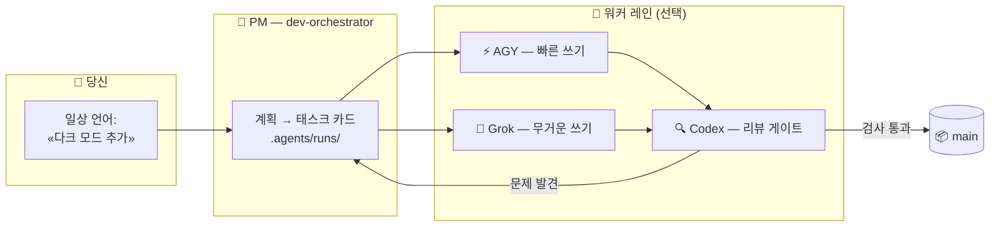

<div align="center">


# 🏭 Claude Lane Stack

### 혼자 쓰는 작은 AI 코딩 공장

**Claude Code를 위한 멀티 에이전트 오케스트레이션** — 당신은 하나의 AI 에이전트, 즉 프로젝트 매니저와 대화하고,
매니저가 선택적 워커(AGY / Grok / Codex)에게 일을 나눠주고, 결과물을 리뷰한 뒤
**완성된 코드를 `main`에 머지해요**. 다섯 개의 채팅도, 수동 머지도 없어요.

[](LICENSE)
[](https://github.com/VKirill/claude-lane-stack/releases)
[](https://docs.anthropic.com/en/docs/claude-code)
[](docs/BEGINNER.ko.md)
[](https://t.me/pomogay_marketing)

🌍 **README:** [English](README.md) · [Русский](README.ru.md) · [简体中文](README.zh-CN.md) · [日本語](README.ja.md) · [Español](README.es.md) · [Deutsch](README.de.md) · [Français](README.fr.md) · [Português](README.pt-BR.md)
🐣 **초보자 가이드:** [EN](docs/BEGINNER.md) · [RU](docs/BEGINNER.ru.md) · [中文](docs/BEGINNER.zh-CN.md) · [日本語](docs/BEGINNER.ja.md) · [ES](docs/BEGINNER.es.md) · [DE](docs/BEGINNER.de.md) · [FR](docs/BEGINNER.fr.md) · [PT](docs/BEGINNER.pt-BR.md)

</div>

---

## 📌 목차

- 왜 필요한가 · 누구를 위한 것인가 · 어떻게 작동하나
- 빠른 시작 · 태스크 카드 · 머지는 당신이 하지 않아요
- 치트 시트 · 프로파일 · FAQ · 문서

<!-- v1.2.0-whats-new -->

---

## 🆕 v1.2.0 현재 기능 요약

| 기능 | 설명 |
|------|------|
| 🧭 **Onboard 2.0** | **minimal / full** 시나리오 + **fast / deep** 깊이 (성숙 레포는 deep) |
| 🔬 Deep | 엔트리포인트, 플로우, wiki↔코드, 실제 테스트, 배포, 시크릿 이름만 |
| 🏃 **lane-bg / lane-wait** | Claude foreground Bash ~2분 종료 → 긴 레인은 detach 필수 |
| 🔥 **lane-session** | AGY/Grok이 run별 대화를 이어가며 최대 3개 슬롯으로 병렬 실행 |
| ⏱️ **lane-exec** | 활동 기반 idle + 절대 max (detach 프로세스) |
| 🧠 모델 | GPT-**5.6** Sol / Terra / Luna 만 (5.5 없음). 파일은 영어 |
| 🚀 명령 | `/project-onboard` · `/project-onboard deep` |

[ONBOARD-SCENARIOS.md](docs/ONBOARD-SCENARIOS.md) · [LANE-EXEC.md](docs/LANE-EXEC.md) · [Release](https://github.com/VKirill/claude-lane-stack/releases/tag/v1.2.0)


---

## 💡 왜 필요한가

AI 코딩 도구로 일하면 보통 이런 모습이에요: 다섯 개의 채팅 창, 복사-붙여넣기한 코드 조각, 한밤중에 손으로 머지하는 브랜치, 그리고 아무도 서로의 작업을 확인하지 않는 상태.

**Claude Lane Stack은 이것을 컨베이어로 바꿔요:**

| 😩 다섯 개의 채팅 | 🏭 Lane Stack |
|---------------|---------------|
| 모델마다 컨텍스트를 다시 설명해요 | PM 하나가 컨텍스트를 쥐고, 워커는 **태스크 카드**를 받아요 |
| 모델이 서로의 파일을 덮어써요 | 카드마다 **소유 경로**가 적혀 있어요 — 워커는 자기 레인을 지켜요 |
| AI 코드를 아무도 리뷰하지 않아요 | 전담 **리뷰 레인**(Codex)이 모든 머지를 통제해요 |
| 브랜치를 직접 머지해요 | 검사가 통과하면 PM이 **`main`**에 머지해요 |
| 다음 날 아침: "우리 뭐 하고 있었지?" | `/resume-project` — 지금 / 막힘 / 다음을 몇 초 만에 |

태스크 데이터베이스도 없고, 필수 클라우드 서비스도 없어요. **평범한 파일 + 평범한 git** — 모든 것을 저장소에서 들여다볼 수 있어요.

---

## 👥 누구를 위한 것인가

- 🧑‍💻 **솔로 개발자** — 실제 프로젝트를 출시하면서 채팅 혼돈 없이 병렬 AI 워커로 에이전틱 코딩을 하고 싶은 사람
- 🚀 **인디 해커** — 브랜치를 돌보기보다 기능을 설명하는 편이 나은 사람
- 🧠 **바이브 코더** — *무엇을* 원하는지 알고 있으면, 공장이 *어떻게*를 처리해요
- 🏢 **1인 에이전시** — 여러 클라이언트 저장소를 같은 규율로 운영하는 경우

> [!TIP]
> "오케스트레이션"이라는 말을 처음 들어보나요? **[초보자 가이드](docs/BEGINNER.ko.md)**부터 시작하세요 — 모든 것을 작은 공장에 비유해서, 전문 용어 없이 설명해요.

---

## 🧩 어떻게 작동하나

<div align="center">

</div>

당신은 **하나의 에이전트** — 프로젝트 매니저 `dev-orchestrator`와 대화해요. 이 에이전트가 레인들로 작업을 분배해요:



| 역할 | 누구 | 하는 일 |
|------|-----|--------------|
| 👑 오너 | **당신** | *무엇을* 원하는지 말해요 — 어떤 언어로든 |
| 🤖 프로젝트 매니저 | Claude Code 에이전트 `dev-orchestrator` | 계획하고, 배정하고, 검증하고, **머지해요** |
| ⚡🔧 쓰기 레인 | AGY, Grok *(선택)* | 태스크 카드를 구현해요 |
| 🔍 리뷰 레인 | Codex *(선택)* | 독립적인 품질 게이트 |
| 🗂️ 태스크 카드 | `.agents/runs/`의 YAML 파일 | 공장 작업장 — 전부 열어볼 수 있어요 |
| 📦 공식 코드 | Git 브랜치 **`main`** | 모든 성공한 작업이 끝나는 곳 |

> [!NOTE]
> **Claude Code만 있으면 돼요.** 워커가 없어도 괜찮아요 — `agents-doctor`가 설치된 것을 감지하고, PM이 순수 `claude-only` 모드까지 알아서 맞춰요.

---

## 🚀 빠른 시작 (명령어 3개)

```bash
# 1️⃣  스택 설치 — 컴퓨터당 한 번
git clone https://github.com/VKirill/claude-lane-stack.git
cd claude-lane-stack && ./install.sh
export PATH="$HOME/.agents/bin:$PATH"        # 또는 새 터미널을 열어요

# 2️⃣  당신의 프로젝트에서 — 사용 가능한 워커를 감지, 저장소당 한 번
cd /path/to/your-project
agents-doctor --apply .

# 3️⃣  PM을 시작하고 평소처럼 대화해요
claude --agent dev-orchestrator
```

프로젝트에서 처음이라면, 채팅 안에서: **`/project-onboard`** — 저장소의 '여권'을 작성해요(`CLAUDE.md`, 시작 문서).
잠시 쉬었다가 돌아오면: **`/resume-project`** — 지금 / 막힘 / 다음.

> [!IMPORTANT]
> `/resume-project`는 이후 세션을 위한 *"다시 오신 걸 환영해요"* 명령어이지, 설치 단계가 **아니에요**.

📖 쉬운 말로 된 전체 안내: **[docs/BEGINNER.ko.md](docs/BEGINNER.ko.md)**

---

## 📋 태스크 카드: 워커가 자기 레인을 지키는 방법

<div align="center">

</div>

모든 작업은 `.agents/runs/`에 있는 작은 **YAML 계약**이에요 — PM이 만들고, 워커가 따라요:

```yaml
task: add-dark-mode
goal: 설정 페이지의 다크 테마 토글
owns_paths:            # 🔒 이 워커가 건드릴 수 있는 유일한 파일들
  - src/settings/**
  - src/theme.css
verify:
  - npm test
  - npm run lint
lane: agy-implementer  # 누가 실행하는가
review: codex-reviewer # 누가 머지를 통과시키는가
```

- 🔒 `owns_paths` — 병렬 워커가 **충돌할 수 없어요**: 워커가 벗어나면 `check-owns-paths`가 태스크를 실패 처리해요
- ✅ `verify` — 검사가 통과할 때까지 머지가 막혀요
- 📜 카드는 git 히스토리에 남아요 — 어떤 에이전트가 무엇을 왜 했는지에 대한 완전한 감사 기록

자세히: [docs/FILE-CONTRACT.md](docs/FILE-CONTRACT.md)

---

## 📦 머지는 당신이 하지 않아요 — PM이 해요

<div align="center">

</div>

모든 성공한 작업의 끝은 똑같아요: **검증된 코드가 `main`에 안착해요** — 리뷰와 검사를 마친 뒤 오케스트레이터가 `wt-merge-main`으로 머지해요. 워커는 격리된 **git 워크트리**에서 작업하므로, 병렬 작업이 서로를 밟는 일이 없어요.

> [!WARNING]
> 에이전트가 브랜치 정리를 *당신에게* 요청한다면 — 그건 흐름의 버그이지 당신이 할 잡일이 아니에요. PM에게 말하세요: *«머지는 네 일이야»*.

솔로 오케스트레이션 규칙: [docs/SOLO-ORCHESTRATION.md](docs/SOLO-ORCHESTRATION.md)

---

## 🧾 명령어 치트 시트

### 당신이 입력하는 것

| 명령어 / 문구 | 무엇인지 | 언제 |
|------------------|------------|------|
| `./install.sh` | 공장 키트를 `~/.agents`에 설치 | 컴퓨터당 한 번 |
| `agents-doctor --apply .` | CLI 감지 → 라우팅 프로파일 작성 | 프로젝트당 한 번 |
| `claude --agent dev-orchestrator` | **필요한 유일한 채팅**을 열기 | 매 세션 |
| `/project-onboard` | Codex로 저장소 여권 작성 (CLAUDE.md + 문서) | 저장소에서 처음 |
| *«설정에 다크 모드 추가»* | 작업 요청 — 어떤 언어로든 | 기능 & 수정 |
| `/resume-project` | 지금 / 막힘 / 다음 | 쉬고 난 뒤 |
| *«막혔어»* | PM이 조용한 워커를 확인 | 오랜 침묵 |

<details>
<summary>🤖 <b>보통 PM만 입력하는 것</b></summary>

| 명령어 | 무엇인지 |
|---------|------------|
| `run-board` | 작업 점수판 새로고침 |
| `wt-create` / `wt-merge-main` | 격리된 워크트리 + **`main`으로 머지** |
| `check-owns-paths` | 워커가 자기 파일 목록 안에 머물렀나? |
| `lane-heartbeat` / `lane-stall-check` | 워커가 살아 있나? 누가 조용해졌나? |
| `project-memory-init` | PROGRESS / LESSONS 메모리 파일 생성 |
| `night-audit` | 실행과 문서에 대한 예약된 정리 |

</details>

---

## 🚦 역량 프로파일

`agents-doctor`는 발견한 CLI에 따라 다섯 가지 프로파일 중 하나를 작성하고, PM이 그에 맞게 라우팅해요:

| 프로파일 | 가진 것 | 쓰기 레인 | 리뷰 레인 |
|---------|----------|------------|-------------|
| `full` | AGY + Grok + Codex | AGY / Grok | Codex |
| `claude-agy` | AGY | AGY | Claude |
| `claude-grok` | Grok | Grok | Claude |
| `claude-codex` | Codex | Codex | Codex |
| `claude-only` | Claude Code만 | Claude 서브에이전트 | Claude 서브에이전트 |

```bash
agents-doctor            # 감지 리포트 표시
agents-doctor --apply .  # 프로파일을 프로젝트에 저장
```

더 보기: [profiles/README.md](profiles/README.md) · [docs/ROUTING.md](docs/ROUTING.md)

---

## 🧱 박스 안에 뭐가 들었나

```text
claude-lane-stack/
├── agents/        # 에이전트 정의: claude PM + agy / grok / codex 레인
├── bin/           # CLI 도구 11개: agents-doctor, run-board, wt-merge-main, …
├── skills/        # 스킬 11개: 오케스트레이션, 계약, 프로젝트 메모리, 온보딩
├── profiles/      # 라우팅 프로파일 5개 (full → claude-only)
├── hooks/         # 안전 훅: shell guard, code-quality guard, session ledger
├── templates/     # PROGRESS / LESSONS / decisions / session-log 템플릿
├── docs/          # 초보자 가이드 + 심화 설명 (아래 표 ↓)
└── install.sh     # 모든 것을 ~/.agents에 넣어요
```

그리고 온보딩 후 **당신의** 프로젝트 안에는:

```text
your-app/
├── CLAUDE.md          # 짧고 항상 켜져 있는 프로젝트 규칙
├── AGENTS.md          # 다른 도구를 위한 "CLAUDE.md를 읽어라" 포인터
├── .agents/runs/      # 🏭 공장 작업장 — 태스크 카드, 리포트, 머지 노트
└── docs/plans/        # 🧠 전략 문서 (공장 작업장이 아님)
```

---

## ❓ FAQ

<details>
<summary><b>AGY, Grok, Codex를 모두 설치해야 하나요?</b></summary>

아니요 — **Claude Code만 필수예요**. 나머지는 전부 선택적 워커예요. `agents-doctor`가 당신의 구성을 감지하고, PM이 `claude-only` 모드까지 알아서 맞춰요.

</details>

<details>
<summary><b>그냥 Claude Code와 뭐가 다른가요?</b></summary>

그냥 Claude Code는 채팅 하나 안에서 서브에이전트를 돌려요 — 한 컨텍스트, 한 벤더. Lane Stack은 **관리 계층**을 더해요: 파일 소유권이 있는 태스크 카드, 서로 다른 벤더에서 온 병렬 레인, 독립적인 리뷰 게이트, `main`으로의 자동 머지, 그리고 콜드 스타트 복구. 당신은 전략을, Lane Stack은 물류를 담당해요.

</details>

<details>
<summary><b>데이터베이스나 클라우드 서비스가 필요한가요?</b></summary>

아니요. 상태는 **저장소 안의 평범한 파일**(`.agents/runs/`)과 git에 있어요. 모든 것을 읽고, diff하고, 감사할 수 있어요.

</details>

<details>
<summary><b>제 기존 프로젝트에서도 작동하나요?</b></summary>

네. `cd your-project && agents-doctor --apply .`를 실행한 뒤, `/project-onboard`가 기존 코드 위에 여권을 작성해요. 태스크 없이는 아무것도 다시 쓰이지 않아요.

</details>

<details>
<summary><b>워커가 작업 도중에 조용해지면요?</b></summary>

스택에는 `lane-heartbeat` / `lane-stall-check`가 들어 있어요 — PM이 멈춤을 감지하고 다시 배정해요. 언제든 *«막혔어»*라고 말하면 돼요.

</details>

<details>
<summary><b>제 코드는 안전한가요?</b></summary>

각 CLI는 단독으로 쓸 때와 똑같이 자기 벤더하고만 통신해요 — 스택은 **추가 서버를 두지 않아요**. 비밀 값은 태스크 파일에 두면 안 돼요; 민감한 영역(인증, 결제)은 리뷰 레인을 거칠 만해요. [SECURITY.md](SECURITY.md)를 보세요.

</details>

---

## 📚 문서 지도

| 주제 | 문서 |
|-------|-----|
| 🐣 쉬운 말 안내 | [docs/BEGINNER.ko.md](docs/BEGINNER.ko.md) |
| ⚖️ 대안 도구와 비교 | [docs/COMPARISON.md](docs/COMPARISON.md) |
| 🧑‍✈️ 솔로 규칙 — 왜 당신은 머지하지 않는가 | [docs/SOLO-ORCHESTRATION.md](docs/SOLO-ORCHESTRATION.md) |
| 🗂️ 태스크 카드 YAML 해부 | [docs/FILE-CONTRACT.md](docs/FILE-CONTRACT.md) |
| 🔀 누가 쓰고 / 누가 리뷰하는가 | [docs/ROUTING.md](docs/ROUTING.md) |
| 🛡️ 안전 훅 | [docs/HOOKS.md](docs/HOOKS.md) |
| 🧠 프로젝트 메모리 (PROGRESS / LESSONS) | [docs/PROJECT-MEMORY.md](docs/PROJECT-MEMORY.md) |
| 📝 아이디어 백로그 | [docs/TODOS.md](docs/TODOS.md) |<!-- guardian: allow — link to existing docs/TODOS.md file, not a new TODO marker -->
| 🔌 MCP 설정 (lean / hybrid) | [docs/MCP-LEAN.md](docs/MCP-LEAN.md) · [docs/MCP-HYBRID.md](docs/MCP-HYBRID.md) |
| 🤝 기여하기 | [CONTRIBUTING.md](CONTRIBUTING.md) |
| 🔐 보안 정책 | [SECURITY.md](SECURITY.md) |

---

## 📜 라이선스

MIT — [LICENSE](LICENSE). 쓰고, 포크하고, 당신만의 공장을 지으세요.

---

<div align="center">

<a href="https://github.com/VKirill"></a>

**Кирилл Вечкасов** · [@VKirill](https://github.com/VKirill) · Telegram: [Помогающий маркетолог](https://t.me/pomogay_marketing)

*저는 작동하는 컨베이어를 만들어요 — 또 하나의 LLM 채팅이 아니라.*

⭐ **컨베이어 아이디어가 와닿는다면 — 저장소에 별을 눌러주세요.** 솔로 빌더들이 이 프로젝트를 찾는 데 정말 도움이 돼요.

</div>
