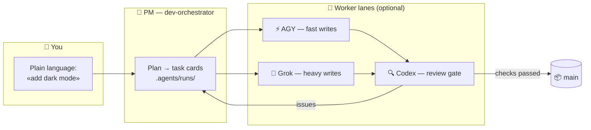

<div align="center">


# 🏭 Claude Lane Stack

### A small AI coding factory for one person · **v1.3.1**

**Multi-agent orchestration for Claude Code** — you talk to one AI project manager,
it dispatches optional workers (AGY / Grok / Codex), reviews their output
and **merges finished code to `main`**. No five chats. No manual merges.

[](LICENSE)
[](https://github.com/VKirill/claude-lane-stack/releases/tag/v1.3.1)
[](https://docs.anthropic.com/en/docs/claude-code)
[](docs/BEGINNER.md)
[](https://t.me/pomogay_marketing)

🌍 **README:** [Русский](README.ru.md) · [简体中文](README.zh-CN.md) · [日本語](README.ja.md) · [Español](README.es.md) · [Deutsch](README.de.md) · [Français](README.fr.md) · [한국어](README.ko.md) · [Português](README.pt-BR.md)  
🐣 **Beginner guide:** [EN](docs/BEGINNER.md) · [RU](docs/BEGINNER.ru.md) · [中文](docs/BEGINNER.zh-CN.md) · [日本語](docs/BEGINNER.ja.md) · [ES](docs/BEGINNER.es.md) · [DE](docs/BEGINNER.de.md) · [FR](docs/BEGINNER.fr.md) · [KO](docs/BEGINNER.ko.md) · [PT](docs/BEGINNER.pt-BR.md)

</div>

---

## 📌 Table of contents

- [Why this exists](#-why-this-exists) · [Who it's for](#-who-its-for) · [How it works](#-how-it-works)
- [Quick start](#-quick-start-3-commands) · [Onboard 2.0](#-onboard-20--scenario--depth) · [Lanes that finish](#-lanes-that-finish--background-survival) · [Progressive accept](#-progressive-accept--no-join-wait)
- [Task cards](#-task-cards-how-workers-stay-in-their-lane) · [You never merge](#-you-never-merge--the-pm-does)
- [Cheat sheet](#-commands-cheat-sheet) · [Profiles](#-capability-profiles) · [FAQ](#-faq) · [Docs](#-documentation-map)

---

## 💡 Why this exists

Working with AI coding tools usually looks like this: five chat windows, copy-pasted snippets, branches you merge by hand at midnight, and no one checking anyone's work.

**Claude Lane Stack turns that into a conveyor:**

| 😩 Five chats | 🏭 Lane Stack |
|---------------|---------------|
| You re-explain context to every model | One PM holds context, workers get **task cards** |
| Models overwrite each other's files | Each card lists **owned paths** — workers stay in their lane |
| Nobody reviews the AI's code | A dedicated **review lane** (Codex) gates every merge |
| You merge branches manually | The PM merges to **`main`** after checks pass |
| Next morning: "what were we doing?" | `/resume-project` — Now / Blocked / Next in seconds |
| Onboard is a thin CLAUDE stub | **Deep forensic passport** on mature repos |
| Long AGY/Grok runs die at ~2 min | **`lane-bg` + `lane-wait`** — detach + poll |
| Parallel tasks wait for the slowest | **Progressive accept** — `lane-poll` + `MODE=start/finish` |

No task database. No required cloud service. **Plain files + plain git** — everything is inspectable in your repo.

---

## 👥 Who it's for

- 🧑‍💻 **Solo developers** who want an agentic coding workflow — parallel AI agents without chat chaos
- 🚀 **Indie hackers** who'd rather describe features than babysit branches
- 🧠 **Vibe-coders** — you know *what* you want; the factory handles *how*
- 🏢 **A one-person agency** running several client repos with the same discipline

> [!TIP]
> Never heard the word "orchestration"? Start with the **[Beginner guide](docs/BEGINNER.md)** — it explains everything as a small factory, zero jargon.

---

## 🧩 How it works

<div align="center">

</div>

You talk to **one agent** — `dev-orchestrator`, the project manager. It routes work across lanes:



| Role | Who | What they do |
|------|-----|--------------|
| 👑 Owner | **You** | Say *what* you want (chat may be any language) |
| 🤖 Project manager | Claude Code agent `dev-orchestrator` | Plans, dispatches, verifies, **merges** |
| ⚡🔧 Write lanes | AGY, Grok *(optional)* | Implement task cards (detached via `lane-bg`) |
| 🔍 Review / write / onboard | Codex *(optional)* | Review gate, emergency write, **project passport** |
| 🗂️ Task cards | YAML in `.agents/runs/` | Factory floor — fully inspectable |
| 📦 Official code | Git branch **`main`** | Where every successful job ends |

**Language policy:** durable files (contracts, CLAUDE, reports, docs) are **English**. Chat with the human may be **Russian** (or your language) — the PM translates. See [docs/LANGUAGE.md](docs/LANGUAGE.md).

**Models (Codex):** GPT-**5.6** only — **Sol** (review / deep / high-risk), **Terra** (scoped write / docs), **Luna** (trivia only). No 5.5. See [docs/ROUTING.md](docs/ROUTING.md).

> [!NOTE]
> **Only Claude Code is required.** Missing workers are fine — `agents-doctor` detects what's installed and the PM adapts, down to pure `claude-only` mode.

---

## 🚀 Quick start (3 commands)

```bash
# 1️⃣  Install the stack — once per computer
git clone https://github.com/VKirill/claude-lane-stack.git
cd claude-lane-stack && git checkout v1.3.1   # or: main
./install.sh
export PATH="$HOME/.agents/bin:$PATH"        # or open a new terminal

# 2️⃣  In YOUR project — detect available workers, once per repo
cd /path/to/your-project
agents-doctor --apply .

# 3️⃣  Start the PM and talk normally
claude --agent dev-orchestrator
```

Then in chat:

| Command | When |
|---------|------|
| **`/project-onboard`** | First time on a repo — passport + docs (auto **minimal/full** + **fast/deep**) |
| **`/project-onboard deep`** | Force forensic analysis |
| **`/resume-project`** | Cold start after a break — Now / Blocked / Next |

> [!IMPORTANT]
> `/resume-project` is a *"welcome back"* command — **not** an installation step.

📖 Walkthrough: **[docs/BEGINNER.md](docs/BEGINNER.md)** · Release notes: **[v1.3.1](https://github.com/VKirill/claude-lane-stack/releases/tag/v1.3.1)**

---

## 🧭 Onboard 2.0 — scenario + depth

First-time setup is not a thin stub. **`project-onboard` + Codex** build a real passport.

### Axis 1 — Scenario (*what* to seed)

| | 🟢 **minimal** | 🟣 **full** |
|--|----------------|-------------|
| When | score &lt; 5 (small / greenfield) | score ≥ 5 or multi-package monorepo |
| Seeds | CLAUDE · AGENTS · ARCHITECTURE · memory · plans | + GOTCHAS · GLOSSARY · TESTING · deployment · nested `apps/*/CLAUDE.md` · SECURITY when domain-heavy |

### Axis 2 — Depth (*how hard* Codex digs)

| | ⚡ **fast** | 🔬 **deep** (default on full) |
|--|------------|--------------------------------|
| Explore | top dirs + manifests | entrypoints, top modules, 3–7 flows, wiki↔code, run tests |
| Model | `gpt-5.6-terra` high | `gpt-5.6-sol` high |
| Report | passport filled | MODULES_READ · FLOWS · WIKI_MISMATCHES · VERIFY |

```bash
project-onboard .                 # auto scenario + depth
project-onboard . --deep          # force forensic
project-onboard . --minimal --fast
```

Writes:

- `.agents/onboard.scenario.yaml` — `scenario` + `depth` + score  
- `.agents/runs/_onboard/artifacts/001/deep-scan.md` — evidence pack for Codex  
- Prefer **pointers** to existing wiki (`gotchas.md`) over UPPERCASE duplicates  

Full guide: [docs/ONBOARD-SCENARIOS.md](docs/ONBOARD-SCENARIOS.md)

---

## 🏃 Lanes that finish — background survival

Claude Code **kills foreground Bash around ~2 minutes**. That is a **host** limit, not `lane-exec`.

Long AGY / Grok / Codex jobs **must** detach:

```bash
# 1) Start detached (returns immediately)
lane-bg --dir "$ARTIFACT_DIR" --label agy-frontend -- \
  lane-exec --idle 600 --max 5400 --log "$ARTIFACT_DIR/lane-exec.log" -- \
  lane-session run --provider agy --run-dir "$RUN_DIR" --task-id "$TASK_ID" \
    --role lane-frontend --cwd "$PROJECT_CWD" --prompt-file "$SPEC" \
    --output "$ARTIFACT_DIR/lane-final.log" --model "Gemini 3.5 Flash (High)"

# 2) Poll with short Bash (safe)
lane-wait --dir "$ARTIFACT_DIR" --once   # exit 2 = running, 0 = done
```

| Tool | Role |
|------|------|
| **`lane-bg`** | nohup detach — job survives Bash death |
| **`lane-wait`** | short status polls |
| **`lane-exec`** | activity-aware idle + absolute max **on the detached process** |
| **`lane-session`** | resumes run-scoped AGY/Grok context; three-slot parallel pool |

Implementers and `dev-orchestrator` are instructed to use this pattern. Details: [docs/LANE-EXEC.md](docs/LANE-EXEC.md)

AGY and Grok no longer relearn the repository on every task in a run. The first
task creates a conversation; later related tasks resume it. A busy conversation
is never shared concurrently—parallel tasks lease another slot (up to three).
Sessions rotate after seven successful tasks by default, on failure, or when the
worktree/model changes. Codex review stays independent and does not reuse writer
context.

---


## ⚡ Progressive accept — no join-wait

Multi-task runs no longer wait for the **slowest** concurrent lane before accepting finished ones.

1. Implementer **`MODE=start`** → `lane-bg` only, returns immediately  
2. PM **`lane-poll --run-dir …`** → see which tasks are `finish_ready`  
3. Implementer **`MODE=finish`** → write `report.md` → **accept now** → free slot  
4. Pipeline the next ready task (still ≤3 concurrent writers)

Single-task / micro still uses **`MODE=full`**. See [docs/LANE-EXEC.md](docs/LANE-EXEC.md) · [skills/orchestrator-lanes](skills/orchestrator-lanes/SKILL.md).

## 📋 Task cards: how workers stay in their lane

<div align="center">

</div>

Every job is a small **YAML contract** in `.agents/runs/` — created by the PM, obeyed by workers (**English**):

```yaml
task: add-dark-mode
goal: Dark theme toggle on the settings page
owns_paths:            # 🔒 the ONLY files this worker may touch
  - src/settings/**
  - src/theme.css
verify:
  - npm test
  - npm run lint
lane: agy-implementer  # who executes
review: codex-reviewer # who gates the merge
```

- 🔒 `owns_paths` — parallel workers **can't collide**: `check-owns-paths` fails the task if a worker strays  
- ✅ `verify` — merge is blocked until checks pass  
- 📜 Cards stay in git history — audit trail of what every agent did  

Details: [docs/FILE-CONTRACT.md](docs/FILE-CONTRACT.md)

---

## 📦 You never merge — the PM does

<div align="center">

</div>

The end of every successful job is the same: **verified code lands on `main`**, merged by the orchestrator via `wt-merge-main` after review and checks. Workers build in isolated **git worktrees**.

> [!WARNING]
> If an agent ever asks *you* to resolve branches — that's a bug in the flow. Tell the PM: *«merging is your job»*.

Rules: [docs/SOLO-ORCHESTRATION.md](docs/SOLO-ORCHESTRATION.md)

---

## 🧾 Commands cheat-sheet

### You type these

| Command / phrase | What it is | When |
|------------------|------------|------|
| `./install.sh` | Install kit into `~/.agents` | Once per computer |
| `agents-doctor --apply .` | Detect CLIs → routing profile | Once per project |
| `claude --agent dev-orchestrator` | **The only chat you need** | Every session |
| `/project-onboard` | Passport via Codex (scenario + depth auto) | First time on a repo |
| `/project-onboard deep` | Force forensic onboard | Mature / messy repos |
| *«Add dark mode…»* | Work request — any language | Features & fixes |
| `/resume-project` | Now / Blocked / Next | After a break |
| *«It's stuck»* | PM checks silent workers | Long silence |

<details>
<summary>🤖 <b>Usually only the PM / implementers type these</b></summary>

| Command | What it is |
|---------|------------|
| `run-board` | Job scoreboard |
| `lane-session status --run-dir .agents/runs/<slug>` | Inspect that run's AGY/Grok session pool |
| `wt-create` / `wt-merge-main` | Worktree + **merge into `main`** |
| `check-owns-paths` | Did the worker stay in its file list? |
| `lane-bg` / `lane-wait` / **`lane-poll`** | Detach long lane + single/multi poll (progressive accept) |
| `lane-exec` | Activity-aware idle/max wrapper |
| `lane-heartbeat` / `lane-stall-check` | Alive? Silent? |
| `project-onboard` | Shell seed + deep-scan (Codex fills) |
| `docs-maintain-project` | Nightly/daily docs honesty |
| `project-memory-init` | PROGRESS / LESSONS |
| `night-audit` | Housekeeping |

</details>

---

## 🚦 Capability profiles

`agents-doctor` writes one of five profiles:

| Profile | You have | Write lane | Review lane |
|---------|----------|------------|-------------|
| `full` | AGY + Grok + Codex | AGY / Grok | Codex Sol |
| `claude-agy` | AGY | AGY | Claude |
| `claude-grok` | Grok | Grok | Claude |
| `claude-codex` | Codex | Codex Terra/Sol | Codex Sol |
| `claude-only` | Claude Code only | Claude subagents | Claude subagents |

```bash
agents-doctor            # report
agents-doctor --apply .  # save into project
```

More: [profiles/README.md](profiles/README.md) · [docs/ROUTING.md](docs/ROUTING.md)

---

## 🧱 What's in the box

```text
claude-lane-stack/
├── agents/        # claude PM + agy / grok / codex lanes (implementers, onboard, review)
├── bin/           # agents-doctor, project-onboard, lane-bg, lane-wait, lane-poll, lane-exec, lane-session,
│                  # wt-*, run-board, docs-maintain-*, …
├── skills/        # orchestration, contracts, memory, onboard, antigravity, …
├── profiles/      # full → claude-only
├── hooks/         # shell guard, code-quality, session ledger
├── templates/     # ARCHITECTURE, GOTCHAS, TESTING, deployment, README anamnesis, …
├── docs/          # beginner + deep dives (table below)
└── install.sh     # → ~/.agents
```

Inside **your** project after onboard:

```text
your-app/
├── CLAUDE.md                      # always-on rules (≤200 lines body)
├── AGENTS.md                      # pointer → CLAUDE.md
├── PROGRESS.md / LESSONS.md       # living memory
├── .agents/
│   ├── onboard.scenario.yaml      # scenario + depth + score
│   ├── routing.profile.yaml       # agents-doctor
│   └── runs/                      # 🏭 factory floor
└── docs/                          # architecture, gotchas, deployment, plans/…
```

---

## ❓ FAQ

<details>
<summary><b>Do I need AGY, Grok and Codex all installed?</b></summary>

No — **only Claude Code is required**. Everything else is optional. `agents-doctor` adapts down to `claude-only`.

</details>

<details>
<summary><b>How is this different from plain Claude Code?</b></summary>

Plain Claude is one worker in one chat. Lane Stack adds **management**: task cards with ownership, multi-vendor lanes, independent review, auto-merge to `main`, deep onboard, cold-start recovery.

</details>

<details>
<summary><b>My AGY run dies after ~2 minutes — is that lane-exec?</b></summary>

Usually **no**. Claude kills **foreground Bash** ~2 min. Fix: implementers must use **`lane-bg`** + **`lane-wait`**. See [docs/LANE-EXEC.md](docs/LANE-EXEC.md). After upgrading, start a **fresh** dev-orchestrator session.

</details>

<details>
<summary><b>minimal vs full vs deep — which do I pick?</b></summary>

Usually nothing — **auto**. Toy repo → minimal + fast. Mature monorepo → full + deep. Override with `/project-onboard deep` or `project-onboard . --full --deep`.

</details>

<details>
<summary><b>Does it need a database or cloud service?</b></summary>

No. State is **files in your repo** (`.agents/runs/`) + git.

</details>

<details>
<summary><b>Will it work on my existing project?</b></summary>

Yes. `agents-doctor --apply .` then `/project-onboard`. Existing wiki pages are **linked**, not blindly duplicated (`gotchas.md` wins over `GOTCHAS.md`).

</details>

<details>
<summary><b>Is my code safe?</b></summary>

Each CLI talks only to its own vendor. No extra servers. Don't put secrets in task YAML; use the review lane for auth/pay. [SECURITY.md](SECURITY.md).

</details>

---

## 📚 Documentation map

| Topic | Doc |
|-------|------|
| 🐣 Plain-language walkthrough | [docs/BEGINNER.md](docs/BEGINNER.md) |
| 🧭 Onboard scenarios + depth | [docs/ONBOARD-SCENARIOS.md](docs/ONBOARD-SCENARIOS.md) |
| ⏱️ Lane timeouts + background | [docs/LANE-EXEC.md](docs/LANE-EXEC.md) |
| 🌐 Language policy (EN files / RU chat) | [docs/LANGUAGE.md](docs/LANGUAGE.md) |
| 🔀 Who writes / who reviews (Sol/Terra) | [docs/ROUTING.md](docs/ROUTING.md) |
| ⚖️ Comparison with alternatives | [docs/COMPARISON.md](docs/COMPARISON.md) |
| 🧑‍✈️ Solo rules — you never merge | [docs/SOLO-ORCHESTRATION.md](docs/SOLO-ORCHESTRATION.md) |
| 🗂️ Task card YAML | [docs/FILE-CONTRACT.md](docs/FILE-CONTRACT.md) |
| 🛡️ Safety hooks | [docs/HOOKS.md](docs/HOOKS.md) |
| 🧠 Project memory | [docs/PROJECT-MEMORY.md](docs/PROJECT-MEMORY.md) |
| 📝 Ideas backlog | [docs/TODOS.md](docs/TODOS.md) |<!-- guardian: allow — link to existing docs/TODOS.md file, not a new TODO marker -->
| 🔌 MCP (lean / hybrid) | [docs/MCP-LEAN.md](docs/MCP-LEAN.md) · [docs/MCP-HYBRID.md](docs/MCP-HYBRID.md) |
| 📰 Changelog | [CHANGELOG.md](CHANGELOG.md) |
| 🚀 Release v1.3.1 | [GitHub Releases](https://github.com/VKirill/claude-lane-stack/releases/tag/v1.3.1) |
| 🤝 Contributing | [CONTRIBUTING.md](CONTRIBUTING.md) |
| 🔐 Security | [SECURITY.md](SECURITY.md) |

---

## 📜 License

MIT — [LICENSE](LICENSE). Use it, fork it, build your own factory.

---

<div align="center">

<a href="https://github.com/VKirill"></a>

**Кирилл Вечкасов** · [@VKirill](https://github.com/VKirill) · Telegram: [Помогающий маркетолог](https://t.me/pomogay_marketing)

*I build working conveyors, not another chat with an LLM.*

⭐ **If the conveyor idea clicks — star the repo.** It helps solo builders find it.

</div>
