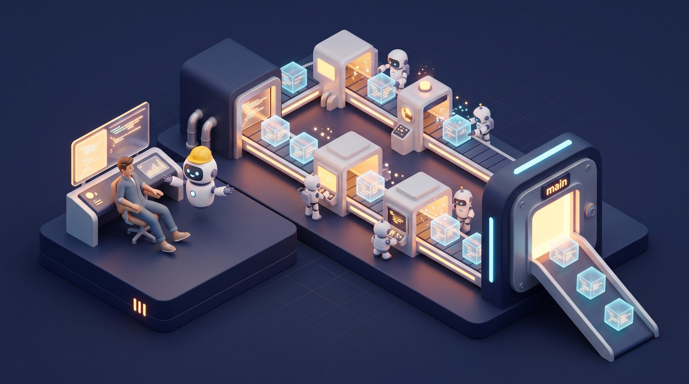
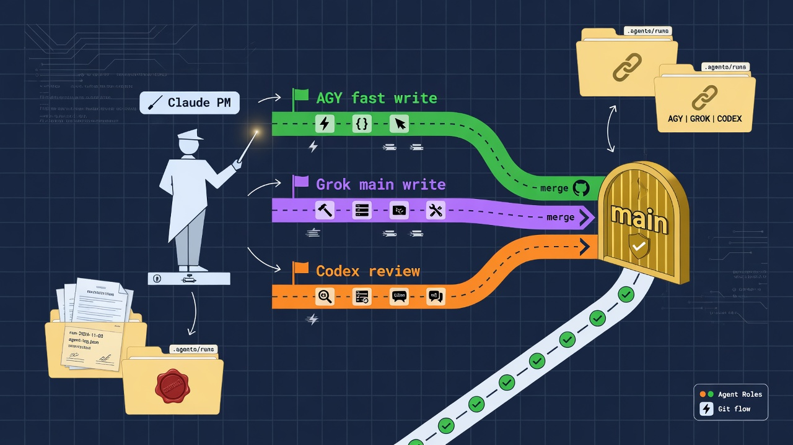
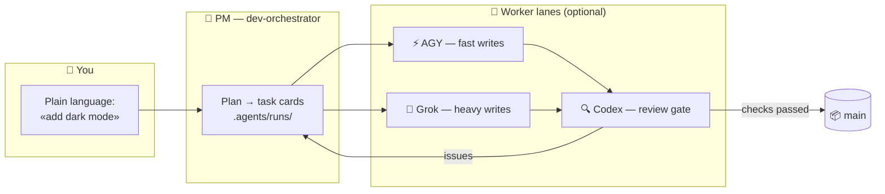
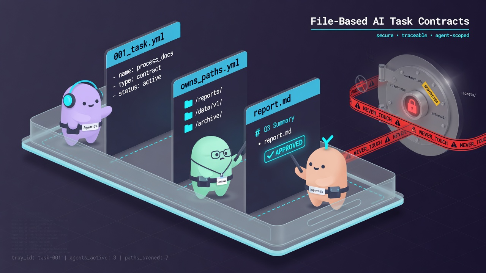
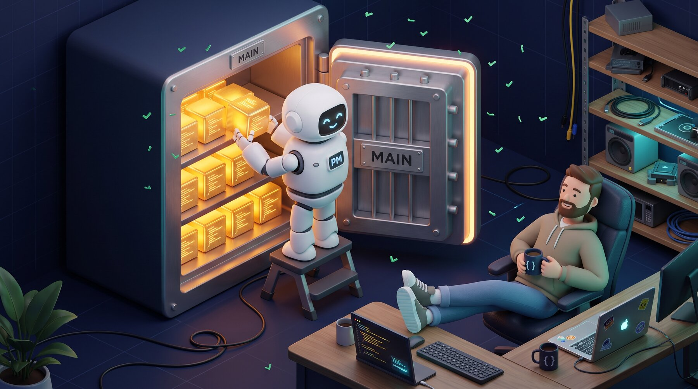

<div align="center">



# 🏭 Claude Lane Stack

### A small AI coding factory for one person

**Multi-agent orchestration for Claude Code** — you talk to one AI project manager,
it dispatches optional workers (AGY / Grok / Codex), reviews their output
and **merges finished code to `main`**. No five chats. No manual merges.

[](LICENSE)
[](https://github.com/VKirill/claude-lane-stack/releases)
[](https://docs.anthropic.com/en/docs/claude-code)
[](docs/BEGINNER.md)
[](https://t.me/pomogay_marketing)

🌍 **README:** [Русский](README.ru.md) · [简体中文](README.zh-CN.md) · [日本語](README.ja.md) · [Español](README.es.md) · [Deutsch](README.de.md) · [Français](README.fr.md) · [한국어](README.ko.md) · [Português](README.pt-BR.md)
🐣 **Beginner guide:** [EN](docs/BEGINNER.md) · [RU](docs/BEGINNER.ru.md) · [中文](docs/BEGINNER.zh-CN.md) · [日本語](docs/BEGINNER.ja.md) · [ES](docs/BEGINNER.es.md) · [DE](docs/BEGINNER.de.md) · [FR](docs/BEGINNER.fr.md) · [KO](docs/BEGINNER.ko.md) · [PT](docs/BEGINNER.pt-BR.md)

</div>

---

## 📌 Table of contents

- [Why this exists](#-why-this-exists) · [Who it's for](#-who-its-for) · [How it works](#-how-it-works)
- [Quick start](#-quick-start-3-commands) · [Task cards](#-task-cards-how-workers-stay-in-their-lane) · [You never merge](#-you-never-merge--the-pm-does)
- [Cheat sheet](#-commands-cheat-sheet) · [Profiles](#-capability-profiles) · [FAQ](#-faq) · [Docs](#-documentation-map)

---

## 💡 Why this exists

Working with AI coding tools usually looks like this: five chat windows, copy-pasted snippets, branches you merge by hand at midnight, and no one checking anyone's work.

**Claude Lane Stack turns that into a conveyor:**

| 😩 Five chats | 🏭 Lane Stack |
|---------------|---------------|
| You re-explain context to every model | One PM holds context, workers get **task cards** |
| Models overwrite each other's files | Each card lists **owned paths** — workers stay in their lane |
| Nobody reviews the AI's code | A dedicated **review lane** (Codex) gates every merge |
| You merge branches manually | The PM merges to **`main`** after checks pass |
| Next morning: "what were we doing?" | `/resume-project` — Now / Blocked / Next in seconds |

No task database. No required cloud service. **Plain files + plain git** — everything is inspectable in your repo.

---

## 👥 Who it's for

- 🧑‍💻 **Solo developers** who want an agentic coding workflow — parallel AI agents without chat chaos
- 🚀 **Indie hackers** who'd rather describe features than babysit branches
- 🧠 **Vibe-coders** — you know *what* you want; the factory handles *how*
- 🏢 **A one-person agency** running several client repos with the same discipline

> [!TIP]
> Never heard the word "orchestration"? Start with the **[Beginner guide](docs/BEGINNER.md)** — it explains everything as a small factory, zero jargon.

---

## 🧩 How it works

<div align="center">

</div>

You talk to **one agent** — `dev-orchestrator`, the project manager. It routes work across lanes:



| Role | Who | What they do |
|------|-----|--------------|
| 👑 Owner | **You** | Say *what* you want, in any language |
| 🤖 Project manager | Claude Code agent `dev-orchestrator` | Plans, dispatches, verifies, **merges** |
| ⚡🔧 Write lanes | AGY, Grok *(optional)* | Implement task cards |
| 🔍 Review lane | Codex *(optional)* | Independent quality gate |
| 🗂️ Task cards | YAML files in `.agents/runs/` | The factory floor — fully inspectable |
| 📦 Official code | Git branch **`main`** | Where every successful job ends |

> [!NOTE]
> **Only Claude Code is required.** Missing workers are fine — `agents-doctor` detects what's installed and the PM adapts, down to a pure `claude-only` mode.

---

## 🚀 Quick start (3 commands)

```bash
# 1️⃣  Install the stack — once per computer
git clone https://github.com/VKirill/claude-lane-stack.git
cd claude-lane-stack && ./install.sh
export PATH="$HOME/.agents/bin:$PATH"        # or open a new terminal

# 2️⃣  In YOUR project — detect available workers, once per repo
cd /path/to/your-project
agents-doctor --apply .

# 3️⃣  Start the PM and talk normally
claude --agent dev-orchestrator
```

First time on a project, inside the chat: **`/project-onboard`** — writes the repo's passport (`CLAUDE.md`, starter docs).
Coming back after a break: **`/resume-project`** — Now / Blocked / Next.

> [!IMPORTANT]
> `/resume-project` is a *"welcome back"* command for later sessions — **not** an installation step.

📖 Full plain-language walkthrough: **[docs/BEGINNER.md](docs/BEGINNER.md)**

---

## 📋 Task cards: how workers stay in their lane

<div align="center">

</div>

Every job is a small **YAML contract** in `.agents/runs/` — created by the PM, obeyed by workers:

```yaml
task: add-dark-mode
goal: Dark theme toggle on the settings page
owns_paths:            # 🔒 the ONLY files this worker may touch
  - src/settings/**
  - src/theme.css
verify:
  - npm test
  - npm run lint
lane: agy-implementer  # who executes
review: codex-reviewer # who gates the merge
```

- 🔒 `owns_paths` — parallel workers **can't collide**: `check-owns-paths` fails the task if a worker strays
- ✅ `verify` — merge is blocked until checks pass
- 📜 Cards stay in git history — a full audit trail of what every agent did and why

Details: [docs/FILE-CONTRACT.md](docs/FILE-CONTRACT.md)

---

## 📦 You never merge — the PM does

<div align="center">

</div>

The end of every successful job is the same: **verified code lands on `main`**, merged by the orchestrator via `wt-merge-main` after review and checks. Workers build in isolated **git worktrees**, so parallel jobs never trample each other.

> [!WARNING]
> If an agent ever asks *you* to resolve branches — that's a bug in the flow, not a chore for you. Tell the PM: *«merging is your job»*.

Solo-orchestration rules: [docs/SOLO-ORCHESTRATION.md](docs/SOLO-ORCHESTRATION.md)

---

## 🧾 Commands cheat-sheet

### You type these

| Command / phrase | What it is | When |
|------------------|------------|------|
| `./install.sh` | Install the factory kit into `~/.agents` | Once per computer |
| `agents-doctor --apply .` | Detect CLIs → write routing profile | Once per project |
| `claude --agent dev-orchestrator` | Open the **only chat you need** | Every session |
| `/project-onboard` | Repo passport via Codex (CLAUDE.md + docs) | First time on a repo |
| *«Add dark mode to settings»* | A work request — any language | Features & fixes |
| `/resume-project` | Now / Blocked / Next | After a break |
| *«It's stuck»* | PM checks silent workers | Long silence |

<details>
<summary>🤖 <b>Usually only the PM types these</b></summary>

| Command | What it is |
|---------|------------|
| `run-board` | Refresh the job scoreboard |
| `wt-create` / `wt-merge-main` | Isolated worktree + **merge into `main`** |
| `check-owns-paths` | Did the worker stay inside its file list? |
| `lane-heartbeat` / `lane-stall-check` | Is the worker alive? Who went silent? |
| `project-memory-init` | Create PROGRESS / LESSONS memory files |
| `night-audit` | Scheduled housekeeping over runs & docs |

</details>

---

## 🚦 Capability profiles

`agents-doctor` writes one of five profiles depending on which CLIs it finds — the PM routes accordingly:

| Profile | You have | Write lane | Review lane |
|---------|----------|------------|-------------|
| `full` | AGY + Grok + Codex | AGY / Grok | Codex |
| `claude-agy` | AGY | AGY | Claude |
| `claude-grok` | Grok | Grok | Claude |
| `claude-codex` | Codex | Codex | Codex |
| `claude-only` | just Claude Code | Claude subagents | Claude subagents |

```bash
agents-doctor            # show detection report
agents-doctor --apply .  # save the profile into the project
```

More: [profiles/README.md](profiles/README.md) · [docs/ROUTING.md](docs/ROUTING.md)

---

## 🧱 What's in the box

```text
claude-lane-stack/
├── agents/        # agent definitions: claude PM + agy / grok / codex lanes
├── bin/           # 11 CLI tools: agents-doctor, run-board, wt-merge-main, …
├── skills/        # 11 skills: orchestration, contracts, project memory, onboarding
├── profiles/      # 5 routing profiles (full → claude-only)
├── hooks/         # safety hooks: shell guard, code-quality guard, session ledger
├── templates/     # PROGRESS / LESSONS / decisions / session-log templates
├── docs/          # beginner guide + deep dives (this table ↓)
└── install.sh     # puts everything into ~/.agents
```

And inside **your** project after onboarding:

```text
your-app/
├── CLAUDE.md          # short always-on project rules
├── AGENTS.md          # "read CLAUDE.md" pointer for other tools
├── .agents/runs/      # 🏭 factory floor — task cards, reports, merge notes
└── docs/plans/        # 🧠 strategy documents (not the factory floor)
```

---

## ❓ FAQ

<details>
<summary><b>Do I need AGY, Grok and Codex all installed?</b></summary>

No — **only Claude Code is required**. Everything else is an optional worker. `agents-doctor` detects your setup and the PM adapts, down to `claude-only` mode.

</details>

<details>
<summary><b>How is this different from plain Claude Code?</b></summary>

Plain Claude Code is one worker in one chat (subagents included). Lane Stack adds the **management layer** on top: task cards with file ownership, parallel agent lanes from different vendors, an independent review gate, automatic merge to `main`, and cold-start recovery. You do strategy; it does logistics.

</details>

<details>
<summary><b>Does it need a database or a cloud service?</b></summary>

No. State lives in **plain files inside your repo** (`.agents/runs/`) and in git. You can read, diff and audit everything.

</details>

<details>
<summary><b>Will it work on my existing project?</b></summary>

Yes. `cd your-project && agents-doctor --apply .`, then `/project-onboard` writes the passport around your existing code. Nothing is rewritten without a task.

</details>

<details>
<summary><b>What if a worker goes silent mid-task?</b></summary>

The stack ships `lane-heartbeat` / `lane-stall-check` — the PM detects stalls and re-dispatches. You can always say *«it's stuck»*.

</details>

<details>
<summary><b>Is my code safe?</b></summary>

Each CLI talks only to its own vendor, exactly as it would standalone — the stack adds **no extra servers**. Secrets don't belong in task files; sensitive areas (auth, payments) deserve the review lane. See [SECURITY.md](SECURITY.md).

</details>

---

## 📚 Documentation map

| Topic | Doc |
|-------|-----|
| 🐣 Plain-language walkthrough | [docs/BEGINNER.md](docs/BEGINNER.md) |
| 🧑‍✈️ Solo rules — why you never merge | [docs/SOLO-ORCHESTRATION.md](docs/SOLO-ORCHESTRATION.md) |
| 🗂️ Task card YAML anatomy | [docs/FILE-CONTRACT.md](docs/FILE-CONTRACT.md) |
| 🔀 Who writes / who reviews | [docs/ROUTING.md](docs/ROUTING.md) |
| 🛡️ Safety hooks | [docs/HOOKS.md](docs/HOOKS.md) |
| 🧠 Project memory (PROGRESS / LESSONS) | [docs/PROJECT-MEMORY.md](docs/PROJECT-MEMORY.md) |
| 📝 Ideas backlog | [docs/TODOS.md](docs/TODOS.md) |<!-- guardian: allow — link to existing docs/TODOS.md file, not a new TODO marker -->
| 🔌 MCP setups (lean / hybrid) | [docs/MCP-LEAN.md](docs/MCP-LEAN.md) · [docs/MCP-HYBRID.md](docs/MCP-HYBRID.md) |
| 🤝 Contributing | [CONTRIBUTING.md](CONTRIBUTING.md) |
| 🔐 Security policy | [SECURITY.md](SECURITY.md) |

---

## 📜 License

MIT — [LICENSE](LICENSE). Use it, fork it, build your own factory.

---

<div align="center">

<a href="https://github.com/VKirill"></a>

**Кирилл Вечкасов** · [@VKirill](https://github.com/VKirill) · Telegram: [Помогающий маркетолог](https://t.me/pomogay_marketing)

*I build working conveyors, not another chat with an LLM.*

⭐ **If the conveyor idea clicks — star the repo.** It genuinely helps solo builders find it.

</div>
