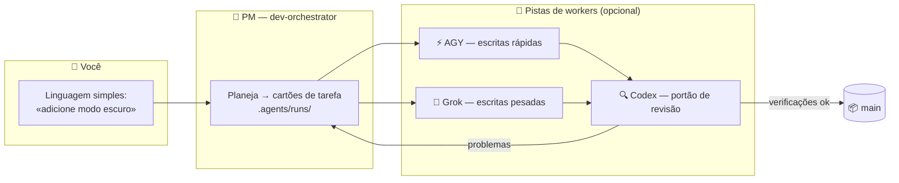

<div align="center">


# 🏭 Claude Lane Stack

### Uma pequena fábrica de código com IA para uma pessoa

**Orquestração multiagente para o Claude Code** — você fala com um único gerente de projeto de IA,
que aciona agentes de IA opcionais (AGY / Grok / Codex), revisa o que eles produzem
e **faz o merge do código pronto na `main`**. Sem cinco chats. Sem merges manuais.

[](LICENSE)
[](https://github.com/VKirill/claude-lane-stack/releases)
[](https://docs.anthropic.com/en/docs/claude-code)
[](docs/BEGINNER.pt-BR.md)
[](https://t.me/pomogay_marketing)

🌍 **README:** [English](README.md) · [Русский](README.ru.md) · [简体中文](README.zh-CN.md) · [日本語](README.ja.md) · [Español](README.es.md) · [Deutsch](README.de.md) · [Français](README.fr.md) · [한국어](README.ko.md)
🐣 **Guia para iniciantes:** [EN](docs/BEGINNER.md) · [RU](docs/BEGINNER.ru.md) · [中文](docs/BEGINNER.zh-CN.md) · [日本語](docs/BEGINNER.ja.md) · [ES](docs/BEGINNER.es.md) · [DE](docs/BEGINNER.de.md) · [FR](docs/BEGINNER.fr.md) · [KO](docs/BEGINNER.ko.md)

</div>

---

## 📌 Índice

- [Por que isto existe](#-por-que-isto-existe) · [Para quem é](#-para-quem-é) · [Como funciona](#-como-funciona)
- [Início rápido](#-início-rápido-3-comandos) · [Cartões de tarefa](#-cartões-de-tarefa-como-os-workers-ficam-na-sua-pista) · [Você nunca faz merge](#-você-nunca-faz-merge--quem-faz-é-o-pm)
- [Cola de comandos](#-cola-de-comandos) · [Perfis](#-perfis-de-capacidade) · [FAQ](#-faq) · [Documentação](#-mapa-da-documentação)

<!-- v1.3.0-whats-new -->

---

## 🆕 Novidades v1.3.0 (estado atual)

| Capacidade | O que faz |
|------------|-----------|
| 🧭 **Onboard 2.0** | Cenários **minimal / full** + profundidade **fast / deep** (full → deep) |
| 🔬 Deep | Entrypoints, fluxos, wiki↔código, testes reais, deploy, segredos (só nomes) |
| 🏃 **lane-bg / lane-wait** | Bash em foreground do Claude morre ~2 min → lanes longas vão detach |
| 🔥 **lane-session** | AGY/Grok retomam a conversa do run; até 3 slots paralelos |
| ⚡ **lane-poll / progressive** | Accept each task as it finishes — no join-wait on the slowest |
| ⏱️ **lane-exec** | idle por atividade + max absoluto no processo detached |
| 🧠 Modelos | Só GPT-**5.6** Sol / Terra / Luna (sem 5.5). Arquivos em inglês |
| 🚀 Comandos | `/project-onboard` · `/project-onboard deep` |

[ONBOARD-SCENARIOS.md](docs/ONBOARD-SCENARIOS.md) · [LANE-EXEC.md](docs/LANE-EXEC.md) · [Release](https://github.com/VKirill/claude-lane-stack/releases/tag/v1.3.0)


---

## 💡 Por que isto existe

Trabalhar com ferramentas de código com IA costuma ser assim: cinco janelas de chat, trechos copiados e colados, branches que você mergeia na mão à meia-noite e ninguém conferindo o trabalho de ninguém.

**O Claude Lane Stack transforma isso numa esteira:**

| 😩 Cinco chats | 🏭 Lane Stack |
|---------------|---------------|
| Você reexplica o contexto para cada modelo | Um PM guarda o contexto; os workers recebem **cartões de tarefa** |
| Os modelos sobrescrevem os arquivos uns dos outros | Cada cartão lista os **caminhos que possui** — os workers ficam na sua pista |
| Ninguém revisa o código da IA | Uma **pista de revisão** dedicada (Codex) controla cada merge |
| Você mergeia branches manualmente | O PM faz o merge na **`main`** depois que as verificações passam |
| Na manhã seguinte: "o que a gente estava fazendo?" | `/resume-project` — Agora / Bloqueado / Próximo em segundos |

Sem banco de dados de tarefas. Sem serviço de nuvem obrigatório. **Arquivos simples + git puro** — tudo é inspecionável no seu repositório.

---

## 👥 Para quem é

- 🧑‍💻 **Desenvolvedores solo** que entregam projetos reais e querem programação agêntica com vários workers de IA em paralelo, sem o caos dos chats
- 🚀 **Indie hackers** que preferem descrever funcionalidades a ficar de babá de branches
- 🧠 **Vibe-coders** — você sabe *o que* quer; a fábrica cuida do *como*
- 🏢 **Uma agência de uma pessoa só** tocando vários repositórios de clientes com a mesma disciplina

> [!TIP]
> Nunca ouviu a palavra "orquestração"? Comece pelo **[Guia para iniciantes](docs/BEGINNER.pt-BR.md)** — ele explica tudo como uma pequena fábrica, sem jargão nenhum.

---

## 🧩 Como funciona

<div align="center">

</div>

Você fala com **um único agente** — o `dev-orchestrator`, o gerente de projeto. Ele distribui o trabalho pelas pistas:



| Papel | Quem | O que faz |
|------|-----|--------------|
| 👑 Dono | **Você** | Diz *o que* quer, em qualquer idioma |
| 🤖 Gerente de projeto | Agente do Claude Code `dev-orchestrator` | Planeja, aciona, verifica, **faz o merge** |
| ⚡🔧 Pistas de escrita | AGY, Grok *(opcional)* | Implementam os cartões de tarefa |
| 🔍 Pista de revisão | Codex *(opcional)* | Portão de qualidade independente |
| 🗂️ Cartões de tarefa | Arquivos YAML em `.agents/runs/` | O chão de fábrica — totalmente inspecionável |
| 📦 Código oficial | Branch git **`main`** | Onde termina todo trabalho bem-sucedido |

> [!NOTE]
> **Só o Claude Code é obrigatório.** Não ter alguns workers não é problema — o `agents-doctor` detecta o que está instalado e o PM se adapta, até chegar ao modo puro `claude-only`.

---

## 🚀 Início rápido (3 comandos)

```bash
# 1️⃣  Instale o stack — uma vez por computador
git clone https://github.com/VKirill/claude-lane-stack.git
cd claude-lane-stack && ./install.sh
export PATH="$HOME/.agents/bin:$PATH"        # ou abra um novo terminal

# 2️⃣  No SEU projeto — detecte os workers disponíveis, uma vez por repositório
cd /path/to/your-project
agents-doctor --apply .

# 3️⃣  Inicie o PM e fale normalmente
claude --agent dev-orchestrator
```

Na primeira vez num projeto, dentro do chat: **`/project-onboard`** — escreve o passaporte do repositório (`CLAUDE.md`, documentos iniciais).
Voltando depois de uma pausa: **`/resume-project`** — Agora / Bloqueado / Próximo.

> [!IMPORTANT]
> `/resume-project` é um comando de *"bem-vindo de volta"* para sessões posteriores — **não** é uma etapa de instalação.

📖 Passo a passo completo em linguagem simples: **[docs/BEGINNER.pt-BR.md](docs/BEGINNER.pt-BR.md)**

---

## 📋 Cartões de tarefa: como os workers ficam na sua pista

<div align="center">

</div>

Todo trabalho é um pequeno **contrato YAML** em `.agents/runs/` — criado pelo PM, obedecido pelos workers:

```yaml
task: add-dark-mode
goal: Alternador de tema escuro na página de configurações
owns_paths:            # 🔒 os ÚNICOS arquivos que este worker pode tocar
  - src/settings/**
  - src/theme.css
verify:
  - npm test
  - npm run lint
lane: agy-implementer  # quem executa
review: codex-reviewer # quem controla o merge
```

- 🔒 `owns_paths` — workers em paralelo **não podem colidir**: o `check-owns-paths` reprova a tarefa se um worker sair da linha
- ✅ `verify` — o merge fica bloqueado até as verificações passarem
- 📜 Os cartões ficam no histórico do git — uma trilha de auditoria completa do que cada agente fez e por quê

Detalhes: [docs/FILE-CONTRACT.md](docs/FILE-CONTRACT.md)

---

## 📦 Você nunca faz merge — quem faz é o PM

<div align="center">

</div>

O fim de todo trabalho bem-sucedido é o mesmo: **código verificado chega na `main`**, mergeado pelo orquestrador via `wt-merge-main` depois da revisão e das verificações. Os workers constroem em **git worktrees** isolados, então trabalhos em paralelo nunca atropelam uns aos outros.

> [!WARNING]
> Se algum agente pedir para *você* resolver branches — isso é um bug no fluxo, não uma tarefa sua. Diga ao PM: *«fazer merge é trabalho seu»*.

Regras de orquestração solo: [docs/SOLO-ORCHESTRATION.md](docs/SOLO-ORCHESTRATION.md)

---

## 🧾 Cola de comandos

### Você digita estes

| Comando / frase | O que é | Quando |
|------------------|------------|------|
| `./install.sh` | Instala o kit de fábrica em `~/.agents` | Uma vez por computador |
| `agents-doctor --apply .` | Detecta as CLIs → escreve o perfil de roteamento | Uma vez por projeto |
| `claude --agent dev-orchestrator` | Abre o **único chat de que você precisa** | Toda sessão |
| `/project-onboard` | Passaporte do repositório via Codex (CLAUDE.md + docs) | Primeira vez num repositório |
| *«Adicione modo escuro nas configurações»* | Um pedido de trabalho — em qualquer idioma | Funcionalidades e correções |
| `/resume-project` | Agora / Bloqueado / Próximo | Depois de uma pausa |
| *«Travou»* | O PM verifica os workers silenciosos | Silêncio longo |

<details>
<summary>🤖 <b>Normalmente só o PM digita estes</b></summary>

| Comando | O que é |
|---------|------------|
| `run-board` | Atualiza o placar de trabalhos |
| `wt-create` / `wt-merge-main` | Worktree isolado + **merge na `main`** |
| `check-owns-paths` | O worker ficou dentro da sua lista de arquivos? |
| `lane-heartbeat` / `lane-stall-check` | O worker está vivo? Quem ficou em silêncio? |
| `project-memory-init` | Cria os arquivos de memória PROGRESS / LESSONS |
| `night-audit` | Faxina agendada sobre runs e docs |

</details>

---

## 🚦 Perfis de capacidade

O `agents-doctor` escreve um de cinco perfis dependendo de quais CLIs ele encontra — e o PM roteia de acordo:

| Perfil | Você tem | Pista de escrita | Pista de revisão |
|---------|----------|------------|-------------|
| `full` | AGY + Grok + Codex | AGY / Grok | Codex |
| `claude-agy` | AGY | AGY | Claude |
| `claude-grok` | Grok | Grok | Claude |
| `claude-codex` | Codex | Codex | Codex |
| `claude-only` | só o Claude Code | Subagentes Claude | Subagentes Claude |

```bash
agents-doctor            # mostra o relatório de detecção
agents-doctor --apply .  # salva o perfil no projeto
```

Mais: [profiles/README.md](profiles/README.md) · [docs/ROUTING.md](docs/ROUTING.md)

---

## 🧱 O que vem na caixa

```text
claude-lane-stack/
├── agents/        # definições de agentes: PM claude + pistas agy / grok / codex
├── bin/           # 11 ferramentas CLI: agents-doctor, run-board, wt-merge-main, …
├── skills/        # 11 skills: orquestração, contratos, memória de projeto, onboarding
├── profiles/      # 5 perfis de roteamento (full → claude-only)
├── hooks/         # hooks de segurança: shell guard, code-quality guard, session ledger
├── templates/     # templates de PROGRESS / LESSONS / decisions / session-log
├── docs/          # guia para iniciantes + aprofundamentos (esta tabela ↓)
└── install.sh     # coloca tudo em ~/.agents
```

E dentro do **seu** projeto depois do onboarding:

```text
your-app/
├── CLAUDE.md          # regras curtas do projeto sempre ativas
├── AGENTS.md          # ponteiro "leia o CLAUDE.md" para outras ferramentas
├── .agents/runs/      # 🏭 chão de fábrica — cartões de tarefa, relatórios, notas de merge
└── docs/plans/        # 🧠 documentos de estratégia (não é o chão de fábrica)
```

---

## ❓ FAQ

<details>
<summary><b>Preciso ter AGY, Grok e Codex todos instalados?</b></summary>

Não — **só o Claude Code é obrigatório**. Todo o resto é um worker opcional. O `agents-doctor` detecta a sua configuração e o PM se adapta, até o modo `claude-only`.

</details>

<details>
<summary><b>Como isto é diferente do Claude Code puro?</b></summary>

O Claude Code puro é um worker em um chat, com no máximo alguns subagentes na mesma sessão. O Lane Stack adiciona a **camada de gestão**: cartões de tarefa com posse de arquivos, pistas paralelas de fornecedores diferentes, um portão de revisão independente, merge automático na `main` e recuperação de cold start. Você cuida da estratégia; ele cuida da logística.

</details>

<details>
<summary><b>Precisa de um banco de dados ou de um serviço de nuvem?</b></summary>

Não. O estado fica em **arquivos simples dentro do seu repositório** (`.agents/runs/`) e no git. Você pode ler, comparar e auditar tudo.

</details>

<details>
<summary><b>Vai funcionar no meu projeto que já existe?</b></summary>

Sim. `cd your-project && agents-doctor --apply .` e depois `/project-onboard` escreve o passaporte ao redor do seu código existente. Nada é reescrito sem uma tarefa.

</details>

<details>
<summary><b>E se um worker ficar em silêncio no meio da tarefa?</b></summary>

O stack traz `lane-heartbeat` / `lane-stall-check` — o PM detecta travamentos e reaciona. Você sempre pode dizer *«travou»*.

</details>

<details>
<summary><b>Meu código está seguro?</b></summary>

Cada CLI conversa só com o próprio fornecedor, exatamente como faria sozinha — o stack **não adiciona nenhum servidor extra**. Segredos não devem ficar em arquivos de tarefa; áreas sensíveis (autenticação, pagamentos) merecem a pista de revisão. Veja [SECURITY.md](SECURITY.md).

</details>

---

## 📚 Mapa da documentação

| Tópico | Documento |
|-------|-----|
| 🐣 Passo a passo em linguagem simples | [docs/BEGINNER.pt-BR.md](docs/BEGINNER.pt-BR.md) |
| ⚖️ Comparativo com alternativas | [docs/COMPARISON.md](docs/COMPARISON.md) |
| 🧑‍✈️ Regras solo — por que você nunca faz merge | [docs/SOLO-ORCHESTRATION.md](docs/SOLO-ORCHESTRATION.md) |
| 🗂️ Anatomia do YAML do cartão de tarefa | [docs/FILE-CONTRACT.md](docs/FILE-CONTRACT.md) |
| 🔀 Quem escreve / quem revisa | [docs/ROUTING.md](docs/ROUTING.md) |
| 🛡️ Hooks de segurança | [docs/HOOKS.md](docs/HOOKS.md) |
| 🧠 Memória de projeto (PROGRESS / LESSONS) | [docs/PROJECT-MEMORY.md](docs/PROJECT-MEMORY.md) |
| 📝 Backlog de ideias | [docs/TODOS.md](docs/TODOS.md) |<!-- guardian: allow — link to existing docs/TODOS.md file, not a new TODO marker -->
| 🔌 Configurações de MCP (lean / hybrid) | [docs/MCP-LEAN.md](docs/MCP-LEAN.md) · [docs/MCP-HYBRID.md](docs/MCP-HYBRID.md) |
| 🤝 Como contribuir | [CONTRIBUTING.md](CONTRIBUTING.md) |
| 🔐 Política de segurança | [SECURITY.md](SECURITY.md) |

---

## 📜 Licença

MIT — [LICENSE](LICENSE). Use, faça fork, construa a sua própria fábrica.

---

<div align="center">

<a href="https://github.com/VKirill"></a>

**Кирилл Вечкасов** · [@VKirill](https://github.com/VKirill) · Telegram: [Помогающий маркетолог](https://t.me/pomogay_marketing)

*Eu construo esteiras que funcionam, não mais um chat com uma LLM.*

⭐ **Se a ideia da esteira fizer sentido — dê uma star no repositório.** Isso ajuda de verdade os builders solo a encontrá-lo.

</div>
