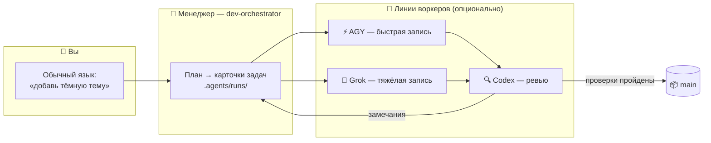

<div align="center">


# 🏭 Claude Lane Stack

### Маленькая ИИ-фабрика кода для одного человека

**Мультиагентная оркестрация ИИ-агентов для Claude Code** — вы говорите с одним ИИ-менеджером,
он раздаёт задачи воркерам (AGY / Grok / Codex), проверяет их работу
и **сам кладёт готовый код в `main`**. Без пяти чатов. Без ручных merge.

[](LICENSE)
[](https://github.com/VKirill/claude-lane-stack/releases)
[](https://docs.anthropic.com/en/docs/claude-code)
[](docs/BEGINNER.ru.md)
[](https://t.me/pomogay_marketing)

🌍 **README:** [English](README.md) · [简体中文](README.zh-CN.md) · [日本語](README.ja.md) · [Español](README.es.md) · [Deutsch](README.de.md) · [Français](README.fr.md) · [한국어](README.ko.md) · [Português](README.pt-BR.md)
🐣 **Гайд новичка:** [RU](docs/BEGINNER.ru.md) · [EN](docs/BEGINNER.md) · [中文](docs/BEGINNER.zh-CN.md) · [日本語](docs/BEGINNER.ja.md) · [ES](docs/BEGINNER.es.md) · [DE](docs/BEGINNER.de.md) · [FR](docs/BEGINNER.fr.md) · [KO](docs/BEGINNER.ko.md) · [PT](docs/BEGINNER.pt-BR.md)

</div>

---

## 📌 Содержание

- [Зачем это](#-зачем-это) · [Для кого](#-для-кого) · [Как это работает](#-как-это-работает)
- [Быстрый старт](#-быстрый-старт-3-команды) · [Карточки задач](#-карточки-задач-как-воркеры-не-мешают-друг-другу) · [Вы не мержите](#-вы-не-мержите--это-делает-менеджер)
- [Шпаргалка](#-шпаргалка-команд) · [Профили](#-профили-возможностей) · [FAQ](#-faq) · [Документация](#-карта-документации)

---

## 💡 Зачем это

Работа с ИИ-инструментами обычно выглядит так: пять окон чатов, копипаст кусков кода, ветки, которые вы мержите руками в полночь, — и никто не проверяет ничью работу.

**Claude Lane Stack превращает это в конвейер:**

| 😩 Пять чатов | 🏭 Lane Stack |
|---------------|---------------|
| Каждой модели заново объясняете контекст | Контекст держит один менеджер, воркеры получают **карточки задач** |
| Модели перезаписывают файлы друг друга | В карточке перечислены **разрешённые файлы** — воркер не выходит из своей полосы |
| Код ИИ никто не ревьюит | Отдельная **линия ревью** (Codex) стоит перед каждым merge |
| Вы мержите ветки вручную | Менеджер сам мержит в **`main`** после проверок |
| Утром: «а что мы вчера делали?» | `/resume-project` — «Сейчас / Блокеры / Дальше» за секунды |

Без базы задач. Без обязательных облачных сервисов. **Обычные файлы + обычный git** — всё видно прямо в репозитории.

---

## 👥 Для кого

- 🧑‍💻 **Соло-разработчики**, которым нужна агентная разработка: параллельные ИИ-агенты без хаоса чатов
- 🚀 **Инди-хакеры**, которым интереснее описывать фичи, чем нянчить ветки
- 🧠 **Вайб-кодеры** — вы знаете, *что* хотите; фабрика разберётся, *как*
- 🏢 **Агентство из одного человека** — несколько клиентских репозиториев с одной дисциплиной

> [!TIP]
> Впервые слышите слово «оркестрация»? Начните с **[гайда новичка](docs/BEGINNER.ru.md)** — там всё объяснено как маленькая фабрика, без жаргона.

---

## 🧩 Как это работает

<div align="center">

</div>

Вы разговариваете с **одним агентом** — `dev-orchestrator`, проект-менеджером. Он распределяет работу по линиям:



| Роль | Кто | Что делает |
|------|-----|------------|
| 👑 Владелец | **Вы** | Говорите, *что* нужно — на любом языке |
| 🤖 Проект-менеджер | Агент Claude Code `dev-orchestrator` | Планирует, раздаёт, проверяет, **мержит** |
| ⚡🔧 Линии записи | AGY, Grok *(опционально)* | Реализуют карточки задач |
| 🔍 Линия ревью | Codex *(опционально)* | Независимый контроль качества |
| 🗂️ Карточки задач | YAML-файлы в `.agents/runs/` | Цех фабрики — всё можно открыть и прочитать |
| 📦 Официальный код | Git-ветка **`main`** | Финал каждой успешной задачи |

> [!NOTE]
> **Обязателен только Claude Code.** Отсутствие воркеров — не проблема: `agents-doctor` определяет, что установлено, и менеджер подстраивается — вплоть до чистого режима `claude-only`.

---

## 🚀 Быстрый старт (3 команды)

```bash
# 1️⃣  Установить стек — один раз на компьютер
git clone https://github.com/VKirill/claude-lane-stack.git
cd claude-lane-stack && ./install.sh
export PATH="$HOME/.agents/bin:$PATH"        # или откройте новый терминал

# 2️⃣  В ВАШЕМ проекте — определить доступных воркеров, один раз на репозиторий
cd /path/to/your-project
agents-doctor --apply .

# 3️⃣  Запустить менеджера и говорить по-человечески
claude --agent dev-orchestrator
```

Первый раз в проекте, внутри чата: **`/project-onboard`** — создаёт «паспорт» репозитория (`CLAUDE.md`, стартовые доки). Авто-выбор **minimal** vs **full** и глубины **fast** vs **deep** (у full по умолчанию deep) — см. [`docs/ONBOARD-SCENARIOS.md`](docs/ONBOARD-SCENARIOS.md). Оверрайд: `--minimal`/`--full`, `--fast`/`--deep`, `/project-onboard deep`.
После перерыва: **`/resume-project`** — «Сейчас / Блокеры / Дальше».

> [!IMPORTANT]
> `/resume-project` — команда «с возвращением» для *следующих* сессий, а **не** шаг установки.

📖 Полный маршрут простым языком: **[docs/BEGINNER.ru.md](docs/BEGINNER.ru.md)**

---

## 📋 Карточки задач: как воркеры не мешают друг другу

<div align="center">

</div>

Каждая задача — маленький **YAML-контракт** в `.agents/runs/`: менеджер его пишет, воркеры выполняют:

```yaml
task: add-dark-mode
goal: Переключатель тёмной темы на странице настроек
owns_paths:            # 🔒 ЕДИНСТВЕННЫЕ файлы, которые можно трогать
  - src/settings/**
  - src/theme.css
verify:
  - npm test
  - npm run lint
lane: agy-implementer  # кто выполняет
review: codex-reviewer # кто пропускает в merge
```

- 🔒 `owns_paths` — параллельные воркеры **не сталкиваются**: `check-owns-paths` завалит задачу, если воркер вышел за список
- ✅ `verify` — merge заблокирован, пока проверки не пройдут
- 📜 Карточки остаются в истории git — полный след: какой агент что делал и зачем

Подробнее: [docs/FILE-CONTRACT.md](docs/FILE-CONTRACT.md)

---

## 📦 Вы не мержите — это делает менеджер

<div align="center">

</div>

Финал каждой успешной задачи одинаков: **проверенный код оказывается в `main`** — его мержит оркестратор через `wt-merge-main` после ревью и проверок. Воркеры работают в изолированных **git worktree**, поэтому параллельные задачи не топчут друг друга.

> [!WARNING]
> Если агент просит *вас* разрулить ветки — это сбой процесса, а не ваша обязанность. Скажите менеджеру: *«мержить — твоя работа»*.

Правила соло-оркестрации: [docs/SOLO-ORCHESTRATION.md](docs/SOLO-ORCHESTRATION.md)

---

## 🧾 Шпаргалка команд

### Это печатаете вы

| Команда / фраза | Что это | Когда |
|-----------------|---------|-------|
| `./install.sh` | Установка фабрики в `~/.agents` | Один раз на компьютер |
| `agents-doctor --apply .` | Определить CLI → записать профиль маршрутизации | Один раз на проект |
| `claude --agent dev-orchestrator` | Открыть **единственный нужный чат** | Каждую сессию |
| `/project-onboard` | Паспорт репозитория через Codex (CLAUDE.md + доки) | Первый раз в репозитории |
| *«Добавь тёмную тему в настройки»* | Рабочий запрос — любой язык | Фичи и фиксы |
| `/resume-project` | «Сейчас / Блокеры / Дальше» | После перерыва |
| *«Застряло»* | Менеджер проверит замолчавших воркеров | Долгая тишина |

<details>
<summary>🤖 <b>Это обычно печатает только менеджер</b></summary>

| Команда | Что это |
|---------|---------|
| `run-board` | Обновить табло задач |
| `wt-create` / `wt-merge-main` | Изолированный worktree + **merge в `main`** |
| `check-owns-paths` | Воркер остался в своём списке файлов? |
| `lane-heartbeat` / `lane-stall-check` | Воркер жив? Кто замолчал? |
| `project-memory-init` | Создать файлы памяти PROGRESS / LESSONS |
| `night-audit` | Ночная уборка по задачам и докам |

</details>

---

## 🚦 Профили возможностей

`agents-doctor` записывает один из пяти профилей — в зависимости от того, какие CLI нашёл; менеджер маршрутизирует соответственно:

| Профиль | У вас есть | Линия записи | Линия ревью |
|---------|-----------|--------------|-------------|
| `full` | AGY + Grok + Codex | AGY / Grok | Codex |
| `claude-agy` | AGY | AGY | Claude |
| `claude-grok` | Grok | Grok | Claude |
| `claude-codex` | Codex | Codex | Codex |
| `claude-only` | только Claude Code | Сабагенты Claude | Сабагенты Claude |

```bash
agents-doctor            # показать отчёт обнаружения
agents-doctor --apply .  # сохранить профиль в проект
```

Подробнее: [profiles/README.md](profiles/README.md) · [docs/ROUTING.md](docs/ROUTING.md)

---

## 🧱 Что в коробке

```text
claude-lane-stack/
├── agents/        # определения агентов: менеджер claude + линии agy / grok / codex
├── bin/           # 11 CLI-инструментов: agents-doctor, run-board, wt-merge-main, …
├── skills/        # 11 скиллов: оркестрация, контракты, память проекта, онбординг
├── profiles/      # 5 профилей маршрутизации (full → claude-only)
├── hooks/         # защитные хуки: shell guard, code-quality guard, session ledger
├── templates/     # шаблоны PROGRESS / LESSONS / decisions / session-log
├── docs/          # гайд новичка + глубокие разборы (таблица ниже ↓)
└── install.sh     # кладёт всё в ~/.agents
```

А в **вашем** проекте после онбординга:

```text
your-app/
├── CLAUDE.md          # короткие постоянные правила проекта
├── AGENTS.md          # указатель «читай CLAUDE.md» для других инструментов
├── .agents/runs/      # 🏭 цех — карточки задач, отчёты, заметки о merge
└── docs/plans/        # 🧠 стратегические документы (не цех)
```

---

## ❓ FAQ

<details>
<summary><b>Нужно ли ставить AGY, Grok и Codex одновременно?</b></summary>

Нет — **обязателен только Claude Code**. Остальное — опциональные воркеры. `agents-doctor` определяет ваш набор, и менеджер подстраивается вплоть до режима `claude-only`.

</details>

<details>
<summary><b>Чем это отличается от обычного Claude Code?</b></summary>

Обычный Claude Code — один воркер в одном чате. Lane Stack добавляет **слой управления**: карточки задач с владением файлами, параллельные линии от разных вендоров, независимое ревью, автоматический merge в `main` и восстановление после холодного старта. Вы занимаетесь стратегией, он — логистикой.

</details>

<details>
<summary><b>Нужна база данных или облачный сервис?</b></summary>

Нет. Состояние живёт в **обычных файлах внутри репозитория** (`.agents/runs/`) и в git. Всё можно прочитать, продиффать и проаудировать.

</details>

<details>
<summary><b>Заработает на моём существующем проекте?</b></summary>

Да. `cd your-project && agents-doctor --apply .`, затем `/project-onboard` создаст паспорт вокруг существующего кода. Ничего не переписывается без задачи.

</details>

<details>
<summary><b>Что если воркер замолчал посреди задачи?</b></summary>

В стеке есть `lane-heartbeat` / `lane-stall-check` — менеджер находит зависших и переназначает задачу. Всегда можно сказать: *«застряло»*.

</details>

<details>
<summary><b>Мой код в безопасности?</b></summary>

Каждый CLI общается только со своим вендором — ровно как и без стека, **дополнительных серверов нет**. Секретам не место в карточках задач; чувствительные зоны (auth, платежи) заслуживают линии ревью. См. [SECURITY.md](SECURITY.md).

</details>

---

## 📚 Карта документации

| Тема | Документ |
|------|----------|
| 🐣 Маршрут простым языком | [docs/BEGINNER.ru.md](docs/BEGINNER.ru.md) |
| ⚖️ Сравнение с альтернативами | [docs/COMPARISON.md](docs/COMPARISON.md) |
| 🧑‍✈️ Правила соло-режима — почему вы не мержите | [docs/SOLO-ORCHESTRATION.md](docs/SOLO-ORCHESTRATION.md) |
| 🗂️ Анатомия YAML-карточки | [docs/FILE-CONTRACT.md](docs/FILE-CONTRACT.md) |
| 🔀 Кто пишет / кто ревьюит | [docs/ROUTING.md](docs/ROUTING.md) |
| 🛡️ Защитные хуки | [docs/HOOKS.md](docs/HOOKS.md) |
| 🧠 Память проекта (PROGRESS / LESSONS) | [docs/PROJECT-MEMORY.md](docs/PROJECT-MEMORY.md) |
| 📝 Бэклог идей | [docs/TODOS.md](docs/TODOS.md) |<!-- guardian: allow — ссылка на существующий файл docs/TODOS.md, не TODO-маркер -->
| 🔌 Настройки MCP (lean / hybrid) | [docs/MCP-LEAN.md](docs/MCP-LEAN.md) · [docs/MCP-HYBRID.md](docs/MCP-HYBRID.md) |
| 🤝 Контрибьютинг | [CONTRIBUTING.md](CONTRIBUTING.md) |
| 🔐 Политика безопасности | [SECURITY.md](SECURITY.md) |

---

## 📜 Лицензия

MIT — [LICENSE](LICENSE). Пользуйтесь, форкайте, стройте свою фабрику.

---

<div align="center">

<a href="https://github.com/VKirill"></a>

**Кирилл Вечкасов** · [@VKirill](https://github.com/VKirill) · Telegram: [Помогающий маркетолог](https://t.me/pomogay_marketing)

*Я собираю работающие конвейеры, а не «ещё один чат с LLM».*

⭐ **Если идея конвейера откликнулась — поставьте звезду.** Это правда помогает соло-разработчикам найти проект.

</div>
