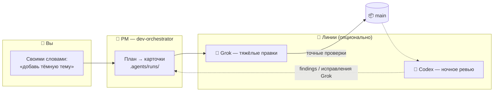

<div align="center">


# 🏭 Claude Lane Stack

### Маленький ИИ-завод для одного человека · **v1.5.7**

**Мульти-агентная оркестрация для Claude Code** — вы говорите с одним ИИ-менеджером проекта,
он ведёт долговечные задачи Grok до приёмки, **сам мержит готовый код в
`main`**, а независимое ревью/исправление выполняет ночью. Без пяти чатов. Без
ручных merge.

[](LICENSE)
[](https://github.com/VKirill/claude-lane-stack/releases/tag/v1.5.7)
[](https://docs.anthropic.com/en/docs/claude-code)
[](docs/BEGINNER.ru.md)
[](https://t.me/pomogay_marketing)

🌍 **README:** [English](README.md) · [简体中文](README.zh-CN.md) · [日本語](README.ja.md) · [Español](README.es.md) · [Deutsch](README.de.md) · [Français](README.fr.md) · [한국어](README.ko.md) · [Português](README.pt-BR.md) 
🐣 **Гайд новичка:** [RU](docs/BEGINNER.ru.md) · [EN](docs/BEGINNER.md) · [中文](docs/BEGINNER.zh-CN.md) · [日本語](docs/BEGINNER.ja.md) · [ES](docs/BEGINNER.es.md) · [DE](docs/BEGINNER.de.md) · [FR](docs/BEGINNER.fr.md) · [KO](docs/BEGINNER.ko.md) · [PT](docs/BEGINNER.pt-BR.md)

</div>

---

## 📌 Содержание

- [Зачем это](#-зачем-это) · [Кому подходит](#-кому-подходит) · [Как устроено](#-как-устроено)
- [Быстрый старт](#-быстрый-старт-3-команды) · [Онборд 2.0](#-онборд-20--сценарий--глубина) · [Лейны, которые доезжают](#-лейны-которые-доезжают--фон)
- [Карточки задач](#-карточки-задач--как-воркеры-не-пересекаются) · [Merge делает PM](#-merge-делает-pm--не-вы)
- [Шпаргалка](#-шпаргалка-команд) · [Профили](#-профили-возможностей) · [FAQ](#-faq) · [Документация](#-карта-документации)

---

## 💡 Зачем это

Обычно работа с ИИ-кодом выглядит так: пять окон чата, копипаст кусков, ветки, которые мержите в полночь вручную, и никто никого не ревьюит.

**Claude Lane Stack превращает это в конвейер:**

| 😩 Пять чатов | 🏭 Lane Stack |
|---------------|---------------|
| Каждый раз заново объясняете контекст | Один PM держит контекст, воркеры получают **карточки** |
| Модели затирают чужие файлы | У карточки список **своих путей** — воркер не лезет чужое |
| Никто не ревьюит код ИИ | Типизированный **ночной review/fix-контур** Codex → Grok → re-review |
| Merge руками | PM мержит в **`main`** после проверок |
| Утром: «а что мы делали?» | `/resume-project` — Сейчас / Блок / Дальше |
| Онборд = пустой CLAUDE | **Deep forensic-паспорт** на взрослых репо |
| Grok умирают через ~2 мин | **`run-controller` + user-systemd** — весь run переживает cleanup хоста |
| Непонятно, идёт ли работа | Один видимый **`run-supervisor`** + точные стадии в Board |
| Параллель ждёт самую долгую задачу | **Progressive accept** — отдельные provider/verify-пулы |

Без обязательной БД и облака. **Обычные файлы + git** — всё можно открыть и проаудитить.

---

## 👥 Кому подходит

- 🧑‍💻 **Соло-разработчики** — агентный workflow без хаоса чатов 
- 🚀 **Инди-хакеры** — описываете фичу, а не нянчите ветки 
- 🧠 **Вайб-кодеры** — знаете *что*, завод делает *как* 
- 🏢 **Соло-агентство** — несколько клиентских репо с одной дисциплиной 

> [!TIP]
> Слово «оркестрация» пугает? Начните с **[гайда для новичков](docs/BEGINNER.ru.md)** — там про завод, без жаргона.

---

## 🧩 Как устроено

Вы общаетесь с **одним агентом** — `dev-orchestrator` (PM). Он раскидывает работу по линиям:



| Роль | Кто | Что делает |
|------|-----|------------|
| 👑 Владелец | **Вы** | Говорите *что* нужно (в чате — на русском) |
| 🤖 PM | Claude Code `dev-orchestrator` | Планирует, диспатчит, проверяет, **мержит** |
| 🔧 Пишущий | Grok *(опц.)* | Делает карточки (через `lane-bg`) |
| 🔍 Ревью / онборд | Codex *(опц.)* | Ночное ревью/re-review, emergency-write, **паспорт проекта** |
| 🗂️ Карточки | YAML в `.agents/runs/` | Пол цеха — всё видно в git |
| 📦 Официальный код | ветка **`main`** | Куда падает успешная работа |

**Язык:** файлы (контракты, CLAUDE, отчёты, docs) — **English**. Чат с человеком — **русский**. См. [docs/LANGUAGE.md](docs/LANGUAGE.md).

**Модели Codex:** только GPT-**5.6** — **Sol** (ревью / deep / high-risk), **Terra** (обычный write / docs), **Luna** (мелочь). Без 5.5. См. [docs/ROUTING.md](docs/ROUTING.md).

> [!NOTE]
> **Обязателен только Claude Code.** Остальное опционально — `agents-doctor` подстроит профиль, вплоть до `claude-only`.
> Для пишущих Grok-лейнов на Linux также нужен `bubblewrap` (`sudo apt install
> bubblewrap` в Ubuntu): он обеспечивает read-only границу для `.agents`.

---

## 🚀 Быстрый старт (3 команды)

```bash
# 1️⃣  Установить завод — один раз на машину
git clone https://github.com/VKirill/claude-lane-stack.git
cd claude-lane-stack && git checkout v1.5.7 # или main
./install.sh
export PATH="$HOME/.agents/bin:$PATH"

# 2️⃣  В ВАШЕМ проекте — один раз на репо
cd /path/to/your-project
agents-doctor --apply .

# 3️⃣  Запустить PM и говорить как с человеком
claude --agent dev-orchestrator
```

В чате:

| Команда | Когда |
|---------|--------|
| **`/project-onboard`** | Первый раз в репо — паспорт (auto minimal/full + fast/deep) |
| **`/project-onboard deep`** | Принудительно forensic |
| **`/resume-project`** | После перерыва — Сейчас / Блок / Дальше |

> [!IMPORTANT]
> `/resume-project` — это «с возвращением», **не** шаг установки.

📖 Гайд: **[docs/BEGINNER.ru.md](docs/BEGINNER.ru.md)** · Релиз: **[v1.5.7](https://github.com/VKirill/claude-lane-stack/releases/tag/v1.5.7)**

---

## 🧭 Онборд 2.0 — сценарий + глубина

Первый заход — не тонкий stub. **`project-onboard` + Codex** собирают настоящий паспорт.

### Ось 1 — Сценарий (*что* сидится)

| | 🟢 **minimal** | 🟣 **full** |
|--|----------------|-------------|
| Когда | score &lt; 5 (маленький / новый) | score ≥ 5 или monorepo |
| Seeds | CLAUDE · AGENTS · ARCHITECTURE · memory · plans | + GOTCHAS · GLOSSARY · TESTING · deployment · nested CLAUDE · SECURITY при domain |

### Ось 2 — Глубина (*как глубоко* копает Codex)

| | ⚡ **fast** | 🔬 **deep** (default на full) |
|--|------------|--------------------------------|
| Explore | верх + манифесты | entrypoints, модули, 3–7 flow, wiki↔code, прогон тестов |
| Модель | `gpt-5.6-terra` high | `gpt-5.6-sol` high |
| Отчёт | паспорт | MODULES_READ · FLOWS · WIKI_MISMATCHES · VERIFY |

```bash
project-onboard .
project-onboard . --deep
project-onboard . --minimal --fast
```

Пишет:

- `.agents/onboard.scenario.yaml` 
- `.agents/runs/_onboard/artifacts/001/deep-scan.md` 
- Существующую wiki **не дублирует** (`gotchas.md` вместо `GOTCHAS.md`) 

Подробно: [docs/ONBOARD-SCENARIOS.md](docs/ONBOARD-SCENARIOS.md)

---

## 🏃 Лейны, которые доезжают — фон

Claude Code **убивает foreground Bash ~за 2 минуты**. Это лимит **хоста**, не `lane-exec`.

Дневной run запускается через долговечный типизированный controller:

```bash
RUN_DIR="$(run-init "$(pwd)" "$SLUG" --score 7)"
run-validate --run-dir "$RUN_DIR" --phase pre-dispatch
run-controller start --run-dir "$RUN_DIR" --project-cwd "$PROJECT_CWD"
run-controller watch --run-dir "$RUN_DIR" --timeout 240
run-controller status --run-dir "$RUN_DIR" --json
```

| Инструмент | Роль |
|------------|------|
| **`run-controller`** | DAG, один retry, progressive owns/verify/accept, точный статус run |
| **`lane-ctl`** | start/status/events/tail/retry/cancel/verify/accept |
| **`lane-bg`** | transient user-systemd service; явный nohup fallback |
| **`lane-exec`** | idle/max на **отцепленном** процессе |
| **`lane-session`** | продолжает контекст Grok; provider-пул 5 по умолчанию, максимум 10 |

Один read-only `run-supervisor` остаётся видимым до accepted/blocked;
`lane-supervisor` теперь служит для одиночной диагностики. Verify-пул отдельный,
2 по умолчанию, максимум 10. См. [docs/LANE-EXEC.md](docs/LANE-EXEC.md)

Grok больше не изучает репозиторий заново перед каждой задачей одного run.
Первая задача создаёт conversation, следующие связанные задачи продолжают её.
Занятая conversation не используется одновременно: параллельная задача получает
другой слот (5 по умолчанию, настраивается 1–10). По умолчанию сессия ротируется после семи успешных задач,
после ошибки или при смене worktree/модели. Codex-review остаётся независимым.

После обновления стека — **новая сессия** PM / свежий spawn implementer.

### Типизированная ночная смена

Ночной контур теперь работает по машинным receipt-файлам:

```bash
night-shift /path/to/project          # один репозиторий
night-shift-all --jobs 2              # активные репозитории, диапазон 1–10
```

Codex запускается через профиль `night-review`: `gpt-5.6-sol`, `xhigh`,
read-only, approval `never`. Он проверяет ограниченные diff-чанки и сохраняет
каждую конкретную или системную ошибку в
`.agents/findings/<fingerprint>.json`; REVIEW, OPEN и TODO являются проекциями.
Grok остаётся единственным обычным пишущим агентом, работает без субагентов и в
отдельном worktree. Finding закрывается только после registered verification,
ownership check, свежего Codex re-review и `acceptance.json`.

Ночной merge/push по умолчанию выключен и включается только политикой проекта:

```yaml
# .agents/night-shift.yaml
auto_merge: false
verification_executables: [] # необязательные имена разрешённых executables
```

Небезопасная сгенерированная shell-команда получает `needs_human` и не запускается.
Для schema-v2 это дополнительно контролирует сам `lane-ctl`: allowlist
фиксируется при старте, а parsed argv запускается напрямую без shell.

---

## 📋 Карточки задач — как воркеры не пересекаются

Каждая работа — **YAML-контракт** в `.agents/runs/` (**English**):

```yaml
schema_version: 2
id: "001"
title: Add dark mode
risk: low
lane: grok
project_cwd: /absolute/path/to/worktree
read_first: [AGENTS.md]
interfaces: ["ThemeToggle(settings)"]
invariants: ["Existing light theme remains the default"]
out_of_scope: ["Server-side account preferences"]
expected_outputs: ["Persistent accessible theme toggle"]
objective: Dark theme toggle on the settings page
owns_paths:
  - src/settings/**
  - src/theme.css
never_touch:
  - .env*
depends_on: []
acceptance:
  - Theme choice persists across reloads
verify: tests
verification:
  - command: npm test
    cwd: /absolute/path/to/worktree
    timeout_sec: 600
```

- 🔒 `owns_paths` — параллельные воркеры не сталкиваются 
- ✅ `verify` — без зелёных проверок нет merge 
- 📜 карточки в git — аудит 

Подробнее: [docs/FILE-CONTRACT.md](docs/FILE-CONTRACT.md)

---

## 📦 Merge делает PM — не вы

Конец успешной работы: **проверенный код в `main`**, merge делает оркестратор
(`wt-merge-main`). Днём LLM-review нет; независимое ревью и исправление идут
ночью. Воркеры пишут в **worktree**.

> [!WARNING]
> Если агент просит *вас* смержить ветки — это баг процесса. Скажите: *«merge — твоя работа»*.

Правила: [docs/SOLO-ORCHESTRATION.md](docs/SOLO-ORCHESTRATION.md)

---

## 🧾 Шпаргалка команд

### Вы набираете

| Команда | Что | Когда |
|---------|-----|--------|
| `./install.sh` | Поставить завод в `~/.agents` | Раз на машину |
| `agents-doctor --apply .` | Профиль маршрутизации | Раз на проект |
| `claude --agent dev-orchestrator` | **Единственный нужный чат** | Каждая сессия |
| `/project-onboard` | Паспорт (scenario + depth auto) | Первый раз в репо |
| `/project-onboard deep` | Forensic-онборд | Взрослые / грязные репо |
| *«Добавь тёмную тему…»* | Задача своими словами | Фичи и фиксы |
| `/resume-project` | Сейчас / Блок / Дальше | После перерыва |
| *«Завис»* | PM смотрит silent workers | Долгое молчание |

<details>
<summary>🤖 <b>Обычно только PM / implementers</b></summary>

| Команда | Зачем |
|---------|--------|
| `run-board` | Табло задач |
| `run-init` / `run-validate` / `run-finalize` | Жизненный цикл versioned run-контракта |
| **`run-controller start/watch/status`** | Долговечный дневной цикл и точный live-статус |
| `lane-session status --run-dir .agents/runs/<slug>` | Сессии Grok только этого run |
| `wt-create` / `wt-merge-main` | Worktree + **merge в main** |
| `check-owns-paths` | Не вышел ли воркер за owns |
| **`lane-ctl`** | Lifecycle control + verification + acceptance receipt |
| `lane-bg` / `lane-exec` / `lane-session` | Process lifetime, idle/max по активности и тёплые сессии |
| `lane-heartbeat` / `lane-stall-check` | Жив? Замолчал? |
| `project-onboard` | Seed + deep-scan |
| `docs-maintain-project` | Актуализация docs |
| `project-memory-init` | PROGRESS / LESSONS |
| `night-audit` | Ночная уборка |
| `night-review` | Typed read-only review + canonical findings |
| `night-shift` / `night-shift-all` | Resumable review → Grok repair → re-review |

</details>

---

## 🚦 Профили возможностей

| Профиль | Есть | Пишет | Ревью |
|---------|------|-------|-------|
| `full` | Grok + Codex | Grok | Codex Sol |
| `claude-` |  |  | Claude |
| `claude-grok` | Grok | Grok | Claude |
| `claude-codex` | Codex | Codex Terra/Sol | Codex Sol |
| `claude-only` | только Claude | subagents | subagents |

```bash
agents-doctor
agents-doctor --apply .
```

[profiles/README.md](profiles/README.md) · [docs/ROUTING.md](docs/ROUTING.md)

---

## 🧱 Что в коробке

```text
claude-lane-stack/
├── agents/ # PM + grok/codex (implementers, onboard, review)
├── bin/ # agents-doctor, project-onboard, lane-ctl, lane-bg, lane-exec, lane-session, …
├── skills/ # orchestration, contracts, memory, onboard, …
├── profiles/ # full → claude-only
├── hooks/ # guards + session ledger
├── templates/ # ARCHITECTURE, GOTCHAS, TESTING, deployment, …
├── docs/ # beginner + deep dives
└── install.sh # → ~/.agents
```

После онборда в **вашем** проекте:

```text
your-app/
├── CLAUDE.md
├── AGENTS.md
├── PROGRESS.md / LESSONS.md
├── .agents/
│ ├── onboard.scenario.yaml
│ ├── routing.profile.yaml
│ └── runs/
└── docs/
```

---

## ❓ FAQ

<details>
<summary><b>Нужны ли сразу, Grok и Codex?</b></summary>

Нет — **достаточно Claude Code**. Остальное опционально.

</details>

<details>
<summary><b>Чем это лучше «просто Claude Code»?</b></summary>

Claude — один воркер. Lane Stack — **менеджмент**: карточки, owns_paths,
долговечный controller, один видимый supervisor на run, ночное ревью/fix,
auto-merge, deep-онборд и cold-start.

</details>

<details>
<summary><b> умер через ~2 минуты — это lane-exec?</b></summary>

Чаще **нет**. Claude убивает **foreground Bash**. Текущий стек стартует весь
run через **`run-controller`**, а `lane-bg` использует transient user-systemd
service. См. [docs/LANE-EXEC.md](docs/LANE-EXEC.md). После апдейта — **новая
сессия** PM.

</details>

<details>
<summary><b>minimal / full / deep — что выбирать?</b></summary>

Обычно ничего — **auto**. Toy → minimal+fast. Взрослый → full+deep. Форс: `/project-onboard deep`.

</details>

<details>
<summary><b>Нужна ли БД или облако?</b></summary>

Нет. Состояние — **файлы в репо** + git.

</details>

<details>
<summary><b>Подойдёт к уже существующему проекту?</b></summary>

Да. `agents-doctor --apply .` → `/project-onboard`. Wiki не затирается, а линкуется.

</details>

---

## 📚 Карта документации

| Тема | Док |
|------|-----|
| 🐣 Гайд для новичков | [docs/BEGINNER.ru.md](docs/BEGINNER.ru.md) |
| 🧭 Онборд: scenario + depth | [docs/ONBOARD-SCENARIOS.md](docs/ONBOARD-SCENARIOS.md) |
| ⏱️ Таймауты + фон | [docs/LANE-EXEC.md](docs/LANE-EXEC.md) |
| 🌐 Язык (EN файлы / RU чат) | [docs/LANGUAGE.md](docs/LANGUAGE.md) |
| 🔀 Маршрутизация Sol/Terra | [docs/ROUTING.md](docs/ROUTING.md) |
| ⚖️ Сравнение с альтернативами | [docs/COMPARISON.md](docs/COMPARISON.md) |
| 🧑‍✈️ Solo-правила | [docs/SOLO-ORCHESTRATION.md](docs/SOLO-ORCHESTRATION.md) |
| 🗂️ YAML-контракт | [docs/FILE-CONTRACT.md](docs/FILE-CONTRACT.md) |
| 🛡️ Хуки | [docs/HOOKS.md](docs/HOOKS.md) |
| 🧠 Память проекта | [docs/PROJECT-MEMORY.md](docs/PROJECT-MEMORY.md) |
| 📝 Идеи | [docs/TODOS.md](docs/TODOS.md) |
| 🔌 MCP | [docs/MCP-LEAN.md](docs/MCP-LEAN.md) · [docs/MCP-HYBRID.md](docs/MCP-HYBRID.md) |
| 📰 Changelog | [CHANGELOG.md](CHANGELOG.md) |
| 🚀 Релиз v1.5.7 | [GitHub Releases](https://github.com/VKirill/claude-lane-stack/releases/tag/v1.5.7) |

---

## 📜 Лицензия

MIT — [LICENSE](LICENSE).

---

<div align="center">

<a href="https://github.com/VKirill"></a>

**Кирилл Вечкасов** · [@VKirill](https://github.com/VKirill) · Telegram: [Помогающий маркетолог](https://t.me/pomogay_marketing)

*Строю рабочие конвейеры, а не ещё один чат с LLM.*

⭐ **Если идея конвейера зашла — поставьте звезду.** Это помогает соло-разработчикам найти репо.

</div>
