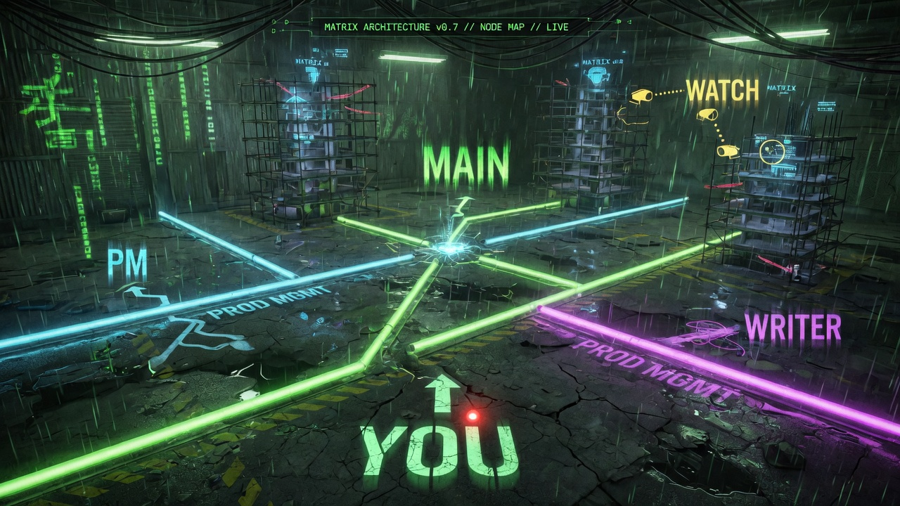
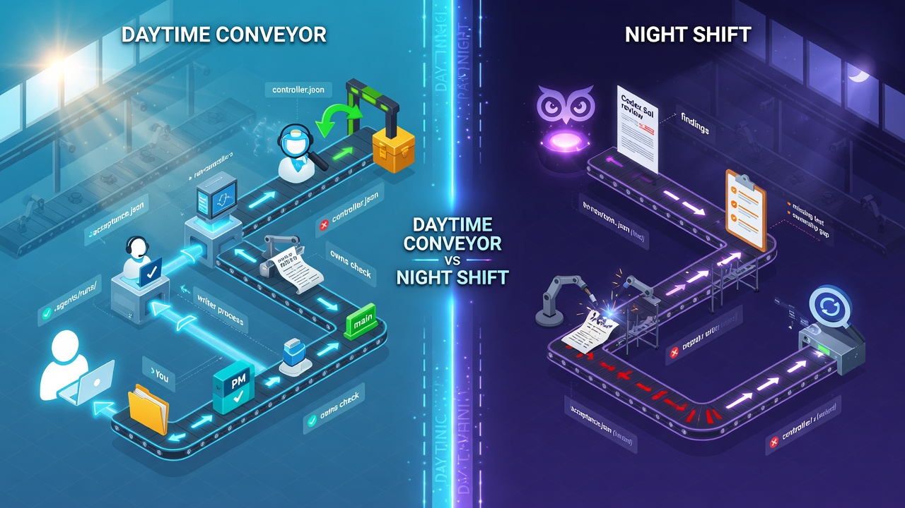

<div align="center">


# Claude Lane Stack

### Маленький ИИ-завод для одного человека · **v1.14.13**

Вы говорите с **одним** ИИ-менеджером проекта. Он планирует работу, запускает
долговечных писателей (Codex / Qwen / Grok / Kimi / AGY — что установлено),
проверяет результат, **сам мержит в `main`**, а независимое ревью делает ночью.

Без пяти чатов. Без ручного merge. Всё — **файлы + git**.

[](LICENSE)
[](https://github.com/VKirill/claude-lane-stack/releases/tag/v1.14.13)
[](https://code.claude.com/docs)
[](https://github.com/openai/codex)
[](https://github.com/QwenLM/qwen-code)
[](https://x.ai)
[](#)
[](#)
[](https://t.me/pomogay_marketing)

**Языки:** [English](README.md) · [Русский](README.ru.md)  
**Гайд с нуля:** [RU](docs/BEGINNER.ru.md) · [EN](docs/BEGINNER.md)

</div>

---

## С какими CLI-агентами мы работаем (это и есть суть)

Это **не** «одна модель на всё». Стек — **control plane**, который гоняет
**настоящие CLI coding-агенты** как долговечные процессы под одним PM.

| CLI-агент | Обязателен? | Роль на заводе |
|-----------|-------------|----------------|
| **[Claude Code](https://code.claude.com/docs)** | **Да** | PM (`dev-orchestrator`), watch/диагностика, чат с вами |
| **[OpenAI Codex CLI](https://github.com/openai/codex)** | Опционально | Дневной writer (luna), ночной **Sol**-ревью, onboard, docs, emergency, plan-critique |
| **Qwen Code** (Qwen CLI) | Опционально | Дневной **writer**-процесс |
| **Grok** (xAI CLI / Grok Build) | Опционально | Дневной **writer**-процесс |
| **Kimi** CLI | Опционально | Дневной **writer** (часто default в full-профиле) |
| **AGY** (Gemini-oriented writer) | Опционально | Дневной **writer**-процесс |

```text
                    ┌──────────────────────────────────────┐
  Вы  ──чат──►      │  Claude Code  ·  dev-orchestrator    │  ← всегда
                    └──────────────────┬───────────────────┘
                                       │ run-supervisor + run-controller
           ┌───────────────┬───────────┼───────────┬───────────────┐
           ▼               ▼           ▼           ▼               ▼
       Codex CLI       Qwen CLI    Grok CLI    Kimi CLI         AGY
      write / review     write       write       write          write
           │               │           │           │               │
           └───────────────┴───────────┴───────────┴───────────────┘
                                       │
                                       ▼
                         проверки + acceptance → main
```

- **Собираете микс.** Ставите только то, что есть. `agents-doctor` / `adoc` видит CLI и собирает профиль (`claude-only`, `claude-codex`, `claude-qwen`, `claude-grok`, `full`, …).
- **Один конвейер на всех писателей.** Owns, L1 verify, `acceptance.json`, progressive accept — один протокол, разные бэкенды.
- **Смена writer без переписывания стека.** В adoc / `.agents/routing.profile.yaml` меняете `main_write` (например `codex` → `qwen`).
- **Codex отдельно для ночи:** независимый Sol-ревью — quality rail, когда Codex есть; остальные CLI в основном дневные (или repair) writers.

Подробности: [docs/ROUTING.md](docs/ROUTING.md) · [docs/PLATFORM-CAPABILITIES.md](docs/PLATFORM-CAPABILITIES.md)

---

## Зачем это

| Обычно с ИИ-кодом | Claude Lane Stack |
|-------------------|-------------------|
| Пять чатов, каждый раз заново объясняете | **Один PM** держит план |
| Модели затирают чужие файлы | У задачи список **своих путей** |
| Никто не ревьюит ИИ | **Ночная смена** (Codex → fix → re-review) |
| Merge веток в полночь руками | **PM мержит `main`** после проверок |
| Утром: «а что мы делали?» | **`resume-project`** → Сейчас / Блок / Дальше |
| Длинная работа умирает через ~2 мин Bash | **Отцепленные процессы** (чат можно закрыть) |

---

## Модель за 60 секунд

<div align="center">

</div>

```text
Вы (чат)  →  PM (dev-orchestrator)
                  │
                  ├─ plan-critique (опционально: LLM смотрит план)
                  ├─ карточки YAML в .agents/runs/<slug>/
                  │
                  ▼
            run-supervisor  (смотрит один run)
                  │
                  ▼
            run-controller  (долговечный процесс)
                  │
                  ▼
       процесс-писатель (codex / qwen / grok / …)
                  │
                  ▼
       owns → L1-тесты → acceptance.json
                  │
                  ▼
            PM merge → main  →  (ночь) ревью Codex
```

**Вы не запускаете «Qwen-кодера» руками в обычной работе.**  
Вы говорите с PM. PM включает **конвейер**. Писатель — **фоновый процесс**,  
а не случайный Claude-субагент с именем бренда модели.

---

## День и ночь

<div align="center">

</div>

| | **День** | **Ночь** |
|--|----------|----------|
| Цель | Быстро катить фичи | Независимое качество |
| Кто пишет продукт | Процесс из профиля **adoc** | Writer после findings |
| Кто «смотрит» | **`run-supervisor`** | `night-shift` / `night-shift-all` |
| LLM-ревью каждого коммита? | **Нет** (так задумано) | **Да** — Codex Sol, typed findings |
| «Готово» = | `acceptance.json` + merge в `main` | Finding fixed + re-review |

---

## Кто есть кто (роли, не бренды)

| Роль | Что это | Что делает |
|------|---------|------------|
| **Вы** | Человек | Говорите *что* нужно |
| **`dev-orchestrator`** | Агент Claude Code (PM) | План, диспатч, merge, общение с вами |
| **`run-supervisor`** | Claude (только watch) | Старт/watch `run-controller` до accepted/blocked |
| **`run-controller`** | Процесс ОС | DAG, retry, owns/verify/accept |
| **Процесс-писатель** | CLI Codex/Qwen/Grok/Kimi/AGY | Делает карточку задачи |
| **`lane-supervisor`** | Claude (одно действие) | Ручной `lane-ctl` status/retry/verify/… |
| **`emergency-writer`** | Claude → Codex | Только после **terminal** block |
| **`night-reviewer` / night-shift** | Codex Sol | Ночное ревью + findings |
| **`project-onboarder`** | Codex | Паспорт проекта с нуля |
| **`docs-maintainer`** | Codex | Обновление доков |

Встроенные помощники Claude, которыми PM тоже может пользоваться: **Explore**, **Plan**, **general-purpose** (research / side-task — **не** замена дневному конвейеру продукта).

Старые имена (ещё работают): `codex-implementer` → `emergency-writer`, `codex-reviewer` → `night-reviewer` и т.д. См. [`agents/claude/README.md`](agents/claude/README.md).

---

## Карточка задачи = контракт

<div align="center">

</div>

Единица работы — YAML в `.agents/runs/<slug>/tasks/`:

- **`owns_paths`** — какие файлы можно трогать
- **`verification[]`** — узкие L1-проверки контроллера
- **`lane:`** — как в adoc `main_write` (например `codex`, `qwen`)
- **Квитанции** — report → owns → verify → **`acceptance.json`**

Нет acceptance → не готово. «В чате зелёное» ≠ «зашипили».

---

## Быстрый старт

### 1) Один раз на машину

```bash
git clone https://github.com/VKirill/claude-lane-stack.git
cd claude-lane-stack
git checkout v1.14.13   # или: main
./install.sh
export PATH="$HOME/.agents/bin:$PATH"
```

Нужно: **Claude Code**, Git, Python 3 (+ PyYAML/jsonschema), Node, rsync, `flock`.  
Опционально писатели: Codex, Qwen, Grok, Kimi, AGY. На Linux для writers — **bubblewrap**.

### 2) Один раз в *вашем* проекте

```bash
cd /path/to/your-project
agents-doctor --apply .    # или: adoc
```

Появится `.agents/routing.profile.yaml` (кто пишет, модель, workspace, plan critique…).

### 3) Запуск PM

**Как у вас обычно** (если есть лаунчер `cc`):

```bash
cd /path/to/your-project
cc          # меню → 1 = dev-orchestrator
```

`cc` сам добавит `--name lane-pm-<папка-проекта>` (для ListAgents / Remote Control).

Или напрямую:

```bash
claude --agent dev-orchestrator --name lane-pm-myproject
```

В чате:

| Вы | Когда |
|----|--------|
| `/project-onboard` или «онбордни репо» | Первый раз |
| `/resume-project` или «где остановились?» | После перерыва |
| «Добавь тёмную тему в настройки» | Обычная фича |

PM: план → (plan-critique) → карточки → **один** `run-supervisor` → terminal digest → merge `main` если зелёно.

---

## Что крутите в `adoc` (простыми словами)

| Настройка | Смысл |
|-----------|--------|
| **Writer** (`main_write`) | `codex` / `qwen` / `grok` / `kimi` / `agy` — **процесс**, который кодит |
| **Model / effort** | например Codex luna + max |
| **Fast mode** | только Codex — `service_tier: fast` |
| **Workspace** | `in_place` / `worktree` / `auto` |
| **Plan critique** | выкл / structural / или LLM перед диспатчем |

Смена adoc mid-session обновляет YAML; длинный PM может не перечитать профиль сам — иногда нужен рестарт `cc` → 1.

---

## Команды, которые реально нужны

| Команда | Зачем |
|---------|--------|
| `agents-doctor` / `adoc` | Выбрать писателей и профиль |
| `resume-project .` | Сейчас / Блок / Дальше |
| `run-init` / `run-validate` / `run-board` | Раны (обычно делает PM) |
| `run-controller start\|watch\|status` | Жизненный цикл (PM — через `run-supervisor`) |
| `lane-ctl …` | Типизированный control plane |
| `night-shift` / `night-shift-all` | Ночное ревью/repair |
| `plan-critique --run-dir …` | Качество плана |

Подробно: [LANE-EXEC](docs/LANE-EXEC.md) · [ROUTING](docs/ROUTING.md) · [SOLO-ORCHESTRATION](docs/SOLO-ORCHESTRATION.md) · [PLATFORM-CAPABILITIES](docs/PLATFORM-CAPABILITIES.md) · [FILE-CONTRACT](docs/FILE-CONTRACT.md)

---

## FAQ для тапочков

**Нужны ли сразу Codex + Qwen + Grok?**  
Нет. **Достаточно Claude Code** (`claude-only`). Каждый следующий CLI — **подключаемый writer** (или rail ревью у Codex). Ставите то, за что платите; `agents-doctor` собирает профиль.

**Почему Claude сам не правит код?**  
Мелочи — может. Нормальные фичи идут через **owns, тесты и квитанции**, чтобы параллель не убила `main`.

**Что такое `general-purpose`?**  
**Встроенный** субагент Claude Code для multi-step side-task ([дока](https://code.claude.com/docs/en/sub-agents#general-purpose)). PM может звать его для research. Фичи продукта — всё равно через конвейер.

**Почему Bash умирает через ~2 минуты?**  
Лимит Claude Code. Писатели крутятся **отцепленно**. Не держите длинные job’ы в foreground PM.

**Кто мержит?**  
PM. Вы — никогда. Если просит вас смержить — PM врёт, чиним скилл.

**Язык?**  
Чат: русский ок. Файлы агентов: **английский**.

---

## Карта доков

| Док | Для чего |
|-----|----------|
| [BEGINNER.ru.md](docs/BEGINNER.ru.md) | С нуля, без жаргона |
| [SOLO-ORCHESTRATION.md](docs/SOLO-ORCHESTRATION.md) | День/ночь |
| [ROUTING.md](docs/ROUTING.md) | Модели и профили |
| [LANE-EXEC.md](docs/LANE-EXEC.md) | Выживание процессов |
| [PLATFORM-CAPABILITIES.md](docs/PLATFORM-CAPABILITIES.md) | Что берём из Claude Code / Codex |
| [agents/claude/README.md](agents/claude/README.md) | Имена role-агентов |
| [CHANGELOG.md](CHANGELOG.md) | Что менялось |

---

## Лицензия

[MIT](LICENSE) · Автор: [VKirill](https://github.com/VKirill) · Канал: [Помогающий маркетолог](https://t.me/pomogay_marketing)
