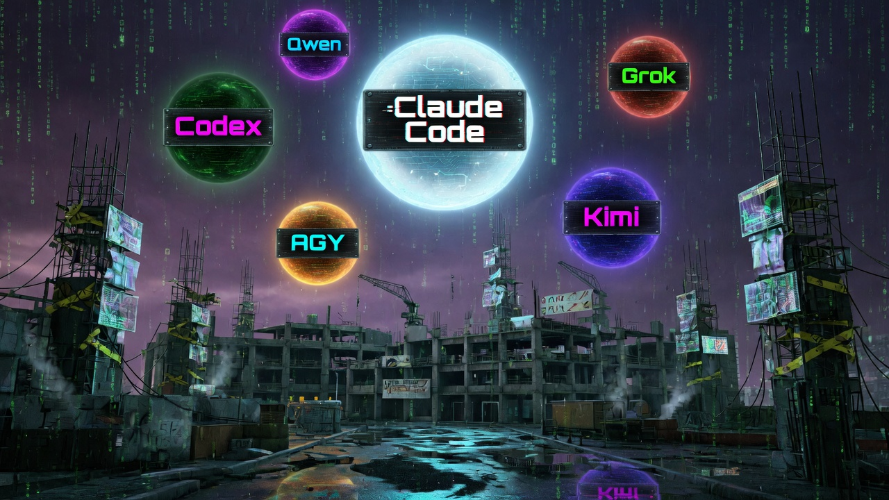
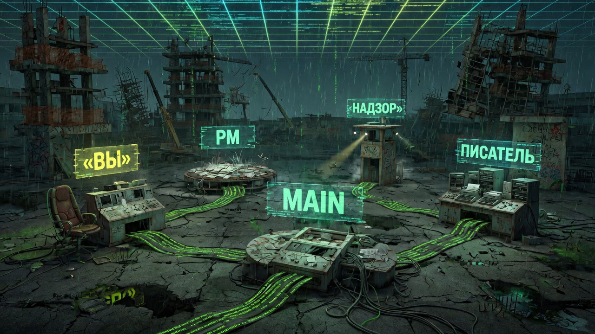
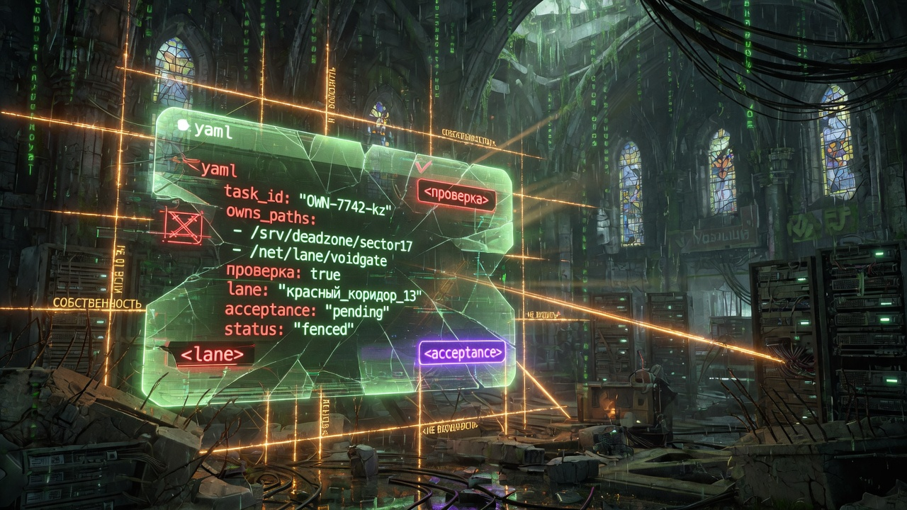
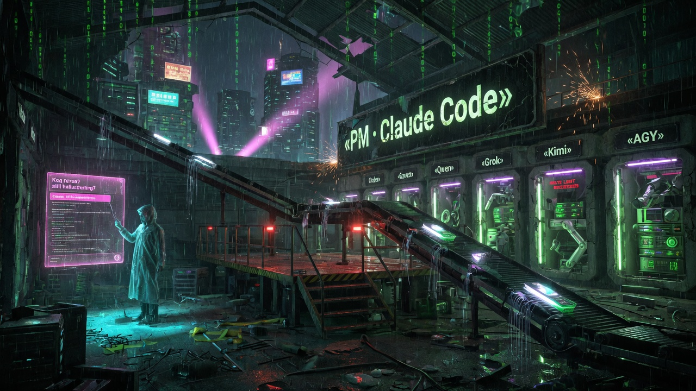

<div align="center">


<br/>

# Claude Lane Stack

### Маленький ИИ-завод для одного человека

**Один человек. Один ИИ-PM. Настоящие CLI coding-агенты на долговечном конвейере.**  
Говорите с Claude Code — он гоняет Codex / Qwen / Grok / Kimi / AGY, проверяет работу, **мержит в `main`**, ночью делает независимое ревью.

Без пяти чатов. Без ручного merge. Всё — **файлы + git**.

<p>
  <a href="https://github.com/VKirill/claude-lane-stack/releases/tag/v1.21.0"></a>
  <a href="LICENSE"></a>
  <a href="https://code.claude.com/docs"></a>
  <a href="https://github.com/openai/codex"></a>
  <a href="https://t.me/pomogay_marketing"></a>
</p>

<p>
  <a href="README.md"><strong>🇬🇧 English</strong></a>
  &nbsp;·&nbsp;
  <a href="docs/BEGINNER.ru.md"><strong>🐣 Гайд для новичков</strong></a>
  &nbsp;·&nbsp;
  <a href="CHANGELOG.md"><strong>Changelog</strong></a>
  &nbsp;·&nbsp;
  <a href="https://github.com/VKirill/claude-lane-stack/stargazers"><strong>★ Star</strong></a>
</p>

</div>

---

<br/>

<div align="center">

</div>

<br/>

| | | | |
|:--:|:--:|:--:|:--:|
| **🏭 Завод, не пять чатов** | **🛡️ Свои пути** | **🌙 Ночное ревью** | **📦 Авто-merge в main** |
| Один PM держит контекст | Writers не лезут чужое | Независимый Codex Sol | Merge руками не вы |

| | | | |
|:--:|:--:|:--:|:--:|
| **🧠 Память** | **📚 Живые docs** | **🎨 Дизайн** | **ℹ️ Первый час** |
| Opt-in корпус фактов | `docs/` из git, не эссе | `docs/DESIGN.md` | `/info` · `/app-architect` |

---

## ✨ Зачем это

Обычно ИИ-код = пять окон, копипаст, merge в полночь, ревью «ну как-нибудь».

**Claude Lane Stack — конвейер:** обычные **файлы + git**, без обязательной облачной БД.

| 😩 Типичный ИИ-кодинг | ✨ Lane Stack |
|------------------------|----------------|
| Каждый раз заново объясняете | **Один PM** держит план |
| Модели затирают файлы | **`owns_paths`** на каждой задаче |
| Никто не ревьюит ИИ | **Ночная смена** (review → fix → re-review) |
| Merge веток руками | **PM мержит `main`** после проверок |
| «А что мы делали?» | **`resume-project`** + **память** (факты, не чат) |
| Доки гниют после спринта | **Ночная Luna** обновляет все stale-страницы `docs/` |
| Job умирает через ~2 мин Bash | **Отцепленные процессы** (чат можно закрыть) |

> [!TIP]
> Слово «оркестрация» пугает? Начните с **[гайда для новичков](docs/BEGINNER.ru.md)** — про завод, без жаргона.

---

## 🔌 С какими CLI-агентами мы работаем

<div align="center">

</div>

<br/>

Это **не** «одна модель на всё».  
Стек — **control plane**, который гоняет **настоящие CLI coding-агенты** как долговечные процессы.

| CLI | Обязателен? | Роль |
|-----|-------------|------|
| **[Claude Code](https://code.claude.com/docs)** | **Да** | PM (`dev-orchestrator`), watch, чат с вами |
| **[OpenAI Codex CLI](https://github.com/openai/codex)** | Опц. | Дневной writer · **ночной Sol-ревью** · onboard · **docs (Luna)** · emergency |
| **Qwen Code** | Опц. | Дневной **writer** |
| **Grok** (xAI CLI) | Опц. | Дневной **writer** |
| **Kimi** CLI | Опц. | Дневной **writer** (часто default в full) |
| **AGY** (Gemini-oriented) | Опц. | Дневной **writer** |
| **Cursor** / **OpenCode** | Опц. | Ещё дневные **writer** (вкладка Кодер в `adoc`) |

```text
  Вы ──чат──►  Claude Code · dev-orchestrator          ← всегда
                        │
              run-supervisor + run-controller
          ┌─────┬─────┬─────┬─────┐
          ▼     ▼     ▼     ▼     ▼
       Codex  Qwen  Grok  Kimi   AGY
          │     │     │     │     │
          └─────┴─────┴─────┴─────┘
                        │
              owns → L1 verify → acceptance → main
```

- **Собираете микс** — только то, за что платите; `agents-doctor` / `adoc` соберёт профиль  
- **Один протокол** — owns, verify, `acceptance.json`, progressive accept  
- **Смена writer** — `main_write` в adoc (например `codex` → `qwen`)  
- **Codex для ночного quality** когда есть  

<details>
<summary><strong>Профили (примеры)</strong></summary>

| Профиль | Writers | Review |
|---------|---------|--------|
| `claude-only` | только Claude | лёгкий |
| `claude-codex` | процесс Codex | ночь Codex Sol |
| `claude-qwen` / `grok` / `kimi` / `agy` | этот CLI | по конфигу |
| `full` | multi-writer ready | ночь Codex |

</details>

---

## 🧠 Как устроено (60 секунд)

<div align="center">

</div>

<br/>

```text
Вы (чат)  →  PM (dev-orchestrator)
                │  plan-critique · YAML в .agents/runs/
                ▼
          run-supervisor   ← Claude смотрит один run
                │
                ▼
          run-controller   ← долговечный процесс ОС
                │
                ▼
       процесс-писатель    ← codex / qwen / grok / …
                │
                ▼
       owns → L1-тесты → acceptance.json
                │
                ▼
          PM merge → main → (ночь) ревью Codex
```

**В обычной работе вы не запускаете «Qwen-кодера» руками.**  
Говорите с PM. PM включает **конвейер**. Писатель — **фоновый процесс**, не субагент с именем бренда.

---

## ☀️ День vs 🌙 ночь

<div align="center">

</div>

<br/>

| | **День** | **Ночь** |
|--|----------|----------|
| Цель | Быстро катить | Независимое качество |
| Код продукта | Writer из **adoc** | Repair после findings |
| Watch | **`run-supervisor`** | `night-shift` |
| LLM-ревью каждого коммита? | **Нет** | **Да** — Codex Sol |
| Docs / память | Writer **не** трогает `docs/` | **`docs-maintain-all`** (Luna, все stale) · **`memory-maintain-project`** |
| Готово | `acceptance.json` + **main** | Finding fixed + re-review |

---

## 🎭 Кто есть кто

| Роль | Тип | Делает |
|------|-----|--------|
| **Вы** | Человек | Говорите *что* нужно |
| **`dev-orchestrator`** | Claude (PM) | План · диспатч · merge · чат |
| **`run-supervisor`** | Claude (watch) | Один run до accepted/blocked |
| **`run-controller`** | Процесс ОС | DAG · retry · owns/verify/accept |
| **Процесс-писатель** | CLI (Codex/Qwen/…) | Делает карточку |
| **`lane-supervisor`** | Claude (1 action) | Typed `lane-ctl` |
| **`emergency-writer`** | Claude → Codex | Только после **terminal** block |
| **`night-reviewer` / night-shift** | Codex Sol | Ночное ревью |
| **`project-onboarder`** | Codex | Паспорт (`docs/llm/*`, CLAUDE) |
| **`docs-maintainer`** | Codex Luna max fast | INIT + ночные живые `docs/` |
| **`memory-maintainer`** | Codex (adoc) | Opt-in корпус фактов (`.agents/memory/`) |
| **`design-lead`** | Claude | Снять / обновить `docs/DESIGN.md` |

Встроенные Claude: **Explore**, **Plan**, **general-purpose** (research / side-task — **не** daytime product writer).  
Алиасы: `codex-implementer` → `emergency-writer` и т.д. → [`agents/claude/README.md`](agents/claude/README.md)

---

## 📋 Карточка = контракт

<div align="center">

</div>

<br/>

Единица работы — `.agents/runs/<slug>/tasks/*.yaml`:

| Поле | Смысл |
|------|--------|
| `owns_paths` | Какие файлы можно трогать |
| `verification[]` | Узкие L1-проверки |
| `lane:` | Как `main_write` в adoc |
| Квитанции | report → owns → verify → **`acceptance.json`** |

> [!IMPORTANT]
> Нет `acceptance.json` → **не готово**. «В чате зелёное» ≠ «зашипили».

---

## 🧠 Память и 📚 живые docs

Два **opt-in** модуля в `adoc` (свои вкладки, не в Этапах). Выкл, пока Enabled + Apply. Writer в фича-lane **не** пишет wiki и не пишет корпус фактов.

| | **Память** | **Docs** |
|--|------------|----------|
| Что | Факты в `.agents/memory/` (CORE + по запросу) | Живые `docs/` + `web.yaml` + `llms.txt` |
| Не | `docs/`, LESSONS, чаты | Память, `wiki/`, `TODO/`, `docs/plans/` |
| Первое включение | корпус `lane-memory` | stubs `docs-web` сразу; Luna INIT в фоне |
| Ночь | `memory-maintain-project` | cron в час → `docs-maintain-all --if-hour` |
| Вход | session ledger + git | **закоммиченный** `git log --since` ∩ `owns` / stub |
| Модель | из вкладки Память | Codex **Luna max fast** |
| Коммит | нет | нет |

```text
обычная сессия Claude / Codex / Cursor
        ↓ commit
git log --since=yesterday
        ↓ hour (дефолт 05:00)
docs-web → daylog → docs-stale → Luna (все stale-страницы)
```

Незакоммиченное ночь не видит. Daylog: `.agents/session-log/DOCS-DAY-YYYY-MM-DD.md`.

---

## 🚀 Быстрый старт

### ① Один раз на машину

Этот репозиторий — **marketplace плагинов Claude Code**. `./install.sh` ставит runtime (`~/.agents`) **и** Claude-плагин.

```bash
git clone https://github.com/VKirill/claude-lane-stack.git
cd claude-lane-stack && git checkout v1.21.0   # или: main
./install.sh
export PATH="$HOME/.agents/bin:$PATH"
```

После установки в Claude Code есть **`lane-stack@claude-lane-stack`**, marketplace сам обновляется с GitHub. Скиллы: `/lane-stack:<name>` (например `/lane-stack:orchestrator-lanes`). Хост `~/.agents` по-прежнему через `./install.sh`. Живой чекаут: `LANE_INSTALL_LOCAL_MARKETPLACE=1 ./install.sh`.

Только плагин (runtime уже стоит):

```bash
claude plugin marketplace add VKirill/claude-lane-stack
claude plugin install lane-stack@claude-lane-stack -y
```

Из локального клона: `claude plugin marketplace add .` и та же `install`. Подхватить: `/reload-plugins`.

**Нужно:** Claude Code · Git · Python 3 (+ PyYAML/jsonschema) · Node · rsync · `flock`  
**Опционально:** Codex · Qwen · Grok · Kimi · AGY · Linux: `bubblewrap`

### ② Один раз в проекте

```bash
cd /path/to/your-project
agents-doctor --apply .     # или: adoc
```

### ③ Запуск PM

```bash
lane-pm                     # бут + имя сессии <agent>-<folder>-ДД-ММ-ГГГГ
# Claude Code 2.1+ сам шлёт initialPrompt агента
```

| В чате | Когда |
|--------|--------|
| `/project-onboard` | Первый раз |
| `/resume-project` | После перерыва |
| `/info` | Шпаргалка конвейера |
| `/app-architect` | Новый app / сервис |
| «Добавь тёмную тему» | Обычная фича |

---

## ⚙️ adoc (просто)

Вкладки: **Кодер · Этапы · Память · Документация · Работа · Ночь · UI · Статус · Инфо · Применить**.

| Ручка | Смысл |
|-------|--------|
| **Writer** `main_write` | `codex` / `qwen` / `grok` / `kimi` / `agy` / `cursor` / `opencode` |
| **Model / effort** | например Codex luna + max |
| **Этапы** | критика плана · код · ночной ревью · специалист · онбординг |
| **Память** | opt-in корпус фактов · inject · maintain |
| **Документация** | opt-in живые `docs/` · час · все stale (лимит 0) |
| **Информация** | `?` — роли и команды первого часа |
| **Fast mode** | Codex / Cursor `service_tier: fast` |
| **Workspace** | `in_place` · `worktree` · `auto` |

---

## 🧰 Шпаргалка команд

| Команда | Зачем |
|---------|--------|
| `agents-doctor` / `adoc` | CLI → профиль |
| `resume-project .` | Сейчас / Блок / Дальше |
| `run-init` · `run-validate` · `run-board` | Раны (обычно PM) |
| `run-controller start\|watch\|status` | Жизненный цикл |
| `lane-ctl …` | Control plane |
| `night-shift` · `night-shift-all` | Ночь |
| `plan-critique --run-dir …` | Качество плана |
| `docs-maintain-project` · `docs-maintain-all` | Живые docs (INIT / ночь / lint) |
| `docs-web` · `docs-stale` | Stubs / INDEX / карта stale (без LLM) |
| `lane-memory` · `memory-maintain-project` | Корпус фактов |

---

## ❓ FAQ для тапочков

<details>
<summary><strong>Плагин или <code>~/.agents</code>?</strong></summary>

**Claude-часть** (агенты PM, playbook-скиллы, `/project-onboard`) — плагин `lane-stack` в marketplace `claude-lane-stack`. **Хост** (`bin/`, board, профили writers) — `~/.agents`. `./install.sh` ставит оба. Не копируйте агентов стека в `~/.claude/agents` — эти копии перебивают плагин.
</details>

<details>
<summary><strong>Нужны ли все CLI сразу?</strong></summary>

Нет. **Достаточно Claude Code** (`claude-only`). Каждый следующий CLI — подключаемый writer (или rail ревью у Codex).
</details>

<details>
<summary><strong>Что такое <code>general-purpose</code>?</strong></summary>

**Встроенный** субагент Claude Code для multi-step side-task ([дока](https://code.claude.com/docs/en/sub-agents#general-purpose)). PM может звать для research. Фичи продукта — через конвейер.
</details>

<details>
<summary><strong>Почему Bash умирает через ~2 минуты?</strong></summary>

Лимит Claude Code. Writers крутятся **отцепленно**.
</details>

<details>
<summary><strong>Кто мержит?</strong></summary>

**PM**. Вы — никогда.
</details>

<details>
<summary><strong>Язык?</strong></summary>

Чат: русский ок. Файлы агентов: **английский** ([LANGUAGE.md](docs/LANGUAGE.md)).
</details>

<details>
<summary><strong>Обычный чат Claude/Codex обновляет docs?</strong></summary>

Ночь смотрит **коммиты**. Включи Docs в `adoc` **в этом** репо и Apply. Незакоммиченное невидимо. Фича-lane `docs/` не пишет.
</details>

---

## 📚 Документация

| Док | Для чего |
|-----|----------|
| [BEGINNER.ru.md](docs/BEGINNER.ru.md) | С нуля |
| [SOLO-ORCHESTRATION.md](docs/SOLO-ORCHESTRATION.md) | День / ночь |
| [ROUTING.md](docs/ROUTING.md) | Модели и профили |
| [LANE-EXEC.md](docs/LANE-EXEC.md) | Процессы |
| [PLATFORM-CAPABILITIES.md](docs/PLATFORM-CAPABILITIES.md) | Claude Code + Codex |
| [FILE-CONTRACT.md](docs/FILE-CONTRACT.md) | Раскладка |
| [DOCS-STAGE.md](docs/DOCS-STAGE.md) | Чертёж живых docs |
| [PROJECT-MEMORY.md](docs/PROJECT-MEMORY.md) | Память vs docs |
| [agents/claude/README.md](agents/claude/README.md) | Имена role-агентов |
| [plugins/lane-stack/README.md](plugins/lane-stack/README.md) | Раскладка Claude-плагина |
| [CHANGELOG.md](CHANGELOG.md) | Релизы |

---

## 🤝 Участие

- [Contributing](CONTRIBUTING.md) · [Code of Conduct](CODE_OF_CONDUCT.md) · [Security](SECURITY.md)
- Issues по шаблонам · PR с тестами и доками
- Канал: [Помогающий маркетолог](https://t.me/pomogay_marketing)

---

<div align="center">

**MIT** © [VKirill](https://github.com/VKirill) и контрибьюторы

<br/>

<a href="https://github.com/VKirill/claude-lane-stack">
  
</a>

<br/><br/>

### Если завод помогает — поставьте ★

Так другие найдут спокойный multi-agent workflow.

</div>
