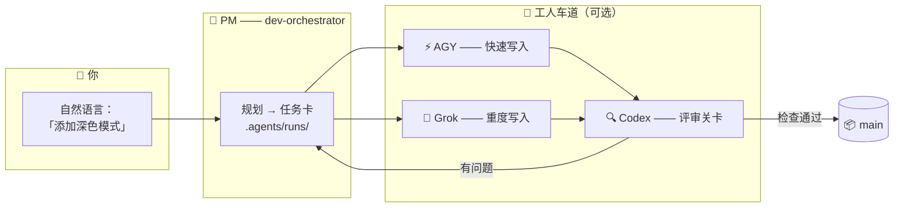

<div align="center">


# 🏭 Claude Lane Stack

### 一个人的小型 AI 编码工厂

**面向 Claude Code 的多智能体编排** —— 你只跟一个担任项目经理的 AI 智能体对话，
它负责派发可选的工人（AGY / Grok / Codex）、评审它们的产出，
并**把完成的代码合并到 `main`**。不用开五个聊天窗口，也不用手动合并。

[](LICENSE)
[](https://github.com/VKirill/claude-lane-stack/releases)
[](https://docs.anthropic.com/en/docs/claude-code)
[](docs/BEGINNER.zh-CN.md)
[](https://t.me/pomogay_marketing)

🌍 **README:** [English](README.md) · [Русский](README.ru.md) · [日本語](README.ja.md) · [Español](README.es.md) · [Deutsch](README.de.md) · [Français](README.fr.md) · [한국어](README.ko.md) · [Português](README.pt-BR.md)
🐣 **新手指南：** **中文** · [EN](docs/BEGINNER.md) · [RU](docs/BEGINNER.ru.md) · [日本語](docs/BEGINNER.ja.md) · [ES](docs/BEGINNER.es.md) · [DE](docs/BEGINNER.de.md) · [FR](docs/BEGINNER.fr.md) · [KO](docs/BEGINNER.ko.md) · [PT](docs/BEGINNER.pt-BR.md)

</div>

---

## 📌 目录

- [为什么需要它](#-为什么需要它) · [适合谁使用](#-适合谁使用) · [工作原理](#-工作原理)
- [快速开始](#-快速开始3-条命令) · [任务卡](#-任务卡让工人各守其道) · [你从不合并](#-你从不合并pm-代劳)
- [命令速查](#-命令速查表) · [能力档案](#-能力档案) · [常见问题](#-常见问题) · [文档地图](#-文档地图)

---

## 💡 为什么需要它

用 AI 编码工具干活，通常是这个样子：五个聊天窗口、复制粘贴的代码片段、半夜手动合并的分支，还没人检查任何人的工作。

**Claude Lane Stack 把这一切变成一条流水线：**

| 😩 五个聊天窗口 | 🏭 Lane Stack |
|---------------|---------------|
| 你得给每个模型重新解释上下文 | 一个 PM 掌握上下文，工人拿到**任务卡** |
| 模型互相覆盖对方的文件 | 每张卡都列出**所属路径** —— 工人各守其道 |
| 没人评审 AI 写的代码 | 有专门的**评审车道**（Codex）为每次合并把关 |
| 你手动合并分支 | 检查通过后，PM 合并到 **`main`** |
| 第二天早上：“我们当时在干嘛来着？” | `/resume-project` —— 几秒钟看清 现在 / 受阻 / 下一步 |

没有任务数据库。没有必须的云服务。**纯文件 + 纯 git** —— 一切都能在你的仓库里直接查看。

---

## 👥 适合谁使用

- 🧑‍💻 **独立开发者** —— 想用智能体编程（Agentic Coding）让多个 AI 工人并行干真实项目，又不想陷入聊天窗口的混乱
- 🚀 **独立开发者 / Indie hacker** —— 宁愿描述功能，也不愿盯着分支操心
- 🧠 **氛围编码者（Vibe-coder）** —— 你知道自己*想要什么*；工厂负责搞定*怎么做*
- 🏢 **一人机构** —— 用同一套纪律同时运营多个客户仓库

> [!TIP]
> 从没听过“编排（orchestration）”这个词？先从**[新手指南](docs/BEGINNER.zh-CN.md)**开始 —— 它把一切都讲成一座小工厂，零术语。

---

## 🧩 工作原理

<div align="center">

</div>

你只跟**一个智能体**对话 —— `dev-orchestrator`，也就是项目经理。它在各条车道之间调度工作：



| 角色 | 是谁 | 干什么 |
|------|-----|--------------|
| 👑 主人 | **你** | 用任何语言说出你*想要什么* |
| 🤖 项目经理 | Claude Code 智能体 `dev-orchestrator` | 规划、派发、验证、**合并** |
| ⚡🔧 写入车道 | AGY、Grok *（可选）* | 落实任务卡 |
| 🔍 评审车道 | Codex *（可选）* | 独立的质量关卡 |
| 🗂️ 任务卡 | `.agents/runs/` 里的 YAML 文件 | 车间现场 —— 完全可查看 |
| 📦 正式代码 | Git 分支 **`main`** | 每一个成功任务的归宿 |

> [!NOTE]
> **只有 Claude Code 是必需的。** 缺少工人也没关系 —— `agents-doctor` 会检测装了什么，PM 随之适配，一直可以退到纯 `claude-only` 模式。

---

## 🚀 快速开始（3 条命令）

```bash
# 1️⃣  安装整套工具 —— 每台电脑一次
git clone https://github.com/VKirill/claude-lane-stack.git
cd claude-lane-stack && ./install.sh
export PATH="$HOME/.agents/bin:$PATH"        # 或者打开一个新终端

# 2️⃣  在你的项目里 —— 检测可用的工人，每个仓库一次
cd /path/to/your-project
agents-doctor --apply .

# 3️⃣  启动 PM，正常对话
claude --agent dev-orchestrator
```

在某个项目上第一次使用时，在聊天里输入：**`/project-onboard`** —— 它会写出这个仓库的“护照”（`CLAUDE.md`、初始文档）。
休息之后回来：**`/resume-project`** —— 现在 / 受阻 / 下一步。

> [!IMPORTANT]
> `/resume-project` 是给后续会话用的*“欢迎回来”*命令 —— **不是**安装步骤。

📖 完整的大白话逐步讲解：**[docs/BEGINNER.zh-CN.md](docs/BEGINNER.zh-CN.md)**

---

## 📋 任务卡：让工人各守其道

<div align="center">

</div>

每个任务都是 `.agents/runs/` 里的一份小型 **YAML 契约** —— 由 PM 创建，工人遵守：

```yaml
task: add-dark-mode
goal: 设置页上的深色主题开关
owns_paths:            # 🔒 这个工人唯一可以改动的文件
  - src/settings/**
  - src/theme.css
verify:
  - npm test
  - npm run lint
lane: agy-implementer  # 谁来执行
review: codex-reviewer # 谁来把关合并
```

- 🔒 `owns_paths` —— 并行的工人**不会撞车**：一旦某个工人越界，`check-owns-paths` 就让任务失败
- ✅ `verify` —— 检查不通过就不许合并
- 📜 任务卡保留在 git 历史里 —— 完整记录每个智能体做了什么、为什么这么做

细节：[docs/FILE-CONTRACT.md](docs/FILE-CONTRACT.md)

---

## 📦 你从不合并，PM 代劳

<div align="center">

</div>

每个成功任务的结局都一样：**验证过的代码落到 `main`**，在评审和检查通过后，由编排者通过 `wt-merge-main` 完成合并。工人在隔离的 **git worktree** 里施工，因此并行任务永远不会互相踩踏。

> [!WARNING]
> 如果某个智能体竟然要求*你*去解决分支合并 —— 那是流程里的 bug，不是你该干的活。告诉 PM：*「合并是你的工作」*。

单人编排规则：[docs/SOLO-ORCHESTRATION.md](docs/SOLO-ORCHESTRATION.md)

---

## 🧾 命令速查表

### 这些是你来输入的

| 命令 / 说法 | 是什么 | 什么时候用 |
|------------------|------------|------|
| `./install.sh` | 把工厂套件装进 `~/.agents` | 每台电脑一次 |
| `agents-doctor --apply .` | 检测各个 CLI → 写出路由档案 | 每个项目一次 |
| `claude --agent dev-orchestrator` | 打开**你唯一需要的那个聊天** | 每次会话 |
| `/project-onboard` | 通过 Codex 生成仓库护照（CLAUDE.md + 文档） | 在某个仓库上第一次 |
| *「给设置加个深色模式」* | 一个工作请求 —— 任何语言都行 | 功能与修复 |
| `/resume-project` | 现在 / 受阻 / 下一步 | 休息之后 |
| *「它卡住了」* | PM 检查沉默的工人 | 长时间没动静 |

<details>
<summary>🤖 <b>通常只有 PM 才会输入这些</b></summary>

| 命令 | 是什么 |
|---------|------------|
| `run-board` | 刷新任务记分板 |
| `wt-create` / `wt-merge-main` | 隔离 worktree + **合并进 `main`** |
| `check-owns-paths` | 工人是否守在自己的文件清单内？ |
| `lane-heartbeat` / `lane-stall-check` | 工人还活着吗？谁沉默了？ |
| `project-memory-init` | 创建 PROGRESS / LESSONS 记忆文件 |
| `night-audit` | 对 runs 与文档做定时的日常整理 |

</details>

---

## 🚦 能力档案

`agents-doctor` 会根据它找到的 CLI，写出五种档案之一 —— PM 据此路由：

| 档案 | 你拥有 | 写入车道 | 评审车道 |
|---------|----------|------------|-------------|
| `full` | AGY + Grok + Codex | AGY / Grok | Codex |
| `claude-agy` | AGY | AGY | Claude |
| `claude-grok` | Grok | Grok | Claude |
| `claude-codex` | Codex | Codex | Codex |
| `claude-only` | 只有 Claude Code | Claude 子智能体 | Claude 子智能体 |

```bash
agents-doctor            # 显示检测报告
agents-doctor --apply .  # 把档案保存进项目
```

更多：[profiles/README.md](profiles/README.md) · [docs/ROUTING.md](docs/ROUTING.md)

---

## 🧱 盒子里有什么

```text
claude-lane-stack/
├── agents/        # 智能体定义：claude PM + agy / grok / codex 车道
├── bin/           # 11 个 CLI 工具：agents-doctor、run-board、wt-merge-main……
├── skills/        # 11 个技能：编排、契约、项目记忆、上手引导
├── profiles/      # 5 个路由档案（full → claude-only）
├── hooks/         # 安全钩子：shell 守卫、代码质量守卫、会话账本
├── templates/     # PROGRESS / LESSONS / decisions / session-log 模板
├── docs/          # 新手指南 + 深入文档（见下表 ↓）
└── install.sh     # 把所有东西放进 ~/.agents
```

上手引导之后，在**你的**项目里：

```text
your-app/
├── CLAUDE.md          # 简短的、始终生效的项目规则
├── AGENTS.md          # 给其他工具的“去读 CLAUDE.md”指针
├── .agents/runs/      # 🏭 车间现场 —— 任务卡、报告、合并记录
└── docs/plans/        # 🧠 策略文档（不是车间现场）
```

---

## ❓ 常见问题

<details>
<summary><b>AGY、Grok 和 Codex 我全都得装吗？</b></summary>

不用 —— **只有 Claude Code 是必需的**。其余全是可选的工人。`agents-doctor` 会检测你的配置，PM 随之适配，一直可以退到 `claude-only` 模式。

</details>

<details>
<summary><b>这跟单纯用 Claude Code 有什么区别？</b></summary>

单纯的 Claude Code 即便会派生子智能体（sub-agent），本质上仍是同一个聊天里的一个工人。Lane Stack 加上了一层**管理**：带文件所有权的任务卡、来自不同厂商的并行车道、独立的评审关卡、自动合并到 `main`，以及冷启动恢复。你负责策略，它负责后勤。

</details>

<details>
<summary><b>它需要数据库或云服务吗？</b></summary>

不需要。状态就存在**你仓库里的纯文件**（`.agents/runs/`）和 git 中。你可以读取、diff 并审计一切。

</details>

<details>
<summary><b>它能在我现有的项目上跑吗？</b></summary>

能。`cd your-project && agents-doctor --apply .`，然后 `/project-onboard` 会围绕你现有的代码写出护照。没有任务，就不会重写任何东西。

</details>

<details>
<summary><b>如果一个工人干到一半沉默了怎么办？</b></summary>

这套工具自带 `lane-heartbeat` / `lane-stall-check` —— PM 会检测到停滞并重新派发。你随时可以说*「它卡住了」*。

</details>

<details>
<summary><b>我的代码安全吗？</b></summary>

每个 CLI 只跟它自己的厂商通信，跟单独使用时完全一样 —— 这套工具**不增加任何额外服务器**。密钥不该出现在任务文件里；敏感区域（认证、支付）值得走评审车道。见 [SECURITY.md](SECURITY.md)。

</details>

---

## 📚 文档地图

| 主题 | 文档 |
|-------|-----|
| 🐣 大白话逐步讲解 | [docs/BEGINNER.zh-CN.md](docs/BEGINNER.zh-CN.md) |
| ⚖️ 与同类工具对比 | [docs/COMPARISON.md](docs/COMPARISON.md) |
| 🧑‍✈️ 单人规则 —— 为什么你从不合并 | [docs/SOLO-ORCHESTRATION.md](docs/SOLO-ORCHESTRATION.md) |
| 🗂️ 任务卡 YAML 结构剖析 | [docs/FILE-CONTRACT.md](docs/FILE-CONTRACT.md) |
| 🔀 谁写代码 / 谁评审 | [docs/ROUTING.md](docs/ROUTING.md) |
| 🛡️ 安全钩子 | [docs/HOOKS.md](docs/HOOKS.md) |
| 🧠 项目记忆（PROGRESS / LESSONS） | [docs/PROJECT-MEMORY.md](docs/PROJECT-MEMORY.md) |
| 📝 想法待办 | [docs/TODOS.md](docs/TODOS.md) |<!-- guardian: allow — link to existing docs/TODOS.md file, not a new TODO marker -->
| 🔌 MCP 配置（精简 / 混合） | [docs/MCP-LEAN.md](docs/MCP-LEAN.md) · [docs/MCP-HYBRID.md](docs/MCP-HYBRID.md) |
| 🤝 参与贡献 | [CONTRIBUTING.md](CONTRIBUTING.md) |
| 🔐 安全策略 | [SECURITY.md](SECURITY.md) |

---

## 📜 许可证

MIT —— [LICENSE](LICENSE)。用它、fork 它、打造你自己的工厂。

---

<div align="center">

<a href="https://github.com/VKirill"></a>

**Кирилл Вечкасов** · [@VKirill](https://github.com/VKirill) · Telegram：[Помогающий маркетолог](https://t.me/pomogay_marketing)

*我打造能干活的流水线，而不是又一个跟 LLM 的聊天。*

⭐ **如果“流水线”这个想法戳中了你 —— 给仓库点个 star 吧。** 这真的能帮到独立开发者找到它。

</div>
