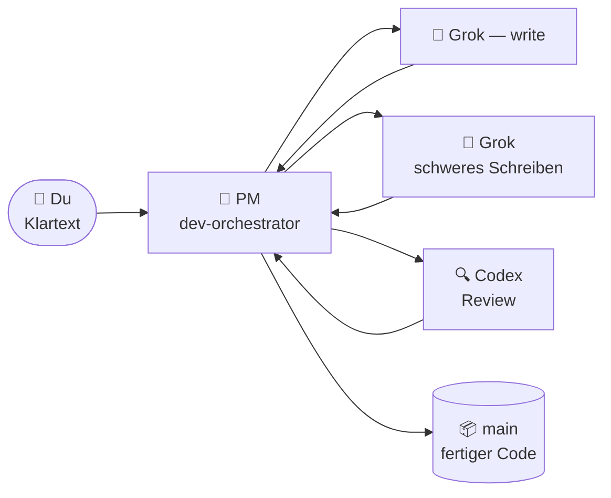

# 🐣 Einsteiger-Guide — Claude Lane Stack

> **Du musst kein Multi-Agent-Experte sein.**
> Diese Seite erklärt das System wie eine kleine Fabrik: du sprichst mit einem Manager, der Manager weist Workern Aufgaben zu, und fertige Arbeit landet auf dem `main`-Branch — für dich, ohne dich.

**Andere Sprachen:** [English](BEGINNER.md) · [Русский](BEGINNER.ru.md) · [简体中文](BEGINNER.zh-CN.md) · [日本語](BEGINNER.ja.md) · [Español](BEGINNER.es.md) · [Français](BEGINNER.fr.md) · [한국어](BEGINNER.ko.md) · [Português](BEGINNER.pt-BR.md)

---

## 🎯 Was du hier vor dir hast (60 Sekunden)

| Alltag | In diesem Projekt |
|---------------|-----------------|
| 🧑‍💼 Dir gehört eine Werkstatt | Du — der Mensch |
| 📋 Du stellst einen **Projektmanager** ein | Claude-Code-Agent `dev-orchestrator` |
| 👷 Der PM stellt Bauarbeiter und Prüfer ein | Andere KI-Tools:, Grok, Codex |
| 🗂️ Arbeit lebt auf **Task Cards**, nicht im Zurufen | Dateien in `.agents/runs/` |
| 📦 Fertige Ware kommt ins Lager | Git-Branch **`main`** |



**Orchestrierung** bedeutet einfach: der PM entscheidet, wer was macht, prüft das Ergebnis und mergt fertigen Code nach `main`.
Du führst **keine** fünf Chats und du mergst **keine** Branches von Hand.

> [!NOTE]
> Nur **Claude Code ist erforderlich**., Grok und Codex sind optionale Worker — der Stack erkennt, was du hast, und passt sich an.

---

## 📍 Die Reise

Drei Stationen, in deinem eigenen Tempo. Keine Timer, kein „Tag 1 / Tag 2“ — eine Station ist fertig, wenn ihre Checkliste besteht.

| Station | Was passiert | Wie oft |
|---------|--------------|-----------|
| 🧰 [**1. Die Fabrik installieren**](#-station-1--die-fabrik-installieren) | Der Stack landet in `~/.agents` | Einmal pro Computer |
| 🔌 [**2. Dein Projekt anbinden**](#-station-2--dein-projekt-anbinden) | Worker erkennen, Projektdokumente schreiben | Einmal pro Repository |
| 🚀 [**3. Erste Aufgabe**](#-station-3--deine-erste-aufgabe) | Der PM baut etwas Kleines für dich | Danach jeden Tag |

Dazu zwei Situationen, die dir später begegnen: [Zurückkommen nach einer Pause](#-zurückkommen-nach-einer-pause) und [wenn etwas festzustecken scheint](#-wenn-etwas-festzustecken-scheint).

---

## 🧰 Station 1 — Die Fabrik installieren

*Einmal pro Computer.*

> [!IMPORTANT]
> Voraussetzung: [Claude Code](https://docs.anthropic.com/en/docs/claude-code) ist installiert und du hast dich mindestens einmal angemeldet. Codex / Grok sind **optional** — überspring sie ruhig.

```bash
# 1. Den Stack herunterladen
git clone https://github.com/VKirill/claude-lane-stack.git
cd claude-lane-stack

# 2. Agenten, Skills und Tools nach ~/.agents installieren
./install.sh

# 3. Die Tools im Terminal sichtbar machen
export PATH="$HOME/.agents/bin:$PATH"
```

> [!TIP]
> Füge die `export PATH=..`-Zeile einmal zu deiner `~/.bashrc` (oder `~/.zshrc`) hinzu — dann funktioniert jedes neue Terminal einfach.

**Checkliste Station 1 — fertig, wenn:**

- [ ] `./install.sh` ohne Fehler durchgelaufen ist
- [ ] `agents-doctor` einen Bericht ausgibt (irgendeinen) statt „command not found“

<details>
<summary>🚑 <b>Fehlerbehebung: «agents-doctor: command not found»</b></summary>

Dein Terminal sieht `~/.agents/bin` noch nicht. Öffne entweder ein **neues** Terminal oder führe aus:

```bash
export PATH="$HOME/.agents/bin:$PATH"
```

So behebst du es dauerhaft:

```bash
echo 'export PATH="$HOME/.agents/bin:$PATH"' >> ~/.bashrc
```

</details>

---

## 🔌 Station 2 — Dein Projekt anbinden

*Einmal pro Repository — deine App, nicht das Repo dieses Stacks.*

```bash
# 1. Geh in DEIN Projekt
cd ~/projects/my-app

# 2. Erkennen, welche KI-CLIs du hast → ein Routing-Profil schreiben
agents-doctor --apply .

# 3. Den PM starten
claude --agent dev-orchestrator
```

Dann, **im Claude-Chat**, ein Befehl:

```text
/project-onboard
```

Codex (oder Claude selbst, wenn Codex fehlt) schreibt den „Ausweis“ des Projekts: `CLAUDE.md`, Start-Dokumente, Gedächtnisdateien. Warte, bis es fertig ist — das ist eine einmalige Sache pro Repo.

**Was das Profil bedeutet** — einfach „welche Worker hier verfügbar sind“:

| Profil | Du hast installiert | Wer schreibt Code | Wer reviewt |
|---------|-------------------|-----------------|-------------|
| `full` | Grok + Codex | Grok | Codex |
| `claude-codex` | Nur Codex | Codex | Codex |
| `claude-only` | Nur Claude Code | Claude-Subagenten | Claude-Subagenten |

**Checkliste Station 2 — fertig, wenn:**

- [ ] `agents-doctor --apply .` einen Profilnamen ausgegeben hat (z. B. `full` oder `claude-only`)
- [ ] `CLAUDE.md` nach `/project-onboard` im Projekt-Root existiert

> [!NOTE]
> Ein „schlechteres“ Profil ist kein Problem. `claude-only` funktioniert einwandfrei — es ist nur langsamer und nutzt ein Gehirn statt drei.

---

## 🚀 Station 3 — Deine erste Aufgabe

*Gleicher Ordner, gleicher Befehl, jede Arbeitssitzung:*

```

> **v1.1.0:** `/project-onboard` wählt minimal/full und fast/deep. Lange Lanes: `lane-bg` ([LANE-EXEC.md](LANE-EXEC.md)).
bash
claude --agent dev-orchestrator
```

Jetzt nenne ein **kleines, konkretes** Ziel in Klartext:

> *«Füge dem README einen Installationsabschnitt hinzu»*
> *«Korrigiere den Tippfehler auf der Preisseite»*
> *«Добавь тёмную тему в настройки»* — jede Sprache funktioniert

**Was du siehst, während der PM arbeitet:**

| Dir fällt auf | Bedeutung | Musst du handeln? |
|-----------|---------|-------------|
| Dateien tauchen unter `.agents/runs/` auf | Task Cards für Worker — die Werkshalle | Nein, nur Neugier |
| PM erwähnt „Worktree“ | Isolierte Kopie, damit Worker nicht kollidieren | Nein |
| PM meldet Prüfungen / Review | Qualitäts-Gate vor dem Merge | Nein |
| PM sagt **fertig, nach `main` gemergt** | Dein Ergebnis ist offiziell | ✅ Sieh dir die App an |

**Checkliste Station 3 — fertig, wenn:**

- [ ] Die Änderung ist auf `main` und du hast nie `git merge` getippt

> [!WARNING]
> Wenn der PM jemals **dich** bittet, einen Branch zu mergen — dann stimmt etwas nicht. Mergen ist der Job des PM (`wt-merge-main`). Sag *«merge das selbst, das ist dein Job»*.

---

## 🌅 Zurückkommen nach einer Pause

Neues Chat-Fenster = der PM hat das gestrige Gespräch vergessen. **Der Code und die Aufgaben-History sind sicher** — nur das Chat-Gedächtnis ist weg. Dieser Moment heißt *Kaltstart*, und dafür gibt es einen Spickzettel:

```bash
cd ~/projects/my-app
claude --agent dev-orchestrator
```

dann im Chat:

```text
/resume-project
```

Du bekommst eine kurze **Now / Blocked / Next**-Zusammenfassung und machst in Klartext weiter.

> [!TIP]
> `/resume-project` ist ein *„Willkommen zurück“*-Befehl, **kein** Installationsschritt. Die allererste Sitzung in einem Projekt braucht ihn nicht — es gibt noch nichts fortzusetzen.

---

## 🧯 Wenn etwas festzustecken scheint

Lange Stille? Worker können hängen bleiben — der Stack hat genau dafür Werkzeuge.

| Sag dem PM | Was passiert |
|---------------|--------------|
| *«Es hängt, prüf die Worker»* | PM führt `lane-stall-check` aus, findet stumme Worker |
| *«Zeig das Board»* | PM führt `run-board` aus — die Job-Anzeigetafel |
| *«Starte die Aufgabe neu»* | PM verteilt den Worker erneut auf dieselbe Task Card |

Immer noch komisch? Frag den PM direkt: *«erkläre in einfachen Worten, was du gerade tust»*. Er wird es tun.

---

## 💬 Was du dem PM sagen kannst — Spickzettel

| Du sagst | Der PM tut |
|---------|-------------|
| `/project-onboard` | Einmaliger Repo-Ausweis (CLAUDE.md + Dokumente) |
| *«Dark Mode zu den Einstellungen hinzufügen»* | Plan → Task Cards → Worker → Prüfungen → Merge nach `main` |
| *«Nur planen, kein Code»* | Schreibt einen Plan unter `docs/plans/` — nichts wird gemergt |
| *«Setze den Plan um»* | Überführt einen Plan in echte Task Cards unter `.agents/runs/` |
| `/resume-project` | Now / Blocked / Next nach einer Pause |
| *«Es hängt»* | Stall-Check, erneutes Verteilen |

**Besser vermeiden:** git-Branches selbst verwalten · fünf Claude-Fenster für ein Feature laufen lassen · stillschweigend Dateien bearbeiten, die ein Worker mitten im Lauf besitzt (sag es erst dem PM).

---

## 📖 Glossar

<details>
<summary><b>Jeder Begriff, der dir begegnet, in einfachen Worten</b> (zum Öffnen klicken)</summary>

| Begriff | Einfache Bedeutung | Wann es dich interessiert |
|------|----------------|---------------|
| **Agent** | Eine KI, die mit Tools Code lesen/schreiben kann | Immer — sie machen die Arbeit |
| **PM / Orchestrator** | Der „Chef“-Agent (`dev-orchestrator`) | Mit dem sprichst du meistens |
| **Lane** | Ein Worker-Typ: schnelles Schreiben / schweres Schreiben / Review | Das Setup wählt  vs. Grok vs. Codex |
| **Claude Code** | Anthropics Terminal-Coding-App | **Erforderlich** — beherbergt den PM |
| **Grok** | xAI CLI | Optionaler Schwer-Schreib-Worker |
| **Codex** | OpenAI CLI | Optionaler Reviewer + Onboarding |
| **Task Card / Vertrag** | Kleine YAML-Datei: Ziel, erlaubte Dateien, Prüfungen | Der PM schreibt sie; Worker befolgen sie |
| **`.agents/runs/`** | Ordner mit aktiven Jobs — die Werkshalle | Erscheint, sobald echte Arbeit beginnt |
| **`docs/plans/`** | Strategie-Notizen (Recherche, lange Pläne) | Noch kein Code — sag *«umsetzen»* |
| **`main`** | Der offizielle git-Branch | Wo jeder erfolgreiche Job endet |
| **Worktree** | Isolierte Repo-Kopie für parallele Arbeit | Der Trick des PM, damit Worker sich nicht streiten |
| **Merge** | Fertige Arbeit in `main` einfügen | **Job des PM, nie deiner** |
| **Onboard** | Erstmaliger Projekt-Ausweis | Einmal pro Repository |
| **Kaltstart** | Neuer Chat, Gedächtnis leer | `/resume-project` behebt es |

</details>

---

## ❓ FAQ

<details>
<summary><b>Muss ich Grok + Codex alle installiert haben?</b></summary>

Nein. Nur **Claude Code** ist erforderlich. `agents-doctor` erkennt, was vorhanden ist, und schreibt ein passendes Profil — die Fabrik schrumpft oder wächst entsprechend.

</details>

<details>
<summary><b>Wo wird meine Arbeit gespeichert, wenn ich alles schließe?</b></summary>

Code — auf der Festplatte und in git (`main` nach jedem Erfolg). Aufgaben-History — in `.agents/runs/`. Nur das **Chat-Gedächtnis** verschwindet; `/resume-project` baut den Kontext in Sekunden wieder auf.

</details>

<details>
<summary><b>Es gibt einen großen Plan in <code>docs/plans/</code>, aber keinen Code. Ein Bug?</b></summary>

Nein — das ist ein **Strategiedokument** (Recherche, SEO-Plan, Architektur). Die Code-Arbeit beginnt erst, wenn ein Plan zu Task Cards wird. Sag *«setze es um»* und der PM erstellt einen Run unter `.agents/runs/`.

</details>

<details>
<summary><b>Kann ich selbst Code bearbeiten, während die Fabrik läuft?</b></summary>

Ja, vorsichtig. Best Practice: sag dem PM, was du angefasst hast, damit seine Task Cards nicht mit deinen Händen kollidieren.

</details>

<details>
<summary><b>Wie unterscheidet sich das davon, einfach… Claude Code zu nutzen?</b></summary>

Reines Claude Code ist ein Worker in einem Chat. Lane Stack fügt eine **Manager-Ebene** hinzu: Task Cards mit Dateibesitz, parallele Worker von verschiedenen Anbietern, eine unabhängige Review-Lane und automatischer Merge nach `main`. Du redest Strategie; es erledigt die Logistik.

</details>

<details>
<summary><b>Wird mein Code an ungewöhnliche Orte gesendet?</b></summary>

Jedes CLI (Claude/Grok / Codex) spricht mit seinem eigenen Anbieter, genau wie im Alleinbetrieb. Der Stack fügt keine zusätzlichen Server hinzu. Secrets gehören nicht in Task-Dateien — siehe [SECURITY.md](./SECURITY.md).

</details>

---

## 🧭 Wie es weitergeht

| Du willst | Lies |
|----------|------|
| Die Startseite mit dem großen Überblick | [README](./README.de.md) |
| Regeln der Solo-Orchestrierung (warum du nie mergst) | [SOLO-ORCHESTRATION.md](SOLO-ORCHESTRATION.md) |
| Was in einer Task Card steckt | [FILE-CONTRACT.md](FILE-CONTRACT.md) |
| Wer schreibt und wer reviewt | [ROUTING.md](ROUTING.md) |
| Sicherheits-Hooks | [HOOKS.md](HOOKS.md) |
| Projektgedächtnis (PROGRESS / LESSONS) | [PROJECT-MEMORY.md](PROJECT-MEMORY.md) |

> 🏭 Irgendwo auf dieser Seite hängengeblieben? Öffne den PM-Chat und frag: *«erkläre das einfach»*. Dich zu lehren **ist** Teil seines Jobs.
