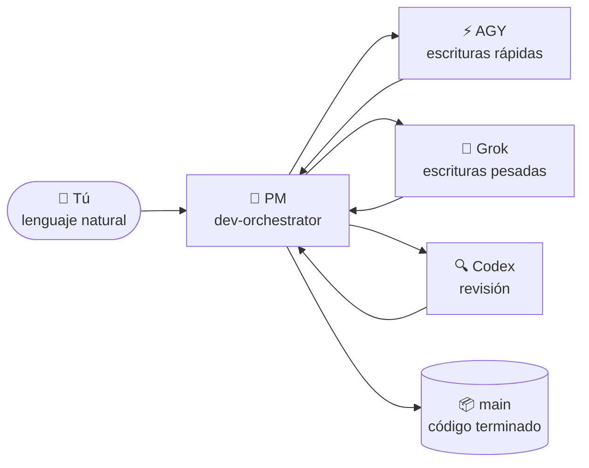

# 🐣 Guía para principiantes — Claude Lane Stack

> **No necesitas ser un experto en multi-agente.**
> Esta página explica el sistema como una pequeña fábrica: hablas con un solo jefe, el jefe asigna los workers, y el trabajo terminado llega a la rama `main` — para ti, sin ti.

**Otros idiomas:** [English](BEGINNER.md) · [Русский](BEGINNER.ru.md) · [简体中文](BEGINNER.zh-CN.md) · [日本語](BEGINNER.ja.md) · [Deutsch](BEGINNER.de.md) · [Français](BEGINNER.fr.md) · [한국어](BEGINNER.ko.md) · [Português](BEGINNER.pt-BR.md)

---

## 🎯 Qué estás viendo (60 segundos)

| Vida cotidiana | En este proyecto |
|---------------|-----------------|
| 🧑‍💼 Tienes un taller | Tú — el humano |
| 📋 Contratas a un **jefe de proyecto** | Agente de Claude Code `dev-orchestrator` |
| 👷 El PM contrata constructores e inspectores | Otras herramientas de IA: AGY, Grok, Codex |
| 🗂️ El trabajo vive en **tarjetas de tarea**, no en gritos | Archivos en `.agents/runs/` |
| 📦 Los productos terminados van al almacén | Rama de Git **`main`** |



**Orquestación** simplemente significa: el PM decide quién hace qué, comprueba el resultado y fusiona el código terminado en `main`.
**No** manejas cinco chats y **no** fusionas ramas a mano.

> [!NOTE]
> Solo **Claude Code es obligatorio**. AGY, Grok y Codex son workers opcionales — el stack detecta lo que tienes y se adapta.

---

## 🗺️ El recorrido

Tres estaciones, a tu propio ritmo. Sin cronómetros, sin «día 1 / día 2» — cada estación está lista cuando pasa su checklist.

| Estación | Qué pasa | Con qué frecuencia |
|---------|--------------|-----------|
| 🏗️ [**1. Instala la fábrica**](#-estación-1--instala-la-fábrica) | El stack llega a `~/.agents` | Una vez por equipo |
| 🔌 [**2. Conecta tu proyecto**](#-estación-2--conecta-tu-proyecto) | Detecta workers, escribe los docs del proyecto | Una vez por repositorio |
| 🚀 [**3. Primera tarea**](#-estación-3--tu-primera-tarea) | El PM construye algo pequeño para ti | Luego cada día |

Además, dos situaciones que encontrarás más adelante: [volver tras una pausa](#-volver-tras-una-pausa) y [cuando algo parece atascado](#-cuando-algo-parece-atascado).

---

## 🏗️ Estación 1 — Instala la fábrica

*Una vez por equipo.*

> [!IMPORTANT]
> Requisito previo: [Claude Code](https://docs.anthropic.com/en/docs/claude-code) está instalado y has iniciado sesión al menos una vez. Codex / AGY / Grok son **opcionales** — sáltatelos sin problema.

```bash
# 1. Descarga el stack
git clone https://github.com/VKirill/claude-lane-stack.git
cd claude-lane-stack

# 2. Instala agentes, skills y herramientas en ~/.agents
./install.sh

# 3. Haz visibles las herramientas en la terminal
export PATH="$HOME/.agents/bin:$PATH"
```

> [!TIP]
> Añade la línea `export PATH=...` a tu `~/.bashrc` (o `~/.zshrc`) una vez — y así cada terminal nueva funciona sin más.

**Checklist de la Estación 1 — lista cuando:**

- [ ] `./install.sh` terminó sin errores
- [ ] `agents-doctor` imprime un informe (cualquiera) en lugar de «command not found»

<details>
<summary>🚑 <b>Solución de problemas: «agents-doctor: command not found»</b></summary>

Tu terminal aún no ve `~/.agents/bin`. Abre una terminal **nueva**, o ejecuta:

```bash
export PATH="$HOME/.agents/bin:$PATH"
```

Para arreglarlo de forma permanente:

```bash
echo 'export PATH="$HOME/.agents/bin:$PATH"' >> ~/.bashrc
```

</details>

---

## 🔌 Estación 2 — Conecta tu proyecto

*Una vez por repositorio — tu app, no el repo de este stack.*

```bash
# 1. Entra en TU proyecto
cd ~/projects/my-app

# 2. Detecta qué CLI de IA tienes → escribe un perfil de enrutamiento
agents-doctor --apply .

# 3. Arranca el PM
claude --agent dev-orchestrator
```

Luego, **dentro del chat de Claude**, un comando:

```text
/project-onboard
```

Codex (o el propio Claude si Codex no está) escribe el «pasaporte» del proyecto: `CLAUDE.md`, documentos iniciales, archivos de memoria. Espera a que termine — esto es algo que se hace una sola vez por repo.

**Qué significa el perfil** — simplemente «qué workers están disponibles aquí»:

| Perfil | Lo que tienes instalado | Quién escribe el código | Quién revisa |
|---------|-------------------|-----------------|-------------|
| `full` | AGY + Grok + Codex | AGY / Grok | Codex |
| `claude-codex` | solo Codex | Codex | Codex |
| `claude-only` | solo Claude Code | Subagentes de Claude | Subagentes de Claude |

**Checklist de la Estación 2 — lista cuando:**

- [ ] `agents-doctor --apply .` imprimió el nombre de un perfil (p. ej. `full` o `claude-only`)
- [ ] `CLAUDE.md` existe en la raíz del proyecto tras `/project-onboard`

> [!NOTE]
> Un perfil «peor» no es un problema. `claude-only` funciona bien — solo es más lento y usa un cerebro en lugar de tres.

---

## 🚀 Estación 3 — Tu primera tarea

*Misma carpeta, mismo comando, cada sesión de trabajo:*

```bash
claude --agent dev-orchestrator
```

Ahora di un objetivo **pequeño y concreto** en lenguaje natural:

> *«Añade una sección de instalación al README»*
> *«Corrige la errata en la página de precios»*
> *«Добавь тёмную тему в настройки»* — cualquier idioma sirve

**Lo que verás mientras el PM trabaja:**

| Notas | Significado | ¿Actúas? |
|-----------|---------|-------------|
| Aparecen archivos en `.agents/runs/` | Tarjetas de tarea para los workers — la planta de la fábrica | No, solo curiosidad |
| El PM menciona «worktree» | Copia aislada para que los workers no colisionen | No |
| El PM informa de verificaciones / revisión | Control de calidad antes del merge | No |
| El PM dice **listo, fusionado a `main`** | Tu resultado es oficial | ✅ Revisa la app |

**Checklist de la Estación 3 — lista cuando:**

- [ ] El cambio está en `main` y nunca escribiste `git merge`

> [!WARNING]
> Si el PM alguna vez te pide a **ti** que fusiones una rama — algo va mal. Hacer merge es trabajo del PM (`wt-merge-main`). Di *«fusiónalo tú, que es tu trabajo»*.

---

## 🌅 Volver tras una pausa

Ventana de chat nueva = el PM olvidó la conversación de ayer. **El código y el historial de tareas están a salvo** — solo se pierde la memoria del chat. Ese momento se llama *arranque en frío*, y para eso existe una receta rápida:

```bash
cd ~/projects/my-app
claude --agent dev-orchestrator
```

luego, dentro del chat:

```text
/resume-project
```

Obtienes un breve resumen **Ahora / Bloqueado / Siguiente** y continúas en lenguaje natural.

> [!TIP]
> `/resume-project` es un comando de *«bienvenido de nuevo»*, **no** un paso de instalación. La primera sesión en un proyecto no lo necesita — todavía no hay nada que retomar.

---

## 🧯 Cuando algo parece atascado

¿Silencio prolongado? Los workers pueden atascarse — el stack tiene herramientas justo para esto.

| Dile al PM | Qué pasa |
|---------------|--------------|
| *«Está atascado, revisa los workers»* | El PM ejecuta `lane-stall-check`, encuentra los workers en silencio |
| *«Muestra el tablero»* | El PM ejecuta `run-board` — el marcador de trabajos |
| *«Reinicia esa tarea»* | El PM vuelve a despachar el worker sobre la misma tarjeta de tarea |

¿Sigue raro? Pregúntale al PM directamente: *«explícame en palabras sencillas qué estás haciendo ahora mismo»*. Lo hará.

---

## 💬 Qué decirle al PM — referencia rápida

| Tú dices | El PM hace |
|---------|-------------|
| `/project-onboard` | Pasaporte del repo por única vez (CLAUDE.md + docs) |
| *«Añade modo oscuro a los ajustes»* | Plan → tarjetas de tarea → workers → verificaciones → merge a `main` |
| *«Solo el plan, sin código»* | Escribe un plan en `docs/plans/` — no se fusiona nada |
| *«Implementa el plan»* | Convierte un plan en tarjetas de tarea reales en `.agents/runs/` |
| `/resume-project` | Ahora / Bloqueado / Siguiente tras una pausa |
| *«Está atascado»* | Comprobación de atascos, nuevo despacho |

**Mejor evitar:** gestionar tú mismo las ramas de git · abrir cinco ventanas de Claude para una sola funcionalidad · editar en silencio archivos que un worker posee mientras trabaja (avisa antes al PM).

---

## 📖 Glosario

<details>
<summary><b>Todos los términos que encontrarás, en palabras sencillas</b> (clic para abrir)</summary>

| Término | Significado sencillo | Cuándo te importa |
|------|----------------|---------------|
| **Agente** | Una IA que puede leer/escribir código con herramientas | Siempre — hacen el trabajo |
| **PM / orquestador** | El agente «jefe» (`dev-orchestrator`) | Hablas sobre todo con este |
| **Carril (lane)** | Un tipo de worker: escritura rápida / escritura pesada / revisión | La configuración elige entre AGY, Grok y Codex |
| **Claude Code** | La app de programación en terminal de Anthropic | **Obligatorio** — aloja al PM |
| **AGY** | El CLI Antigravity de Google | Worker opcional de escritura rápida |
| **Grok** | El CLI de xAI | Worker opcional de escritura pesada |
| **Codex** | El CLI de OpenAI | Revisor opcional + onboarding |
| **Tarjeta de tarea / contrato** | Pequeño archivo YAML: objetivo, archivos permitidos, verificaciones | El PM las escribe; los workers las obedecen |
| **`.agents/runs/`** | Carpeta de trabajos activos — la planta de la fábrica | Aparece cuando empieza el trabajo real |
| **`docs/plans/`** | Notas de estrategia (investigación, planes largos) | Todavía no es código — di *«implementa»* |
| **`main`** | La rama oficial de git | Donde termina cada trabajo exitoso |
| **Worktree** | Copia aislada del repo para trabajo en paralelo | El truco del PM para que los workers no se peleen |
| **Merge** | Integrar el trabajo terminado en `main` | **Trabajo del PM, nunca tuyo** |
| **Onboard** | Pasaporte del proyecto por primera vez | Una vez por repositorio |
| **Arranque en frío (cold start)** | Chat nuevo, memoria vacía | `/resume-project` lo soluciona |

</details>

---

## ❓ Preguntas frecuentes

<details>
<summary><b>¿Necesito tener AGY + Grok + Codex instalados a la vez?</b></summary>

No. Solo **Claude Code** es obligatorio. `agents-doctor` detecta lo que existe y escribe un perfil acorde — la fábrica se encoge o crece para encajar.

</details>

<details>
<summary><b>¿Dónde se guarda mi trabajo si cierro todo?</b></summary>

El código — en disco y en git (`main` tras cada éxito). El historial de tareas — en `.agents/runs/`. Solo desaparece la **memoria del chat**; `/resume-project` reconstruye el contexto en segundos.

</details>

<details>
<summary><b>Hay un plan grande en <code>docs/plans/</code> pero no hay código. ¿Es un bug?</b></summary>

No — eso es un **documento de estrategia** (investigación, plan de SEO, arquitectura). El trabajo de código solo empieza cuando un plan se convierte en tarjetas de tarea. Di *«impleméntalo»* y el PM crea un run en `.agents/runs/`.

</details>

<details>
<summary><b>¿Puedo editar el código yo mismo mientras la fábrica funciona?</b></summary>

Sí, con cuidado. Buena práctica: dile al PM qué tocaste, para que sus tarjetas de tarea no colisionen con tus manos.

</details>

<details>
<summary><b>¿En qué se diferencia de simplemente… usar Claude Code?</b></summary>

Claude Code a secas es un worker en un chat. Lane Stack añade una **capa de gestión**: tarjetas de tarea con propiedad de archivos, workers en paralelo de distintos proveedores, un carril de revisión independiente y merge automático a `main`. Tú hablas de estrategia; él lleva la logística.

</details>

<details>
<summary><b>¿Mi código se envía a algún lugar inusual?</b></summary>

Cada CLI (Claude/AGY/Grok/Codex) habla con su propio proveedor exactamente igual que si funcionara por su cuenta. El stack no añade servidores extra. Los secretos no van en los archivos de tarea — consulta [SECURITY.md](../SECURITY.md).

</details>

---

## 🧭 Adónde ir después

| Lo que quieres | Lee |
|----------|------|
| La portada con la visión general | [README](../README.es.md) |
| Reglas de la orquestación en solitario (por qué nunca haces merge) | [SOLO-ORCHESTRATION.md](SOLO-ORCHESTRATION.md) |
| Qué hay dentro de una tarjeta de tarea | [FILE-CONTRACT.md](FILE-CONTRACT.md) |
| Quién escribe y quién revisa | [ROUTING.md](ROUTING.md) |
| Hooks de seguridad | [HOOKS.md](HOOKS.md) |
| Memoria de proyecto (PROGRESS / LESSONS) | [PROJECT-MEMORY.md](PROJECT-MEMORY.md) |

> 🏭 ¿Te atascaste en algún punto de esta página? Abre el chat del PM y pregunta: *«explícame esto de forma sencilla»*. Enseñarte **es** parte de su trabajo.
