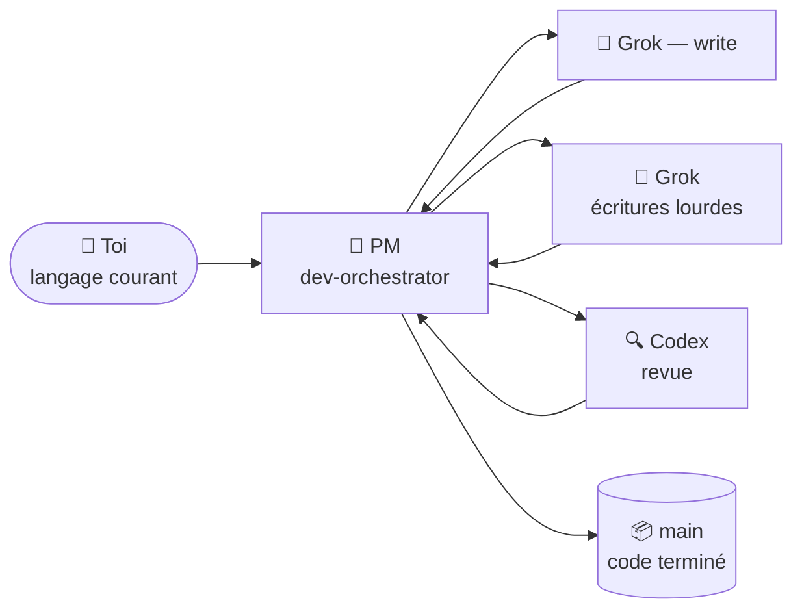

# 🐣 Guide du débutant — Claude Lane Stack

> **Pas besoin d'être un expert du multi-agent.**
> Cette page explique le système comme une petite usine : tu parles à un seul manager, le manager assigne des workers, et le travail terminé arrive sur la branche `main` — pour toi, sans toi.

**Autres langues :** [English](BEGINNER.md) · [Русский](BEGINNER.ru.md) · [简体中文](BEGINNER.zh-CN.md) · [日本語](BEGINNER.ja.md) · [Español](BEGINNER.es.md) · [Deutsch](BEGINNER.de.md) · [한국어](BEGINNER.ko.md) · [Português](BEGINNER.pt-BR.md)

---

## 🎯 Ce que tu as sous les yeux (60 secondes)

| Dans la vie de tous les jours | Dans ce projet |
|---------------|-----------------|
| 🧑‍💼 Tu possèdes un atelier | Toi — l'humain |
| 📋 Tu embauches un **chef de projet** | Agent Claude Code `dev-orchestrator` |
| 👷 Le PM embauche des ouvriers et des inspecteurs | D'autres outils IA :, Grok, Codex |
| 🗂️ Le travail vit sur des **fiches de tâche**, pas dans les cris | Des fichiers dans `.agents/runs/` |
| 📦 Les produits finis vont à l'entrepôt | Branche Git **`main`** |



**L'orchestration**, ça veut simplement dire : le PM décide qui fait quoi, vérifie le résultat, et fusionne le code terminé dans `main`.
Tu ne fais **pas** tourner cinq chats et tu ne fusionnes **pas** les branches à la main.

> [!NOTE]
> Seul **Claude Code est requis**., Grok et Codex sont des workers optionnels — le stack détecte ce que tu as et s'adapte.

---

## 📍 Le parcours

Trois étapes, à ton rythme. Pas de minuteur, pas de « jour 1 / jour 2 » — chaque étape est terminée quand sa checklist passe.

| Étape | Ce qui se passe | À quelle fréquence |
|---------|--------------|-----------|
| 🧰 [**1. Installer l'usine**](#-étape-1--installer-lusine) | Le stack arrive dans `~/.agents` | Une fois par ordinateur |
| 🔌 [**2. Connecter ton projet**](#-étape-2--connecter-ton-projet) | Détecte les workers, écrit les docs du projet | Une fois par dépôt |
| 🚀 [**3. Ta première tâche**](#-étape-3--ta-première-tâche) | Le PM te construit quelque chose de petit | Puis tous les jours |

Plus deux situations que tu rencontreras plus tard : [revenir après une pause](#-revenir-après-une-pause) et [quand quelque chose semble coincé](#-quand-quelque-chose-semble-coincé).

---

## 🧰 Étape 1 — Installer l'usine

*Une fois par ordinateur.*

> [!IMPORTANT]
> Prérequis : [Claude Code](https://docs.anthropic.com/en/docs/claude-code) est installé et tu t'es connecté au moins une fois. Codex / Grok sont **optionnels** — tu peux les ignorer sans souci.

```bash
# 1. Télécharge le stack
git clone https://github.com/VKirill/claude-lane-stack.git
cd claude-lane-stack

# 2. Installe les agents, skills et outils dans ~/.agents
./install.sh

# 3. Rends les outils visibles dans le terminal
export PATH="$HOME/.agents/bin:$PATH"
```

> [!TIP]
> Ajoute la ligne `export PATH=..` à ton `~/.bashrc` (ou `~/.zshrc`) une bonne fois — ensuite, chaque nouveau terminal fonctionne tout seul.

**Checklist de l'étape 1 — terminée quand :**

- [ ] `./install.sh` s'est terminé sans erreur
- [ ] `agents-doctor` affiche un rapport (n'importe lequel) au lieu de « command not found »

<details>
<summary>🚑 <b>Dépannage : « agents-doctor: command not found »</b></summary>

Ton terminal ne voit pas encore `~/.agents/bin`. Soit tu ouvres un **nouveau** terminal, soit tu lances :

```bash
export PATH="$HOME/.agents/bin:$PATH"
```

Pour régler ça définitivement :

```bash
echo 'export PATH="$HOME/.agents/bin:$PATH"' >> ~/.bashrc
```

</details>

---

## 🔌 Étape 2 — Connecter ton projet

*Une fois par dépôt — ton app, pas le dépôt de ce stack.*

```bash
# 1. Va dans TON projet
cd ~/projects/my-app

# 2. Détecte les CLI IA que tu as → écrit un profil de routage
agents-doctor --apply .

# 3. Lance le PM
claude --agent dev-orchestrator
```

Ensuite, **dans le chat Claude**, une seule commande :

```text
/project-onboard
```

Codex (ou Claude lui-même si Codex est absent) écrit le « passeport » du projet : `CLAUDE.md`, docs de départ, fichiers mémoire. Attends que ça se termine — c'est une opération unique par dépôt.

**Ce que veut dire le profil** — juste « quels workers sont disponibles ici » :

| Profil | Ce que tu as installé | Qui écrit le code | Qui relit |
|---------|-------------------|-----------------|-------------|
| `full` | Grok + Codex | Grok | Codex |
| `claude-codex` | Codex seulement | Codex | Codex |
| `claude-only` | Juste Claude Code | Sous-agents Claude | Sous-agents Claude |

**Checklist de l'étape 2 — terminée quand :**

- [ ] `agents-doctor --apply .` a affiché un nom de profil (par ex. `full` ou `claude-only`)
- [ ] `CLAUDE.md` existe à la racine du projet après `/project-onboard`

> [!NOTE]
> Un profil « moins bon » n'est pas un problème. `claude-only` marche très bien — c'est juste plus lent et ça utilise un seul cerveau au lieu de trois.

---

## 🚀 Étape 3 — Ta première tâche

*Même dossier, même commande, à chaque session de travail :*

```

> **v1.1.0:** `/project-onboard` choisit minimal/full et fast/deep. Lanes longues: `lane-bg` ([LANE-EXEC.md](LANE-EXEC.md)).
bash
claude --agent dev-orchestrator
```

Maintenant, exprime un objectif **petit et concret** en langage courant :

> *« Ajoute une section installation au README »*
> *« Corrige la faute de frappe sur la page des tarifs »*
> *« Добавь тёмную тему в настройки »* — n'importe quelle langue fonctionne

**Ce que tu verras pendant que le PM travaille :**

| Tu remarques | Signification | Tu interviens ? |
|-----------|---------|-------------|
| Des fichiers apparaissent sous `.agents/runs/` | Des fiches de tâche pour les workers — l'atelier | Non, juste par curiosité |
| Le PM parle de « worktree » | Une copie isolée pour que les workers ne se marchent pas dessus | Non |
| Le PM rend compte des vérifs / de la revue | Contrôle qualité avant la fusion | Non |
| Le PM dit **terminé, fusionné dans `main`** | Ton résultat est officiel | ✅ Vérifie l'app |

**Checklist de l'étape 3 — terminée quand :**

- [ ] Le changement est sur `main` et tu n'as jamais tapé `git merge`

> [!WARNING]
> Si le PM te demande un jour, à **toi**, de fusionner une branche — c'est qu'il y a un problème. La fusion, c'est le boulot du PM (`wt-merge-main`). Dis *« fusionne toi-même, c'est ton boulot »*.

---

## 🌅 Revenir après une pause

Nouvelle fenêtre de chat = le PM a oublié la conversation d'hier. **Le code et l'historique des tâches sont intacts** — seule la mémoire du chat a disparu. Ce moment s'appelle un *démarrage à froid*, et il existe un aide-mémoire pour ça :

```bash
cd ~/projects/my-app
claude --agent dev-orchestrator
```

puis, dans le chat :

```text
/resume-project
```

Tu obtiens un court résumé **Maintenant / Bloqué / Ensuite** et tu continues en langage courant.

> [!TIP]
> `/resume-project` est une commande de *« bon retour »*, **pas** une étape d'installation. La toute première session sur un projet n'en a pas besoin — il n'y a encore rien à reprendre.

---

## 🧯 Quand quelque chose semble coincé

Long silence ? Les workers peuvent se bloquer — le stack a des outils faits exactement pour ça.

| Dis au PM | Ce qui se passe |
|---------------|--------------|
| *« Ça coince, vérifie les workers »* | Le PM lance `lane-stall-check`, trouve les workers silencieux |
| *« Montre le tableau »* | Le PM lance `run-board` — le tableau de bord des tâches |
| *« Relance cette tâche »* | Le PM redéploie le worker sur la même fiche de tâche |

Toujours bizarre ? Demande directement au PM : *« explique-moi ce que tu fais là, avec des mots simples »*. Il le fera.

---

## 💬 Quoi dire au PM — aide-mémoire

| Tu dis | Le PM fait |
|---------|-------------|
| `/project-onboard` | Passeport du dépôt en une fois (CLAUDE.md + docs) |
| *« Ajoute le mode sombre aux réglages »* | Plan → fiches de tâche → workers → vérifs → fusion vers `main` |
| *« Juste un plan, pas de code »* | Écrit un plan sous `docs/plans/` — rien de fusionné |
| *« Implémente le plan »* | Transforme un plan en vraies fiches de tâche sous `.agents/runs/` |
| `/resume-project` | Maintenant / Bloqué / Ensuite après une pause |
| *« Ça coince »* | Vérification de blocage, redéploiement |

**À éviter :** gérer les branches git toi-même · faire tourner cinq fenêtres Claude sur une seule fonctionnalité · modifier en douce des fichiers qu'un worker possède en plein run (préviens le PM d'abord).

---

## 📖 Glossaire

<details>
<summary><b>Tous les termes que tu croiseras, en mots simples</b> (clique pour ouvrir)</summary>

| Terme | Sens simple | Quand ça te concerne |
|------|----------------|---------------|
| **Agent** | Une IA qui peut lire/écrire du code avec des outils | Toujours — ce sont eux qui bossent |
| **PM / orchestrateur** | L'agent « chef » (`dev-orchestrator`) | C'est surtout à lui que tu parles |
| **Voie (lane)** | Un type de worker : écriture rapide / écriture lourde / revue | La config choisit  vs Grok vs Codex |
| **Claude Code** | L'app de code en terminal d'Anthropic | **Requis** — héberge le PM |
| **Grok** | Le CLI xAI | Worker optionnel d'écriture lourde |
| **Codex** | Le CLI OpenAI | Relecteur optionnel + onboarding |
| **Fiche de tâche / contrat** | Petit fichier YAML : objectif, fichiers autorisés, vérifs | Le PM les écrit ; les workers les respectent |
| **`.agents/runs/`** | Dossier des tâches actives — l'atelier | Apparaît dès que le vrai travail commence |
| **`docs/plans/`** | Notes de stratégie (recherche, plans longs) | Pas encore du code — dis *« implémente »* |
| **`main`** | La branche git officielle | Là où finit chaque tâche réussie |
| **Worktree** | Copie isolée du dépôt pour le travail en parallèle | L'astuce du PM pour que les workers ne se battent pas |
| **Merge (fusion)** | Intégrer le travail terminé dans `main` | **Le boulot du PM, jamais le tien** |
| **Onboard** | Passeport de projet, la première fois | Une fois par dépôt |
| **Démarrage à froid** | Nouveau chat, mémoire vide | `/resume-project` règle ça |

</details>

---

## ❓ FAQ

<details>
<summary><b>Dois-je installer Grok + Codex, tous les trois ?</b></summary>

Non. Seul **Claude Code** est requis. `agents-doctor` détecte ce qui existe et écrit un profil correspondant — l'usine rétrécit ou grandit pour s'adapter.

</details>

<details>
<summary><b>Où est sauvegardé mon travail si je ferme tout ?</b></summary>

Le code — sur le disque et dans git (`main` après chaque réussite). L'historique des tâches — dans `.agents/runs/`. Seule la **mémoire du chat** disparaît ; `/resume-project` reconstruit le contexte en quelques secondes.

</details>

<details>
<summary><b>Il y a un gros plan dans <code>docs/plans/</code> mais pas de code. Un bug ?</b></summary>

Non — c'est un **document de stratégie** (recherche, plan SEO, architecture). Le travail de code ne démarre que lorsqu'un plan devient des fiches de tâche. Dis *« implémente-le »* et le PM crée un run sous `.agents/runs/`.

</details>

<details>
<summary><b>Puis-je modifier le code moi-même pendant que l'usine tourne ?</b></summary>

Oui, prudemment. La bonne pratique : dis au PM ce que tu as touché, pour que ses fiches de tâche n'entrent pas en collision avec tes mains.

</details>

<details>
<summary><b>En quoi est-ce différent de… juste utiliser Claude Code ?</b></summary>

Claude Code tout seul, c'est un worker dans un chat. Lane Stack ajoute une **couche de gestion** : fiches de tâche avec propriété des fichiers, workers en parallèle issus de différents fournisseurs, une voie de revue indépendante, et la fusion automatique vers `main`. Toi, tu parles stratégie ; lui, il gère la logistique.

</details>

<details>
<summary><b>Mon code est-il envoyé quelque part d'inhabituel ?</b></summary>

Chaque CLI (Claude/Grok / Codex) parle à son propre fournisseur exactement comme s'il était seul. Le stack n'ajoute aucun serveur supplémentaire. Les secrets n'ont pas leur place dans les fichiers de tâche — voir [SECURITY.md](./SECURITY.md).

</details>

---

## 🧭 Et ensuite

| Tu veux | Lire |
|----------|------|
| La page d'accueil avec la vue d'ensemble | [README](./README.fr.md) |
| Les règles de l'orchestration solo (pourquoi tu ne fusionnes jamais) | [SOLO-ORCHESTRATION.md](SOLO-ORCHESTRATION.md) |
| Ce qu'il y a dans une fiche de tâche | [FILE-CONTRACT.md](FILE-CONTRACT.md) |
| Qui écrit et qui relit | [ROUTING.md](ROUTING.md) |
| Hooks de sécurité | [HOOKS.md](HOOKS.md) |
| Mémoire de projet (PROGRESS / LESSONS) | [PROJECT-MEMORY.md](PROJECT-MEMORY.md) |

> 🏭 Coincé quelque part sur cette page ? Ouvre le chat du PM et demande : *« explique-moi ça simplement »*. T'expliquer les choses **fait** partie de son boulot.
