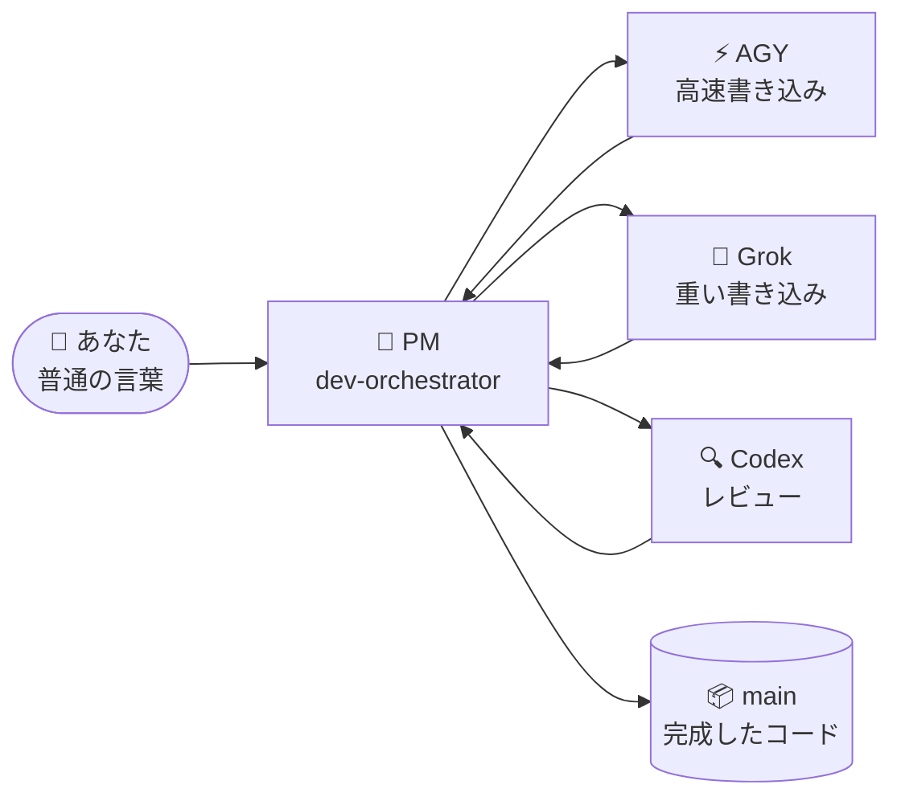

# 🐣 初心者ガイド — Claude Lane Stack

> **あなたはマルチエージェントの専門家である必要はありません。**
> このページでは、システムを小さな工場になぞらえて説明します。あなたは1人のマネージャーと話し、マネージャーがワーカーに仕事を割り当て、完成した作業が `main` ブランチに着地します — あなたのために、あなたの手を煩わせずに。

**他の言語:** [English](BEGINNER.md) · [Русский](BEGINNER.ru.md) · [简体中文](BEGINNER.zh-CN.md) · [Español](BEGINNER.es.md) · [Deutsch](BEGINNER.de.md) · [Français](BEGINNER.fr.md) · [한국어](BEGINNER.ko.md) · [Português](BEGINNER.pt-BR.md)

---

## 🎯 今あなたが見ているもの（60秒）

| 日常生活 | このプロジェクトでは |
|---------------|-----------------|
| 🧑‍💼 あなたは工房を持っている | あなた — 人間 |
| 📋 あなたは**プロジェクトマネージャー**を雇う | Claude Code エージェント `dev-orchestrator` |
| 👷 PM が職人と検査官を雇う | 他の AI ツール：AGY、Grok、Codex |
| 🗂️ 仕事は怒鳴り声ではなく**タスクカード**に載る | `.agents/runs/` 内のファイル |
| 📦 完成品は倉庫へ行く | Git ブランチ **`main`** |



**オーケストレーション**とは、単純にこういう意味です：PM が誰が何をするかを決め、結果をチェックし、完成したコードを `main` にマージする。
あなたは5つのチャットを回す必要も**なく**、ブランチを手動でマージする必要も**ありません**。

> [!NOTE]
> 必須なのは **Claude Code だけ**です。AGY、Grok、Codex は任意のワーカーです — スタックはあなたが持っているものを検出して適応します。

---

## 📍 旅路

3つのステーションを、あなた自身のペースで。タイマーもなく、「1日目 / 2日目」もありません — 各ステーションは、そのチェックリストが通れば完了です。

| ステーション | 何が起きるか | 頻度 |
|---------|--------------|-----------|
| 🧰 **1. 工場をインストール** | スタックが `~/.agents` に着地 | コンピュータごとに一度 |
| 🔌 **2. プロジェクトを接続** | ワーカーを検出、プロジェクトドキュメントを書き出す | リポジトリごとに一度 |
| 🚀 **3. 最初のタスク** | PM があなたのために小さな何かを作る | それから毎日 |

さらに、後で出会う2つの状況があります：休憩のあとに戻ってくるとき、そして何かが止まって見えるとき。

---

## 🧰 ステーション1 — 工場をインストール

*コンピュータごとに一度。*

> [!IMPORTANT]
> 前提条件：[Claude Code](https://docs.anthropic.com/en/docs/claude-code) がインストールされ、少なくとも一度ログイン済みであること。Codex / AGY / Grok は**任意**です — 気軽にスキップしてください。

```bash
# 1. スタックをダウンロード
git clone https://github.com/VKirill/claude-lane-stack.git
cd claude-lane-stack

# 2. エージェント、スキル、ツールを ~/.agents にインストール
./install.sh

# 3. ツールをターミナルから見えるようにする
export PATH="$HOME/.agents/bin:$PATH"
```

> [!TIP]
> `export PATH=...` の行を `~/.bashrc`（または `~/.zshrc`）に一度追加しておけば — その後は新しいターミナルすべてでそのまま動きます。

**ステーション1のチェックリスト — 完了の条件：**

- [ ] `./install.sh` がエラーなく終了した
- [ ] `agents-doctor` が「command not found」ではなくレポート（どんなレポートでも）を表示する

<details>
<summary>🚑 <b>トラブルシューティング：「agents-doctor: command not found」</b></summary>

あなたのターミナルはまだ `~/.agents/bin` を見ていません。**新しい**ターミナルを開くか、次を実行してください：

```bash
export PATH="$HOME/.agents/bin:$PATH"
```

恒久的に直すには：

```bash
echo 'export PATH="$HOME/.agents/bin:$PATH"' >> ~/.bashrc
```

</details>

---

## 🔌 ステーション2 — プロジェクトを接続

*リポジトリごとに一度 — このスタックのリポジトリではなく、あなたのアプリで。*

```bash
# 1. あなたのプロジェクトに移動
cd ~/projects/my-app

# 2. どの AI CLI を持っているか検出 → ルーティングプロファイルを書き出す
agents-doctor --apply .

# 3. PM を起動
claude --agent dev-orchestrator
```

そして、**Claude チャットの中で**、1つのコマンド：

```text
/project-onboard
```

Codex（Codex がなければ Claude 自身）がプロジェクトの「パスポート」を書き出します：`CLAUDE.md`、スタータードキュメント、メモリファイル。終わるのを待ってください — これはリポジトリごとに一度きりのことです。

**プロファイルの意味** — 単に「ここでどのワーカーが利用可能か」ということです：

| プロファイル | インストール済み | 誰がコードを書くか | 誰がレビューするか |
|---------|-------------------|-----------------|-------------|
| `full` | AGY + Grok + Codex | AGY / Grok | Codex |
| `claude-codex` | Codex のみ | Codex | Codex |
| `claude-only` | Claude Code のみ | Claude サブエージェント | Claude サブエージェント |

**ステーション2のチェックリスト — 完了の条件：**

- [ ] `agents-doctor --apply .` がプロファイル名（例：`full` や `claude-only`）を表示した
- [ ] `/project-onboard` の後、プロジェクトのルートに `CLAUDE.md` が存在する

> [!NOTE]
> 「より劣った」プロファイルでも問題ではありません。`claude-only` は問題なく動きます — ただ少し遅く、3つではなく1つの頭脳を使うだけです。

---

## 🚀 ステーション3 — 最初のタスク

*同じフォルダ、同じコマンド、毎回の作業セッションで：*

```bash
claude --agent dev-orchestrator
```

さあ、1つの**小さく、具体的な**目標を普通の言葉で言いましょう：

> *「README にインストールのセクションを追加して」*
> *「価格ページのタイプミスを直して」*
> *「Добавь тёмную тему в настройки」* — どんな言語でも動きます

**PM が作業している間に目にするもの：**

| あなたが気づくこと | 意味 | 行動する？ |
|-----------|---------|-------------|
| `.agents/runs/` の下にファイルが現れる | ワーカー向けのタスクカード — 工場のフロア | いいえ、ただの好奇心で |
| PM が「worktree」に言及する | ワーカーが衝突しないための隔離コピー | いいえ |
| PM がチェック / レビューを報告する | マージ前の品質ゲート | いいえ |
| PM が**完了、`main` にマージした**と言う | あなたの結果が公式になった | ✅ アプリを確認 |

**ステーション3のチェックリスト — 完了の条件：**

- [ ] 変更が `main` に載っており、あなたは一度も `git merge` と入力していない

> [!WARNING]
> もし PM が**あなた**にブランチのマージを求めてきたら — 何かがおかしいです。マージは PM の仕事です（`wt-merge-main`）。*「自分でマージして、それが君の仕事だ」*と言いましょう。

---

## 🌅 休憩のあとに戻ってくる

新しいチャットウィンドウ = PM は昨日の会話を忘れています。**コードとタスク履歴は安全です** — 消えたのはチャットの記憶だけです。その瞬間は*コールドスタート*と呼ばれ、そのためのチートシートがあります：

```bash
cd ~/projects/my-app
claude --agent dev-orchestrator
```

そしてチャットの中で：

```text
/resume-project
```

短い **Now / Blocked / Next** のまとめが得られ、普通の言葉で続けられます。

> [!TIP]
> `/resume-project` は *「おかえりなさい」* コマンドであって、インストール手順では**ありません**。プロジェクトでの初めてのセッションでは不要です — まだ再開するものが何もないからです。

---

## 🧯 何かが止まって見えるとき

長い沈黙？ ワーカーは停滞することがあります — スタックにはまさにこのためのツールがあります。

| PM にこう言う | 何が起きるか |
|---------------|--------------|
| *「止まってる、ワーカーを確認して」* | PM が `lane-stall-check` を実行し、沈黙したワーカーを見つける |
| *「ボードを見せて」* | PM が `run-board` を実行 — ジョブのスコアボード |
| *「そのタスクを再起動して」* | PM が同じタスクカードでワーカーを再割り振りする |

まだおかしい？ PM に直接聞きましょう：*「今やっていることを簡単な言葉で説明して」*。ちゃんと説明してくれます。

---

## 💬 PM に何と言えばいいか — チートシート

| あなたが言う | PM がすること |
|---------|-------------|
| `/project-onboard` | 一度きりのリポジトリのパスポート（CLAUDE.md + ドキュメント） |
| *「設定にダークモードを追加して」* | 計画 → タスクカード → ワーカー → チェック → `main` へマージ |
| *「計画だけ、コードなし」* | `docs/plans/` の下に計画を書く — 何もマージされない |
| *「その計画を実装して」* | 計画を `.agents/runs/` の下の実際のタスクカードに昇格させる |
| `/resume-project` | 休憩のあとの Now / Blocked / Next |
| *「止まってる」* | 停滞チェック、再割り振り |

**避けたほうがよいこと：** git ブランチを自分で管理すること · 1つの機能に対して5つの Claude ウィンドウを回すこと · ワーカーが所有するファイルを実行中にこっそり編集すること（まず PM に伝えましょう）。

---

## 📖 用語集

<details>
<summary><b>あなたが出会うすべての用語を、平易な言葉で</b>（クリックで開く）</summary>

| 用語 | かんたんな意味 | いつ気にするか |
|------|----------------|---------------|
| **エージェント** | ツールを使ってコードを読み書きできる AI | 常に — 彼らが作業をする |
| **PM / オーケストレーター** | 「ボス」エージェント（`dev-orchestrator`） | あなたは主にこれと話す |
| **レーン** | ワーカーの種類：高速書き込み / 重い書き込み / レビュー | セットアップが AGY か Grok か Codex かを選ぶ |
| **Claude Code** | Anthropic のターミナル用コーディングアプリ | **必須** — PM をホストする |
| **AGY** | Google Antigravity CLI | 任意の高速書き込みワーカー |
| **Grok** | xAI CLI | 任意の重い書き込みワーカー |
| **Codex** | OpenAI CLI | 任意のレビュアー + オンボーディング |
| **タスクカード / 契約** | 小さな YAML ファイル：目的、許可されたファイル、チェック | PM が書き、ワーカーが従う |
| **`.agents/runs/`** | アクティブなジョブのフォルダ — 工場のフロア | 実際の作業が始まると現れる |
| **`docs/plans/`** | 戦略ノート（リサーチ、長期計画） | まだコードではない — *「実装して」*と言う |
| **`main`** | 公式の git ブランチ | すべての成功したジョブが行き着く先 |
| **Worktree** | 並列作業のための隔離されたリポジトリのコピー | ワーカーが争わないための PM の仕掛け |
| **マージ** | 完成した作業を `main` に折り込むこと | **PM の仕事、決してあなたの仕事ではない** |
| **オンボード** | 初回のプロジェクトパスポート | リポジトリごとに一度 |
| **コールドスタート** | 新しいチャット、記憶が空 | `/resume-project` が解決する |

</details>

---

## ❓ FAQ

<details>
<summary><b>AGY + Grok + Codex をすべてインストールする必要がありますか？</b></summary>

いいえ。必須なのは **Claude Code** だけです。`agents-doctor` が存在するものを検出し、それに合ったプロファイルを書き出します — 工場はぴったり合うように縮んだり広がったりします。

</details>

<details>
<summary><b>すべてを閉じたら、私の作業はどこに保存されますか？</b></summary>

コード — ディスク上と git 内（成功のたびに `main`）。タスク履歴 — `.agents/runs/` 内。消えるのは**チャットの記憶**だけです。`/resume-project` が数秒でコンテキストを再構築します。

</details>

<details>
<summary><b><code>docs/plans/</code> に大きな計画があるのにコードがありません。バグ？</b></summary>

いいえ — それは**戦略ドキュメント**（リサーチ、SEO 計画、アーキテクチャ）です。コード作業は、計画がタスクカードになったときにだけ始まります。*「それを実装して」*と言えば、PM が `.agents/runs/` の下に run を作成します。

</details>

<details>
<summary><b>工場が動いている間、自分でコードを編集できますか？</b></summary>

はい、慎重にすれば。ベストプラクティス：何を触ったかを PM に伝えましょう。そうすれば PM のタスクカードがあなたの手と衝突しません。

</details>

<details>
<summary><b>これは、ただ… Claude Code を使うのと何が違うのですか？</b></summary>

ふつうの Claude Code は、1つのチャットの中の1人のワーカーです。Lane Stack は**マネージャーレイヤー**を追加します：ファイル所有権を持つタスクカード、異なるベンダーからの並列ワーカー、独立したレビューレーン、そして `main` への自動マージ。あなたは戦略を話し、工場はロジスティクスを回します。

</details>

<details>
<summary><b>私のコードはどこか変わった場所へ送られますか？</b></summary>

各 CLI（Claude/AGY/Grok/Codex）は、単独で使うときとまったく同じように、自分のベンダーと通信します。スタックは追加のサーバーを足しません。シークレットはタスクファイルに入れるべきではありません — [SECURITY.md](../SECURITY.md) を参照してください。

</details>

---

## 🧭 次はどこへ

| あなたが望むこと | 読むもの |
|----------|------|
| 全体像を示すトップページ | [README](../README.ja.md) |
| ソロオーケストレーションのルール（なぜあなたはマージしないのか） | [SOLO-ORCHESTRATION.md](SOLO-ORCHESTRATION.md) |
| タスクカードの中身 | [FILE-CONTRACT.md](FILE-CONTRACT.md) |
| 誰が書き、誰がレビューするか | [ROUTING.md](ROUTING.md) |
| 安全フック | [HOOKS.md](HOOKS.md) |
| プロジェクトメモリ（PROGRESS / LESSONS） | [PROJECT-MEMORY.md](PROJECT-MEMORY.md) |

> 🏭 このページのどこかで詰まった？ PM チャットを開いて聞きましょう：*「これを簡単に説明して」*。あなたに教えることも PM の仕事の**一部**です。
