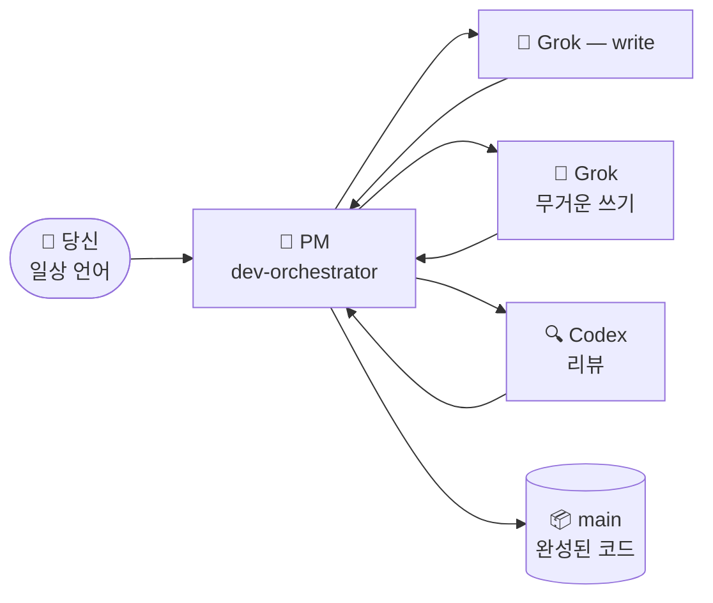

# 🐣 초보자 가이드 — Claude Lane Stack

> **멀티 에이전트 전문가가 될 필요는 없어요.**
> 이 페이지는 시스템을 작은 공장에 비유해서 설명해요: 당신은 매니저 한 명과 대화하고, 매니저가 워커에게 일을 배정하고, 완성된 작업이 `main` 브랜치에 안착해요 — 당신을 위해, 당신 없이.

**다른 언어:** [English](BEGINNER.md) · [Русский](BEGINNER.ru.md) · [简体中文](BEGINNER.zh-CN.md) · [日本語](BEGINNER.ja.md) · [Español](BEGINNER.es.md) · [Deutsch](BEGINNER.de.md) · [Français](BEGINNER.fr.md) · [Português](BEGINNER.pt-BR.md)

---

## 🎯 지금 보고 있는 것 (60초)

| 일상 생활 | 이 프로젝트에서는 |
|---------------|-----------------|
| 🧑‍💼 당신이 작업장을 소유해요 | 당신 — 사람 |
| 📋 **프로젝트 매니저**를 고용해요 | Claude Code 에이전트 `dev-orchestrator` |
| 👷 PM이 빌더와 검사원을 고용해요 | 다른 AI 도구:, Grok, Codex |
| 🗂️ 작업은 고함이 아니라 **태스크 카드**에 담겨요 | `.agents/runs/`의 파일 |
| 📦 완성품은 창고로 가요 | Git 브랜치 **`main`** |



**오케스트레이션**은 간단히 말해: PM이 누가 무엇을 할지 정하고, 결과를 확인하고, 완성된 코드를 `main`에 머지한다는 뜻이에요.
당신은 다섯 개의 채팅을 돌리지 **않고**, 브랜치를 손으로 머지하지 **않아요**.

> [!NOTE]
> **Claude Code만 필수예요**., Grok, Codex는 선택적 워커예요 — 스택이 당신이 가진 것을 감지하고 맞춰요.

---

## 📍 여정

세 개의 정거장을, 당신의 속도로. 타이머도, "1일 차 / 2일 차"도 없어요 — 각 정거장은 체크리스트를 통과하면 완료예요.

| 정거장 | 무슨 일이 | 얼마나 자주 |
|---------|--------------|-----------|
| 🧰 **1. 공장 설치** | 스택이 `~/.agents`에 안착 | 컴퓨터당 한 번 |
| 🔌 **2. 프로젝트 연결** | 워커 감지, 프로젝트 문서 작성 | 저장소당 한 번 |
| 🚀 **3. 첫 태스크** | PM이 당신을 위해 작은 것을 만들어요 | 그다음엔 매일 |

그리고 나중에 마주칠 두 가지 상황도 있어요: **잠시 쉬었다가 돌아오기**와 **무언가 막힌 것 같을 때**.

---

## 🧰 1단계 — 공장 설치

*컴퓨터당 한 번.*

> [!IMPORTANT]
> 사전 조건: [Claude Code](https://docs.anthropic.com/en/docs/claude-code)가 설치되어 있고 최소 한 번 로그인했어야 해요. Codex / Grok은 **선택**이에요 — 얼마든지 건너뛰어도 돼요.

```bash
# 1. 스택 다운로드
git clone https://github.com/VKirill/claude-lane-stack.git
cd claude-lane-stack

# 2. 에이전트, 스킬, 도구를 ~/.agents에 설치
./install.sh

# 3. 터미널에서 도구가 보이게 만들기
export PATH="$HOME/.agents/bin:$PATH"
```

> [!TIP]
> `export PATH=..` 줄을 `~/.bashrc`(또는 `~/.zshrc`)에 한 번 추가해 두면 — 새 터미널마다 바로 작동해요.

**1단계 체크리스트 — 완료 조건:**

- [ ] `./install.sh`가 오류 없이 끝났어요
- [ ] `agents-doctor`가 "command not found" 대신 리포트(무엇이든)를 출력해요

<details>
<summary>🚑 <b>문제 해결: «agents-doctor: command not found»</b></summary>

터미널이 아직 `~/.agents/bin`을 보지 못해요. **새** 터미널을 열거나, 다음을 실행하세요:

```bash
export PATH="$HOME/.agents/bin:$PATH"
```

영구적으로 고치려면:

```bash
echo 'export PATH="$HOME/.agents/bin:$PATH"' >> ~/.bashrc
```

</details>

---

## 🔌 2단계 — 프로젝트 연결

*저장소당 한 번 — 이 스택의 저장소가 아니라 당신의 앱.*

```bash
# 1. 당신의 프로젝트로 이동
cd ~/projects/my-app

# 2. 어떤 AI CLI가 있는지 감지 → 라우팅 프로파일 작성
agents-doctor --apply .

# 3. PM 시작
claude --agent dev-orchestrator
```

그다음, **Claude 채팅 안에서** 명령어 하나:

```text
/project-onboard
```

Codex(또는 Codex가 없으면 Claude 자체)가 프로젝트의 "여권"을 작성해요: `CLAUDE.md`, 시작 문서, 메모리 파일. 끝날 때까지 기다리세요 — 저장소당 한 번뿐인 일이에요.

**프로파일의 의미** — 그냥 "여기서 어떤 워커를 쓸 수 있는가":

| 프로파일 | 설치된 것 | 누가 코드를 쓰나 | 누가 리뷰하나 |
|---------|-------------------|-----------------|-------------|
| `full` | Grok + Codex | Grok | Codex |
| `claude-codex` | Codex만 | Codex | Codex |
| `claude-only` | Claude Code만 | Claude 서브에이전트 | Claude 서브에이전트 |

**2단계 체크리스트 — 완료 조건:**

- [ ] `agents-doctor --apply .`가 프로파일 이름(예: `full` 또는 `claude-only`)을 출력했어요
- [ ] `/project-onboard` 후 프로젝트 루트에 `CLAUDE.md`가 있어요

> [!NOTE]
> "못한" 프로파일도 문제가 아니에요. `claude-only`도 잘 작동해요 — 그저 더 느리고, 세 개 대신 하나의 두뇌를 쓸 뿐이에요.

---

## 🚀 3단계 — 첫 태스크

*같은 폴더, 같은 명령어, 매 작업 세션마다:*

```

> **v1.1.0:** `/project-onboard`이 minimal/full·fast/deep 자동 선택. 긴 레인: `lane-bg` ([LANE-EXEC.md](LANE-EXEC.md)).
bash
claude --agent dev-orchestrator
```

이제 **작고 구체적인** 목표 하나를 일상 언어로 말하세요:

> *«README에 설치 섹션 추가»*
> *«가격 페이지의 오타 수정»*
> *«Добавь тёмную тему в настройки»* — 어떤 언어로든 돼요

**PM이 일하는 동안 보게 될 것:**

| 눈에 띄는 것 | 의미 | 뭔가 해야 하나요? |
|-----------|---------|-------------|
| `.agents/runs/` 아래에 파일이 생겨요 | 워커용 태스크 카드 — 공장 작업장 | 아니요, 그냥 구경만 |
| PM이 "워크트리"를 언급해요 | 워커가 충돌하지 않도록 격리된 복사본 | 아니요 |
| PM이 검사 / 리뷰를 보고해요 | 머지 전 품질 게이트 | 아니요 |
| PM이 **완료, `main`에 머지됨**이라고 해요 | 결과가 공식이 됐어요 | ✅ 앱을 확인하세요 |

**3단계 체크리스트 — 완료 조건:**

- [ ] 변경이 `main`에 있고, 당신은 `git merge`를 한 번도 입력하지 않았어요

> [!WARNING]
> PM이 **당신에게** 브랜치를 머지하라고 요청한다면 — 뭔가 잘못된 거예요. 머지는 PM의 일이에요(`wt-merge-main`). *«네가 직접 머지해, 그게 네 일이야»*라고 말하세요.

---

## 🌅 잠시 쉬었다가 돌아오기

새 채팅 창 = PM이 어제 대화를 잊었어요. **코드와 태스크 히스토리는 안전해요** — 사라진 건 채팅 기억뿐이에요. 이 순간을 *콜드 스타트*라고 부르고, 이를 위한 치트 시트가 있어요:

```bash
cd ~/projects/my-app
claude --agent dev-orchestrator
```

그다음 채팅 안에서:

```text
/resume-project
```

짧은 **지금 / 막힘 / 다음** 요약을 받고, 일상 언어로 이어가면 돼요.

> [!TIP]
> `/resume-project`는 *"다시 오신 걸 환영해요"* 명령어이지, 설치 단계가 **아니에요**. 프로젝트에서의 첫 세션에는 필요 없어요 — 아직 이어갈 게 없으니까요.

---

## 🧯 무언가 막힌 것 같을 때

오랜 침묵? 워커는 멈출 수 있어요 — 스택에는 바로 이를 위한 도구가 있어요.

| PM에게 말하기 | 무슨 일이 |
|---------------|--------------|
| *«막혔어, 워커 확인해»* | PM이 `lane-stall-check`를 실행해 조용한 워커를 찾아요 |
| *«보드 보여줘»* | PM이 `run-board`를 실행 — 작업 점수판 |
| *«그 태스크 다시 시작»* | PM이 같은 태스크 카드로 워커를 다시 배정해요 |

그래도 이상한가요? PM에게 직접 물어보세요: *«지금 뭐 하고 있는지 쉬운 말로 설명해줘»*. 그렇게 해줄 거예요.

---

## 💬 PM에게 무슨 말을 할까 — 치트 시트

| 당신이 말하면 | PM이 하는 일 |
|---------|-------------|
| `/project-onboard` | 저장소 여권 1회 작성 (CLAUDE.md + 문서) |
| *«설정에 다크 모드 추가»* | 계획 → 태스크 카드 → 워커 → 검사 → `main`에 머지 |
| *«계획만, 코드는 말고»* | `docs/plans/` 아래에 계획을 작성 — 아무것도 머지 안 함 |
| *«그 계획 구현해»* | 계획을 `.agents/runs/` 아래의 실제 태스크 카드로 승격 |
| `/resume-project` | 쉬고 난 뒤 지금 / 막힘 / 다음 |
| *«막혔어»* | 멈춤 확인, 재배정 |

**피하는 게 좋아요:** git 브랜치를 직접 관리하기 · 기능 하나에 Claude 창 다섯 개 돌리기 · 실행 도중 워커가 소유한 파일을 말없이 편집하기(먼저 PM에게 알리세요).

---

## 📖 용어집

<details>
<summary><b>마주칠 모든 용어를 쉬운 말로</b> (클릭해서 열기)</summary>

| 용어 | 쉬운 의미 | 언제 중요한가 |
|------|----------------|---------------|
| **에이전트** | 도구로 코드를 읽고 쓰는 AI | 항상 — 이들이 일을 해요 |
| **PM / 오케스트레이터** | "보스" 에이전트(`dev-orchestrator`) | 주로 이 에이전트와 대화해요 |
| **레인** | 워커 유형: 빠른 쓰기 / 무거운 쓰기 / 리뷰 | 설정이  대 Grok 대 Codex를 골라요 |
| **Claude Code** | Anthropic의 터미널 코딩 앱 | **필수** — PM을 호스팅해요 |
| **Grok** | xAI CLI | 선택적 무거운 쓰기 워커 |
| **Codex** | OpenAI CLI | 선택적 리뷰어 + 온보딩 |
| **태스크 카드 / 계약** | 작은 YAML 파일: 목표, 허용 파일, 검사 | PM이 작성하고, 워커가 따라요 |
| **`.agents/runs/`** | 활성 작업 폴더 — 공장 작업장 | 실제 작업이 시작되면 나타나요 |
| **`docs/plans/`** | 전략 노트(리서치, 긴 계획) | 아직 코드가 아니에요 — *«구현해»*라고 말해요 |
| **`main`** | 공식 git 브랜치 | 모든 성공한 작업이 끝나는 곳 |
| **워크트리** | 병렬 작업용 격리된 저장소 복사본 | 워커가 다투지 않게 하는 PM의 기술 |
| **머지** | 완성된 작업을 `main`에 접어 넣기 | **PM의 일, 절대 당신 일이 아님** |
| **온보드** | 첫 프로젝트 여권 | 저장소당 한 번 |
| **콜드 스타트** | 새 채팅, 기억이 빈 상태 | `/resume-project`가 해결해요 |

</details>

---

## ❓ FAQ

<details>
<summary><b>Grok + Codex를 모두 설치해야 하나요?</b></summary>

아니요. **Claude Code**만 필수예요. `agents-doctor`가 존재하는 것을 감지해 맞는 프로파일을 작성해요 — 공장이 딱 맞게 줄거나 늘어나요.

</details>

<details>
<summary><b>모든 걸 닫으면 제 작업은 어디에 저장되나요?</b></summary>

코드 — 디스크와 git에(성공할 때마다 `main`에). 태스크 히스토리 — `.agents/runs/`에. 사라지는 건 **채팅 기억**뿐이에요; `/resume-project`가 몇 초 만에 컨텍스트를 복원해요.

</details>

<details>
<summary><b><code>docs/plans/</code>에 큰 계획이 있는데 코드가 없어요. 버그인가요?</b></summary>

아니요 — 그건 **전략 문서**예요(리서치, SEO 계획, 아키텍처). 코드 작업은 계획이 태스크 카드가 될 때 비로소 시작돼요. *«구현해»*라고 말하면 PM이 `.agents/runs/` 아래에 실행을 만들어요.

</details>

<details>
<summary><b>공장이 돌아가는 동안 제가 직접 코드를 편집해도 되나요?</b></summary>

네, 조심해서요. 모범 사례: 무엇을 건드렸는지 PM에게 알리세요 — 그래야 PM의 태스크 카드가 당신 손과 충돌하지 않아요.

</details>

<details>
<summary><b>이건 그냥… Claude Code를 쓰는 것과 뭐가 다른가요?</b></summary>

그냥 Claude Code는 채팅 하나에 워커 하나예요. Lane Stack은 **매니저 계층**을 더해요: 파일 소유권이 있는 태스크 카드, 서로 다른 벤더의 병렬 워커, 독립적인 리뷰 레인, 그리고 `main`으로의 자동 머지. 당신은 전략을 말하고, Lane Stack은 물류를 운영해요.

</details>

<details>
<summary><b>제 코드가 이상한 곳으로 전송되나요?</b></summary>

각 CLI(Claude/Grok / Codex)는 단독으로 쓸 때와 똑같이 자기 벤더하고만 통신해요. 스택은 추가 서버를 두지 않아요. 비밀 값은 태스크 파일에 두면 안 돼요 — [SECURITY.md](./SECURITY.md)를 보세요.

</details>

---

## 🧭 다음은 어디로

| 원하는 것 | 읽을 것 |
|----------|------|
| 큰 그림이 있는 첫 페이지 | [README](./README.ko.md) |
| 솔로 오케스트레이션 규칙(왜 당신은 머지하지 않는가) | [SOLO-ORCHESTRATION.md](SOLO-ORCHESTRATION.md) |
| 태스크 카드 안에 무엇이 있나 | [FILE-CONTRACT.md](FILE-CONTRACT.md) |
| 누가 쓰고 누가 리뷰하나 | [ROUTING.md](ROUTING.md) |
| 안전 훅 | [HOOKS.md](HOOKS.md) |
| 프로젝트 메모리 (PROGRESS / LESSONS) | [PROJECT-MEMORY.md](PROJECT-MEMORY.md) |

> 🏭 이 페이지 어딘가에서 막혔나요? PM 채팅을 열고 물어보세요: *«이거 쉽게 설명해줘»*. 당신을 가르치는 것도 PM 일의 **일부**예요.
