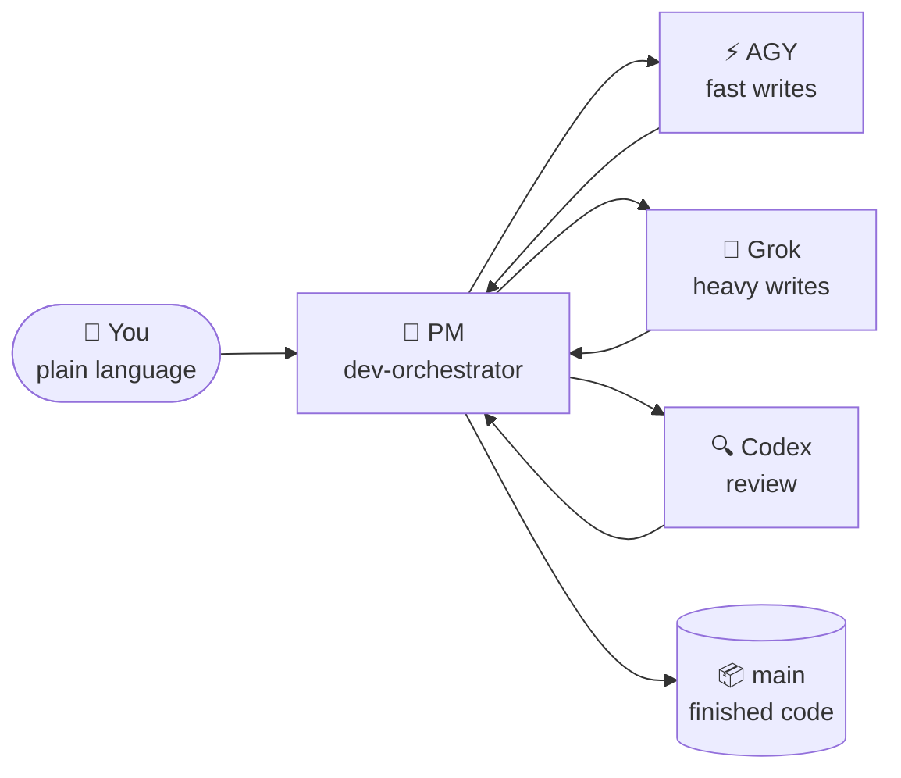

# 🐣 Beginner Guide — Claude Lane Stack

> **You don't need to be a multi-agent expert.**
> This page explains the system like a small factory: you talk to one manager, the manager assigns workers, and finished work lands on the `main` branch — for you, without you.

**Other languages:** [Русский](BEGINNER.ru.md) · [简体中文](BEGINNER.zh-CN.md) · [日本語](BEGINNER.ja.md) · [Español](BEGINNER.es.md) · [Deutsch](BEGINNER.de.md) · [Français](BEGINNER.fr.md) · [한국어](BEGINNER.ko.md) · [Português](BEGINNER.pt-BR.md)

---

## 🎯 What you're looking at (60 seconds)

| Everyday life | In this project |
|---------------|-----------------|
| 🧑‍💼 You own a workshop | You — the human |
| 📋 You hire a **project manager** | Claude Code agent `dev-orchestrator` |
| 👷 The PM hires builders and inspectors | Other AI tools: AGY, Grok, Codex |
| 🗂️ Work lives on **task cards**, not shouting | Files in `.agents/runs/` |
| 📦 Finished goods go to the warehouse | Git branch **`main`** |



**Orchestration** simply means: the PM decides who does what, checks the result, and merges finished code into `main`.
You do **not** run five chats and you do **not** merge branches by hand.

> [!NOTE]
> Only **Claude Code is required**. AGY, Grok and Codex are optional workers — the stack detects what you have and adapts.

---

## 📍 The journey

Three stations, at your own pace. No timers, no "day 1 / day 2" — each station is done when its checklist passes.

| Station | What happens | How often |
|---------|--------------|-----------|
| 🧰 [**1. Install the factory**](#-station-1--install-the-factory) | Stack lands in `~/.agents` | Once per computer |
| 🔌 [**2. Connect your project**](#-station-2--connect-your-project) | Detect workers, write project docs | Once per repository |
| 🚀 [**3. First task**](#-station-3--your-first-task) | PM builds something small for you | Then every day |

Plus two situations you'll meet later: [coming back after a break](#-coming-back-after-a-break) and [when something looks stuck](#-when-something-looks-stuck).

---

## 🧰 Station 1 — Install the factory

*Once per computer.*

> [!IMPORTANT]
> Prerequisite: [Claude Code](https://docs.anthropic.com/en/docs/claude-code) is installed and you've logged in at least once. Codex / AGY / Grok are **optional** — skip them freely.

```bash
# 1. Download the stack
git clone https://github.com/VKirill/claude-lane-stack.git
cd claude-lane-stack

# 2. Install agents, skills and tools into ~/.agents
./install.sh

# 3. Make the tools visible in the terminal
export PATH="$HOME/.agents/bin:$PATH"
```

> [!TIP]
> Add the `export PATH=...` line to your `~/.bashrc` (or `~/.zshrc`) once — then every new terminal just works.

**Station 1 checklist — done when:**

- [ ] `./install.sh` finished without errors
- [ ] `agents-doctor` prints a report (any report) instead of "command not found"

<details>
<summary>🚑 <b>Troubleshooting: «agents-doctor: command not found»</b></summary>

Your terminal doesn't see `~/.agents/bin` yet. Either open a **new** terminal, or run:

```bash
export PATH="$HOME/.agents/bin:$PATH"
```

To fix it permanently:

```bash
echo 'export PATH="$HOME/.agents/bin:$PATH"' >> ~/.bashrc
```

</details>

---

## 🔌 Station 2 — Connect your project

*Once per repository — your app, not this stack's repo.*

```bash
# 1. Go into YOUR project
cd ~/projects/my-app

# 2. Detect which AI CLIs you have → write a routing profile
agents-doctor --apply .

# 3. Start the PM
claude --agent dev-orchestrator
```

Then, **inside the Claude chat**, one command:

```text
/project-onboard
```

Codex (or Claude itself if Codex is absent) writes the project's "passport": `CLAUDE.md`, starter docs, memory files. Wait for it to finish — this is a one-time thing per repo.

**What the profile means** — just "which workers are available here":

| Profile | You have installed | Who writes code | Who reviews |
|---------|-------------------|-----------------|-------------|
| `full` | AGY + Grok + Codex | AGY / Grok | Codex |
| `claude-codex` | Codex only | Codex | Codex |
| `claude-only` | Just Claude Code | Claude subagents | Claude subagents |

**Station 2 checklist — done when:**

- [ ] `agents-doctor --apply .` printed a profile name (e.g. `full` or `claude-only`)
- [ ] `CLAUDE.md` exists in the project root after `/project-onboard`

> [!NOTE]
> A "worse" profile is not a problem. `claude-only` works fine — it's just slower and uses one brain instead of three.

---

## 🚀 Station 3 — Your first task

*Same folder, same command, every work session:*

```bash
claude --agent dev-orchestrator
```

Now say one **small, concrete** goal in plain language:

> *«Add an install section to the README»*
> *«Fix the typo on the pricing page»*
> *«Добавь тёмную тему в настройки»* — any language works

**What you'll see while the PM works:**

| You notice | Meaning | Do you act? |
|-----------|---------|-------------|
| Files appear under `.agents/runs/` | Task cards for workers — the factory floor | No, just curiosity |
| PM mentions "worktree" | Isolated copy so workers don't collide | No |
| PM reports checks / review | Quality gate before merge | No |
| PM says **done, merged to `main`** | Your result is official | ✅ Check the app |

**Station 3 checklist — done when:**

- [ ] The change is on `main` and you never typed `git merge`

> [!WARNING]
> If the PM ever asks **you** to merge a branch — something is wrong. Merging is the PM's job (`wt-merge-main`). Say *«merge it yourself, that's your job»*.

---

## 🌅 Coming back after a break

New chat window = the PM forgot yesterday's conversation. **The code and task history are safe** — only chat memory is gone. That moment is called a *cold start*, and there's a cheat sheet for it:

```bash
cd ~/projects/my-app
claude --agent dev-orchestrator
```

then inside the chat:

```text
/resume-project
```

You get a short **Now / Blocked / Next** summary and continue in plain language.

> [!TIP]
> `/resume-project` is a *"welcome back"* command, **not** an installation step. First-ever session on a project doesn't need it — there is nothing to resume yet.

---

## 🧯 When something looks stuck

Long silence? Workers can stall — the stack has tooling for exactly this.

| Say to the PM | What happens |
|---------------|--------------|
| *«It's stuck, check the workers»* | PM runs `lane-stall-check`, finds silent workers |
| *«Show the board»* | PM runs `run-board` — the job scoreboard |
| *«Restart that task»* | PM re-dispatches the worker on the same task card |

Still weird? Ask the PM directly: *«explain what you're doing right now in simple words»*. It will.

---

## 💬 What to say to the PM — cheat sheet

| You say | The PM does |
|---------|-------------|
| `/project-onboard` | One-time repo passport (CLAUDE.md + docs) |
| *«Add dark mode to settings»* | Plan → task cards → workers → checks → merge to `main` |
| *«Plan only, no code»* | Writes a plan under `docs/plans/` — nothing merged |
| *«Implement the plan»* | Promotes a plan into real task cards under `.agents/runs/` |
| `/resume-project` | Now / Blocked / Next after a break |
| *«It's stuck»* | Stall check, re-dispatch |

**Better avoided:** managing git branches yourself · running five Claude windows on one feature · silently editing files a worker owns mid-run (tell the PM first).

---

## 📖 Glossary

<details>
<summary><b>Every term you'll meet, in plain words</b> (click to open)</summary>

| Term | Simple meaning | When you care |
|------|----------------|---------------|
| **Agent** | An AI that can read/write code with tools | Always — they do the work |
| **PM / orchestrator** | The "boss" agent (`dev-orchestrator`) | You talk mostly to this one |
| **Lane** | A worker type: fast write / heavy write / review | Setup picks AGY vs Grok vs Codex |
| **Claude Code** | Anthropic's terminal coding app | **Required** — hosts the PM |
| **AGY** | Google Antigravity CLI | Optional fast-write worker |
| **Grok** | xAI CLI | Optional heavy-write worker |
| **Codex** | OpenAI CLI | Optional reviewer + onboarding |
| **Task card / contract** | Small YAML file: goal, allowed files, checks | PM writes them; workers obey them |
| **`.agents/runs/`** | Folder of active jobs — the factory floor | Appears once real work starts |
| **`docs/plans/`** | Strategy notes (research, long plans) | Not code yet — say *«implement»* |
| **`main`** | The official git branch | Where every successful job ends |
| **Worktree** | Isolated repo copy for parallel work | PM's trick so workers don't fight |
| **Merge** | Folding finished work into `main` | **PM's job, never yours** |
| **Onboard** | First-time project passport | Once per repository |
| **Cold start** | New chat, memory empty | `/resume-project` fixes it |

</details>

---

## ❓ FAQ

<details>
<summary><b>Do I need AGY + Grok + Codex all installed?</b></summary>

No. Only **Claude Code** is required. `agents-doctor` detects what exists and writes a matching profile — the factory shrinks or grows to fit.

</details>

<details>
<summary><b>Where is my work saved if I close everything?</b></summary>

Code — on disk and in git (`main` after each success). Task history — in `.agents/runs/`. Only the **chat memory** disappears; `/resume-project` rebuilds context in seconds.

</details>

<details>
<summary><b>There's a big plan in <code>docs/plans/</code> but no code. Bug?</b></summary>

No — that's a **strategy document** (research, SEO plan, architecture). Code work only starts when a plan becomes task cards. Say *«implement it»* and the PM creates a run under `.agents/runs/`.

</details>

<details>
<summary><b>Can I edit code myself while the factory runs?</b></summary>

Yes, carefully. Best practice: tell the PM what you touched, so its task cards don't collide with your hands.

</details>

<details>
<summary><b>How is this different from just… using Claude Code?</b></summary>

Plain Claude Code is one worker in one chat. Lane Stack adds a **manager layer**: task cards with file ownership, parallel workers from different vendors, an independent review lane, and automatic merge to `main`. You talk strategy; it runs logistics.

</details>

<details>
<summary><b>Is my code sent anywhere unusual?</b></summary>

Each CLI (Claude/AGY/Grok/Codex) talks to its own vendor exactly as it would standalone. The stack adds no extra servers. Secrets don't belong in task files — see [SECURITY.md](../SECURITY.md).

</details>

---

## 🧭 Where next

| You want | Read |
|----------|------|
| The front page with the big picture | [README](../README.md) |
| Rules of solo orchestration (why you never merge) | [SOLO-ORCHESTRATION.md](SOLO-ORCHESTRATION.md) |
| What's inside a task card | [FILE-CONTRACT.md](FILE-CONTRACT.md) |
| Who writes and who reviews | [ROUTING.md](ROUTING.md) |
| Safety hooks | [HOOKS.md](HOOKS.md) |
| Project memory (PROGRESS / LESSONS) | [PROJECT-MEMORY.md](PROJECT-MEMORY.md) |

> 🏭 Stuck anywhere on this page? Open the PM chat and ask: *«explain this simply»*. Teaching you **is** part of its job.
