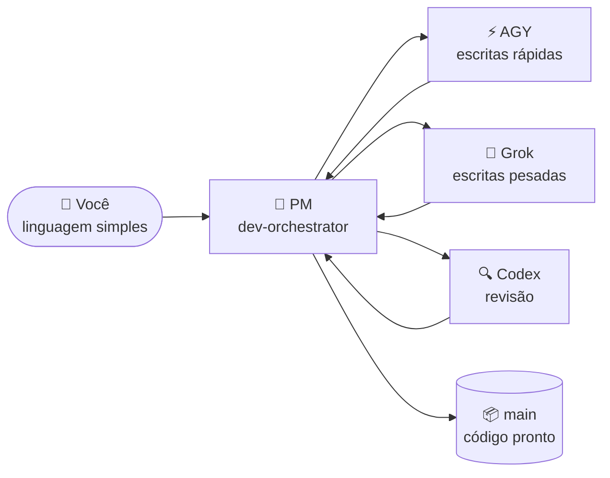

# 🐣 Guia para iniciantes — Claude Lane Stack

> **Você não precisa ser um especialista em multiagentes.**
> Esta página explica o sistema como uma pequena fábrica: você fala com um único gerente, o gerente designa os workers e o trabalho pronto chega na branch `main` — por você, sem você.

**Outros idiomas:** [English](BEGINNER.md) · [Русский](BEGINNER.ru.md) · [简体中文](BEGINNER.zh-CN.md) · [日本語](BEGINNER.ja.md) · [Español](BEGINNER.es.md) · [Deutsch](BEGINNER.de.md) · [Français](BEGINNER.fr.md) · [한국어](BEGINNER.ko.md)

---

## 🎯 O que você está vendo (60 segundos)

| No dia a dia | Neste projeto |
|---------------|-----------------|
| 🧑‍💼 Você é dono de uma oficina | Você — o humano |
| 📋 Você contrata um **gerente de projeto** | Agente do Claude Code `dev-orchestrator` |
| 👷 O PM contrata construtores e inspetores | Outras ferramentas de IA: AGY, Grok, Codex |
| 🗂️ O trabalho vive em **cartões de tarefa**, não em gritaria | Arquivos em `.agents/runs/` |
| 📦 Os produtos acabados vão para o depósito | Branch git **`main`** |



**Orquestração** significa simplesmente: o PM decide quem faz o quê, confere o resultado e faz o merge do código pronto na `main`.
Você **não** roda cinco chats e **não** mergeia branches na mão.

> [!NOTE]
> Só o **Claude Code é obrigatório**. AGY, Grok e Codex são workers opcionais — o stack detecta o que você tem e se adapta.

---

## 📍 A jornada

Três estações, no seu próprio ritmo. Sem cronômetros, sem "dia 1 / dia 2" — cada estação está concluída quando o seu checklist passa.

| Estação | O que acontece | Com que frequência |
|---------|--------------|-----------|
| 🧰 [**1. Instalar a fábrica**](#-estação-1--instalar-a-fábrica) | O stack chega em `~/.agents` | Uma vez por computador |
| 🔌 [**2. Conectar seu projeto**](#-estação-2--conectar-seu-projeto) | Detecta os workers, escreve os docs do projeto | Uma vez por repositório |
| 🚀 [**3. Primeira tarefa**](#-estação-3--sua-primeira-tarefa) | O PM constrói algo pequeno para você | Depois, todos os dias |

Além disso, duas situações que você vai encontrar mais tarde: [voltando depois de uma pausa](#-voltando-depois-de-uma-pausa) e [quando algo parece travado](#-quando-algo-parece-travado).

---

## 🧰 Estação 1 — Instalar a fábrica

*Uma vez por computador.*

> [!IMPORTANT]
> Pré-requisito: o [Claude Code](https://docs.anthropic.com/en/docs/claude-code) está instalado e você fez login pelo menos uma vez. Codex / AGY / Grok são **opcionais** — pode pular sem problema.

```bash
# 1. Baixe o stack
git clone https://github.com/VKirill/claude-lane-stack.git
cd claude-lane-stack

# 2. Instale agentes, skills e ferramentas em ~/.agents
./install.sh

# 3. Torne as ferramentas visíveis no terminal
export PATH="$HOME/.agents/bin:$PATH"
```

> [!TIP]
> Adicione a linha `export PATH=...` ao seu `~/.bashrc` (ou `~/.zshrc`) uma vez — aí todo novo terminal já funciona.

**Checklist da Estação 1 — concluída quando:**

- [ ] `./install.sh` terminou sem erros
- [ ] `agents-doctor` imprime um relatório (qualquer relatório) em vez de "command not found"

<details>
<summary>🚑 <b>Solução de problemas: «agents-doctor: command not found»</b></summary>

Seu terminal ainda não enxerga o `~/.agents/bin`. Abra um **novo** terminal ou rode:

```bash
export PATH="$HOME/.agents/bin:$PATH"
```

Para corrigir de forma permanente:

```bash
echo 'export PATH="$HOME/.agents/bin:$PATH"' >> ~/.bashrc
```

</details>

---

## 🔌 Estação 2 — Conectar seu projeto

*Uma vez por repositório — o seu app, não o repositório deste stack.*

```bash
# 1. Entre no SEU projeto
cd ~/projects/my-app

# 2. Detecte quais CLIs de IA você tem → escreva um perfil de roteamento
agents-doctor --apply .

# 3. Inicie o PM
claude --agent dev-orchestrator
```

Depois, **dentro do chat do Claude**, um comando:

```text
/project-onboard
```

O Codex (ou o próprio Claude, se o Codex não estiver presente) escreve o "passaporte" do projeto: `CLAUDE.md`, documentos iniciais, arquivos de memória. Espere terminar — isso acontece uma única vez por repositório.

**O que o perfil significa** — apenas "quais workers estão disponíveis aqui":

| Perfil | O que você tem instalado | Quem escreve o código | Quem revisa |
|---------|-------------------|-----------------|-------------|
| `full` | AGY + Grok + Codex | AGY / Grok | Codex |
| `claude-codex` | só o Codex | Codex | Codex |
| `claude-only` | só o Claude Code | Subagentes Claude | Subagentes Claude |

**Checklist da Estação 2 — concluída quando:**

- [ ] `agents-doctor --apply .` imprimiu um nome de perfil (ex.: `full` ou `claude-only`)
- [ ] `CLAUDE.md` existe na raiz do projeto depois de `/project-onboard`

> [!NOTE]
> Um perfil "pior" não é problema. O `claude-only` funciona muito bem — só é mais lento e usa um cérebro em vez de três.

---

## 🚀 Estação 3 — Sua primeira tarefa

*Mesma pasta, mesmo comando, toda sessão de trabalho:*

```

> **v1.1.0:** `/project-onboard` escolhe minimal/full e fast/deep. Lanes longas: `lane-bg` ([LANE-EXEC.md](LANE-EXEC.md)).
bash
claude --agent dev-orchestrator
```

Agora diga um objetivo **pequeno e concreto** em linguagem simples:

> *«Adicione uma seção de instalação ao README»*
> *«Corrija o erro de digitação na página de preços»*
> *«Добавь тёмную тему в настройки»* — qualquer idioma funciona

**O que você vai ver enquanto o PM trabalha:**

| Você percebe | Significado | Você age? |
|-----------|---------|-------------|
| Arquivos aparecem em `.agents/runs/` | Cartões de tarefa para os workers — o chão de fábrica | Não, só curiosidade |
| O PM menciona "worktree" | Cópia isolada para os workers não colidirem | Não |
| O PM relata verificações / revisão | Portão de qualidade antes do merge | Não |
| O PM diz **pronto, mergeado na `main`** | Seu resultado é oficial | ✅ Confira o app |

**Checklist da Estação 3 — concluída quando:**

- [ ] A mudança está na `main` e você nunca digitou `git merge`

> [!WARNING]
> Se o PM pedir para **você** mergear uma branch — algo está errado. Fazer merge é trabalho do PM (`wt-merge-main`). Diga *«faça o merge você mesmo, isso é trabalho seu»*.

---

## 🌅 Voltando depois de uma pausa

Nova janela de chat = o PM esqueceu a conversa de ontem. **O código e o histórico de tarefas estão seguros** — só a memória do chat se foi. Esse momento se chama *cold start*, e existe uma cola para ele:

```bash
cd ~/projects/my-app
claude --agent dev-orchestrator
```

depois, dentro do chat:

```text
/resume-project
```

Você recebe um resumo curto de **Agora / Bloqueado / Próximo** e continua em linguagem simples.

> [!TIP]
> `/resume-project` é um comando de *"bem-vindo de volta"*, **não** uma etapa de instalação. A primeiríssima sessão num projeto não precisa dele — ainda não há nada para retomar.

---

## 🧯 Quando algo parece travado

Silêncio longo? Os workers podem travar — o stack tem ferramentas exatamente para isso.

| Diga ao PM | O que acontece |
|---------------|--------------|
| *«Travou, verifique os workers»* | O PM roda `lane-stall-check` e encontra os workers silenciosos |
| *«Mostre o board»* | O PM roda `run-board` — o placar de trabalhos |
| *«Reinicie essa tarefa»* | O PM reaciona o worker no mesmo cartão de tarefa |

Ainda estranho? Pergunte direto ao PM: *«explique em palavras simples o que você está fazendo agora»*. Ele vai explicar.

---

## 💬 O que dizer ao PM — cola

| Você diz | O PM faz |
|---------|-------------|
| `/project-onboard` | Passaporte único do repositório (CLAUDE.md + docs) |
| *«Adicione modo escuro nas configurações»* | Planeja → cartões de tarefa → workers → verificações → merge na `main` |
| *«Só o plano, sem código»* | Escreve um plano em `docs/plans/` — nada é mergeado |
| *«Implemente o plano»* | Promove um plano a cartões de tarefa reais em `.agents/runs/` |
| `/resume-project` | Agora / Bloqueado / Próximo depois de uma pausa |
| *«Travou»* | Verificação de travamento, reacionamento |

**Melhor evitar:** gerenciar branches do git você mesmo · rodar cinco janelas do Claude numa mesma funcionalidade · editar em silêncio arquivos que um worker possui durante a execução (avise o PM primeiro).

---

## 📖 Glossário

<details>
<summary><b>Todos os termos que você vai encontrar, em palavras simples</b> (clique para abrir)</summary>

| Termo | Significado simples | Quando importa |
|------|----------------|---------------|
| **Agente** | Uma IA que consegue ler/escrever código com ferramentas | Sempre — são eles que fazem o trabalho |
| **PM / orquestrador** | O agente "chefe" (`dev-orchestrator`) | É com ele que você mais fala |
| **Pista (lane)** | Um tipo de worker: escrita rápida / escrita pesada / revisão | A configuração escolhe AGY vs Grok vs Codex |
| **Claude Code** | O app de código no terminal da Anthropic | **Obrigatório** — hospeda o PM |
| **AGY** | CLI Google Antigravity | Worker opcional de escrita rápida |
| **Grok** | CLI da xAI | Worker opcional de escrita pesada |
| **Codex** | CLI da OpenAI | Revisor + onboarding opcional |
| **Cartão de tarefa / contrato** | Pequeno arquivo YAML: objetivo, arquivos permitidos, verificações | O PM os escreve; os workers os obedecem |
| **`.agents/runs/`** | Pasta de trabalhos ativos — o chão de fábrica | Aparece quando o trabalho de verdade começa |
| **`docs/plans/`** | Notas de estratégia (pesquisa, planos longos) | Ainda não é código — diga *«implemente»* |
| **`main`** | A branch git oficial | Onde termina todo trabalho bem-sucedido |
| **Worktree** | Cópia isolada do repositório para trabalho em paralelo | Truque do PM para os workers não brigarem |
| **Merge** | Incorporar o trabalho pronto na `main` | **Trabalho do PM, nunca seu** |
| **Onboard** | Passaporte do projeto na primeira vez | Uma vez por repositório |
| **Cold start** | Chat novo, memória vazia | O `/resume-project` resolve |

</details>

---

## ❓ FAQ

<details>
<summary><b>Preciso ter AGY + Grok + Codex todos instalados?</b></summary>

Não. Só o **Claude Code** é obrigatório. O `agents-doctor` detecta o que existe e escreve um perfil correspondente — a fábrica encolhe ou cresce para se ajustar.

</details>

<details>
<summary><b>Onde meu trabalho fica salvo se eu fechar tudo?</b></summary>

O código — no disco e no git (na `main` depois de cada sucesso). O histórico de tarefas — em `.agents/runs/`. Só a **memória do chat** desaparece; o `/resume-project` reconstrói o contexto em segundos.

</details>

<details>
<summary><b>Tem um plano grande em <code>docs/plans/</code> mas nenhum código. É bug?</b></summary>

Não — isso é um **documento de estratégia** (pesquisa, plano de SEO, arquitetura). O trabalho de código só começa quando um plano vira cartões de tarefa. Diga *«implemente isso»* e o PM cria um run em `.agents/runs/`.

</details>

<details>
<summary><b>Posso editar o código eu mesmo enquanto a fábrica roda?</b></summary>

Sim, com cuidado. Boa prática: diga ao PM no que você mexeu, para que os cartões de tarefa dele não colidam com as suas mãos.

</details>

<details>
<summary><b>Como isto é diferente de simplesmente… usar o Claude Code?</b></summary>

O Claude Code puro é um worker em um chat. O Lane Stack adiciona uma **camada de gestão**: cartões de tarefa com posse de arquivos, workers em paralelo de fornecedores diferentes, uma pista de revisão independente e merge automático na `main`. Você fala de estratégia; ele cuida da logística.

</details>

<details>
<summary><b>Meu código é enviado para algum lugar incomum?</b></summary>

Cada CLI (Claude/AGY/Grok/Codex) conversa com o próprio fornecedor exatamente como faria sozinha. O stack não adiciona nenhum servidor extra. Segredos não devem ficar em arquivos de tarefa — veja [SECURITY.md](../SECURITY.md).

</details>

---

## 🧭 Para onde ir agora

| Você quer | Leia |
|----------|------|
| A página inicial com a visão geral | [README](../README.pt-BR.md) |
| Regras da orquestração solo (por que você nunca faz merge) | [SOLO-ORCHESTRATION.md](SOLO-ORCHESTRATION.md) |
| O que tem dentro de um cartão de tarefa | [FILE-CONTRACT.md](FILE-CONTRACT.md) |
| Quem escreve e quem revisa | [ROUTING.md](ROUTING.md) |
| Hooks de segurança | [HOOKS.md](HOOKS.md) |
| Memória de projeto (PROGRESS / LESSONS) | [PROJECT-MEMORY.md](PROJECT-MEMORY.md) |

> 🏭 Travou em algum ponto desta página? Abra o chat do PM e peça: *«explique isso de forma simples»*. Te ensinar **faz** parte do trabalho dele.
