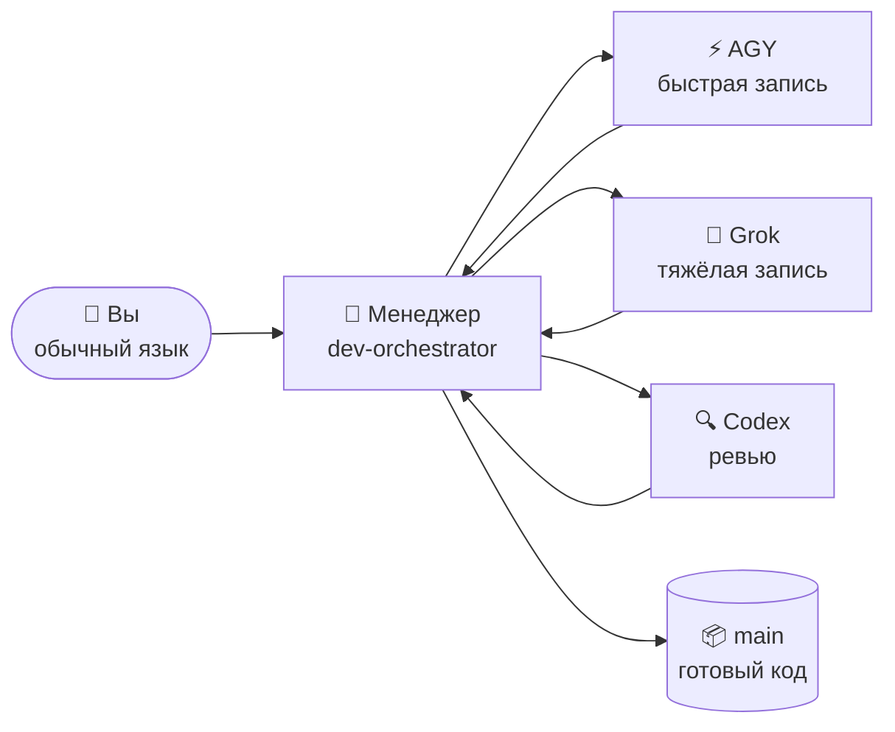

# 🐣 Гайд новичка — Claude Lane Stack

> **Не нужно быть экспертом по мультиагентам.**
> Эта страница объясняет систему как маленькую фабрику: вы говорите с одним менеджером, менеджер раздаёт задания рабочим, готовое попадает в ветку `main` — для вас, но без вас.

**Другие языки:** [English](BEGINNER.md) · [简体中文](BEGINNER.zh-CN.md) · [日本語](BEGINNER.ja.md) · [Español](BEGINNER.es.md) · [Deutsch](BEGINNER.de.md) · [Français](BEGINNER.fr.md) · [한국어](BEGINNER.ko.md) · [Português](BEGINNER.pt-BR.md)

---

## 🎯 Что перед вами (60 секунд)

| В обычной жизни | В этом проекте |
|-----------------|----------------|
| 🧑‍💼 Вы — владелец мастерской | Вы — человек |
| 📋 Вы нанимаете **проект-менеджера** | Агент Claude Code `dev-orchestrator` |
| 👷 Менеджер нанимает строителей и приёмщиков | Другие ИИ-инструменты: AGY, Grok, Codex |
| 🗂️ Работа живёт на **карточках заданий**, а не в криках через цех | Файлы в `.agents/runs/` |
| 📦 Готовая продукция едет на склад | Git-ветка **`main`** |



**Оркестрация** — это просто: менеджер решает, кто что делает, проверяет результат и мержит готовый код в `main`.
Вы **не** ведёте пять чатов и **не** мержите ветки руками.

> [!NOTE]
> Обязателен только **Claude Code**. AGY, Grok и Codex — опциональные рабочие: стек сам определяет, что у вас есть, и подстраивается.

---

## 📍 Маршрут

Три станции, в вашем темпе. Никаких таймеров и «дней» — станция пройдена, когда сошёлся её чек-лист.

| Станция | Что происходит | Как часто |
|---------|----------------|-----------|
| 🧰 [**1. Установить фабрику**](#-станция-1--установить-фабрику) | Стек ложится в `~/.agents` | Один раз на компьютер |
| 🔌 [**2. Подключить проект**](#-станция-2--подключить-проект) | Найти воркеров, создать доки проекта | Один раз на репозиторий |
| 🚀 [**3. Первая задача**](#-станция-3--первая-задача) | Менеджер собирает что-то маленькое для вас | Дальше — каждый день |

Плюс две ситуации, которые встретятся позже: [возвращение после перерыва](#-возвращение-после-перерыва) и [когда что-то застряло](#-когда-что-то-застряло).

---

## 🧰 Станция 1 — Установить фабрику

*Один раз на компьютер.*

> [!IMPORTANT]
> Предусловие: установлен [Claude Code](https://docs.anthropic.com/en/docs/claude-code) и вы хотя бы раз в него залогинились. Codex / AGY / Grok — **опциональны**, смело пропускайте.

```bash
# 1. Скачать стек
git clone https://github.com/VKirill/claude-lane-stack.git
cd claude-lane-stack

# 2. Установить агентов, скиллы и инструменты в ~/.agents
./install.sh

# 3. Сделать инструменты видимыми в терминале
export PATH="$HOME/.agents/bin:$PATH"
```

> [!TIP]
> Добавьте строку `export PATH=...` в свой `~/.bashrc` (или `~/.zshrc`) один раз — и каждый новый терминал будет работать сразу.

**Чек-лист станции 1 — готово, когда:**

- [ ] `./install.sh` завершился без ошибок
- [ ] `agents-doctor` печатает отчёт (любой), а не «command not found»

<details>
<summary>🚑 <b>Проблема: «agents-doctor: command not found»</b></summary>

Терминал ещё не видит `~/.agents/bin`. Либо откройте **новый** терминал, либо выполните:

```bash
export PATH="$HOME/.agents/bin:$PATH"
```

Чтобы починить навсегда:

```bash
echo 'export PATH="$HOME/.agents/bin:$PATH"' >> ~/.bashrc
```

</details>

---

## 🔌 Станция 2 — Подключить проект

*Один раз на репозиторий — ваше приложение, а не репозиторий этого стека.*

```bash
# 1. Зайти в ВАШ проект
cd ~/projects/my-app

# 2. Определить, какие ИИ-CLI установлены → записать профиль маршрутизации
agents-doctor --apply .

# 3. Запустить менеджера
claude --agent dev-orchestrator
```

Затем, **внутри чата Claude**, одна команда:

```text
/project-onboard
```

Codex (или сам Claude, если Codex не установлен) напишет «паспорт» проекта: `CLAUDE.md`, стартовые доки, файлы памяти. Дождитесь окончания — это разовая операция для репозитория.

**Что означает профиль** — просто «какие рабочие здесь доступны»:

| Профиль | Установлено | Кто пишет код | Кто ревьюит |
|---------|-------------|---------------|-------------|
| `full` | AGY + Grok + Codex | AGY / Grok | Codex |
| `claude-codex` | только Codex | Codex | Codex |
| `claude-only` | только Claude Code | Сабагенты Claude | Сабагенты Claude |

**Чек-лист станции 2 — готово, когда:**

- [ ] `agents-doctor --apply .` напечатал имя профиля (например, `full` или `claude-only`)
- [ ] После `/project-onboard` в корне проекта появился `CLAUDE.md`

> [!NOTE]
> «Слабый» профиль — не беда. `claude-only` прекрасно работает — просто медленнее и одним мозгом вместо трёх.

---

## 🚀 Станция 3 — Первая задача

*Та же папка, та же команда — каждую рабочую сессию:*

```bash
claude --agent dev-orchestrator
```

Теперь назовите одну **маленькую и конкретную** цель обычным языком:

> *«Добавь в README раздел про установку»*
> *«Исправь опечатку на странице тарифов»*
> *«Add dark mode to settings»* — любой язык подойдёт

**Что вы увидите, пока менеджер работает:**

| Вы замечаете | Что это значит | Нужно ли вмешиваться? |
|--------------|----------------|-----------------------|
| Появились файлы в `.agents/runs/` | Карточки заданий для воркеров — цех фабрики | Нет, только из любопытства |
| Менеджер упоминает «worktree» | Изолированная копия, чтобы воркеры не столкнулись | Нет |
| Менеджер отчитывается о проверках / ревью | Контроль качества перед merge | Нет |
| Менеджер говорит: **готово, замержено в `main`** | Ваш результат стал официальным | ✅ Проверьте приложение |

**Чек-лист станции 3 — готово, когда:**

- [ ] Изменение в `main`, а вы ни разу не набрали `git merge`

> [!WARNING]
> Если менеджер просит **вас** замержить ветку — что-то пошло не так. Merge — работа менеджера (`wt-merge-main`). Скажите: *«мержи сам, это твоя работа»*.

---

## 🌅 Возвращение после перерыва

Новое окно чата = менеджер забыл вчерашний разговор. **Код и история задач целы** — пропала только память чата. Этот момент называют *холодным стартом*, и на него есть шпаргалка:

```bash
cd ~/projects/my-app
claude --agent dev-orchestrator
```

затем внутри чата:

```text
/resume-project
```

Вы получите короткую сводку **«Сейчас / Блокеры / Дальше»** — и продолжаете обычным языком.

> [!TIP]
> `/resume-project` — команда *«с возвращением»*, а **не** шаг установки. В самой первой сессии проекта она не нужна — возобновлять пока нечего.

---

## 🧯 Когда что-то застряло

Долгая тишина? Воркеры бывают зависают — в стеке есть инструменты ровно для этого.

| Скажите менеджеру | Что произойдёт |
|-------------------|----------------|
| *«Застряло, проверь воркеров»* | Менеджер запустит `lane-stall-check` и найдёт замолчавших |
| *«Покажи табло»* | Менеджер запустит `run-board` — табло задач |
| *«Перезапусти эту задачу»* | Менеджер переназначит воркера на ту же карточку |

Всё равно странно? Спросите прямо: *«объясни простыми словами, что ты сейчас делаешь»*. Объяснит.

---

## 💬 Что говорить менеджеру — шпаргалка

| Вы говорите | Менеджер делает |
|-------------|-----------------|
| `/project-onboard` | Разовый паспорт репозитория (CLAUDE.md + доки) |
| *«Добавь тёмную тему в настройки»* | План → карточки → воркеры → проверки → merge в `main` |
| *«Только план, без кода»* | Пишет план в `docs/plans/` — ничего не мержится |
| *«Реализуй план»* | Превращает план в карточки задач в `.agents/runs/` |
| `/resume-project` | «Сейчас / Блокеры / Дальше» после перерыва |
| *«Застряло»* | Проверка зависших, переназначение |

**Лучше не делать:** самому управлять ветками git · открывать пять окон Claude на одну фичу · молча править файлы воркера посреди задачи (сначала скажите менеджеру).

---

## 📖 Словарик

<details>
<summary><b>Все термины, которые встретятся, — простыми словами</b> (нажмите, чтобы открыть)</summary>

| Термин | Простой смысл | Когда важно |
|--------|---------------|-------------|
| **Агент** | ИИ, который умеет читать/писать код инструментами | Всегда — они делают работу |
| **Менеджер / оркестратор** | Агент-«начальник» (`dev-orchestrator`) | С ним вы в основном и говорите |
| **Линия (lane)** | Тип воркера: быстрая запись / тяжёлая запись / ревью | Когда выбирается AGY vs Grok vs Codex |
| **Claude Code** | Терминальное приложение Anthropic для кода | **Обязателен** — в нём живёт менеджер |
| **AGY** | CLI Google Antigravity | Опциональный быстрый воркер |
| **Grok** | CLI xAI | Опциональный тяжёлый воркер |
| **Codex** | CLI OpenAI | Опциональный ревьюер + онбординг |
| **Карточка / контракт** | Маленький YAML: цель, разрешённые файлы, проверки | Пишет менеджер; воркеры подчиняются |
| **`.agents/runs/`** | Папка активных задач — цех фабрики | Появляется с началом реальной работы |
| **`docs/plans/`** | Стратегические заметки (исследования, планы) | Это ещё не код — скажите *«реализуй»* |
| **`main`** | Официальная git-ветка | Финал каждой успешной задачи |
| **Worktree** | Изолированная копия репозитория | Трюк менеджера, чтобы воркеры не дрались |
| **Merge** | Влить готовую работу в `main` | **Работа менеджера, никогда не ваша** |
| **Онбординг** | Разовый паспорт проекта | Один раз на репозиторий |
| **Холодный старт** | Новый чат, память пуста | Лечится `/resume-project` |

</details>

---

## ❓ FAQ

<details>
<summary><b>Нужно ли ставить AGY + Grok + Codex одновременно?</b></summary>

Нет. Обязателен только **Claude Code**. `agents-doctor` находит установленное и пишет подходящий профиль — фабрика сжимается и растёт под ваш набор.

</details>

<details>
<summary><b>Где сохранится работа, если я всё закрою?</b></summary>

Код — на диске и в git (`main` после каждого успеха). История задач — в `.agents/runs/`. Пропадает только **память чата**; `/resume-project` восстанавливает контекст за секунды.

</details>

<details>
<summary><b>В <code>docs/plans/</code> лежит большой план, а кода нет. Это баг?</b></summary>

Нет — это **стратегический документ** (исследование, SEO-план, архитектура). Кодовая работа начинается, когда план превращается в карточки. Скажите *«реализуй»* — и менеджер создаст run в `.agents/runs/`.

</details>

<details>
<summary><b>Можно ли править код самому, пока фабрика работает?</b></summary>

Да, аккуратно. Лучшая практика: скажите менеджеру, что вы трогали, чтобы карточки не столкнулись с вашими руками.

</details>

<details>
<summary><b>Чем это отличается от просто… Claude Code?</b></summary>

Обычный Claude Code — один воркер в одном чате. Lane Stack добавляет **слой управления**: карточки с владением файлами, параллельные воркеры разных вендоров, независимая линия ревью и автоматический merge в `main`. Вы — про стратегию; он — про логистику.

</details>

<details>
<summary><b>Мой код куда-то отправляется?</b></summary>

Каждый CLI (Claude/AGY/Grok/Codex) общается со своим вендором ровно так же, как работал бы отдельно. Стек не добавляет своих серверов. Секретам не место в карточках задач — см. [SECURITY.md](../SECURITY.md).

</details>

---

## 🧭 Куда дальше

| Хотите | Читайте |
|--------|---------|
| Главная страница с общей картиной | [README](../README.ru.md) |
| Правила соло-оркестрации (почему вы не мержите) | [SOLO-ORCHESTRATION.md](SOLO-ORCHESTRATION.md) |
| Что внутри карточки задачи | [FILE-CONTRACT.md](FILE-CONTRACT.md) |
| Кто пишет и кто ревьюит | [ROUTING.md](ROUTING.md) |
| Защитные хуки | [HOOKS.md](HOOKS.md) |
| Память проекта (PROGRESS / LESSONS) | [PROJECT-MEMORY.md](PROJECT-MEMORY.md) |

> 🏭 Застряли на этой странице? Откройте чат менеджера и попросите: *«объясни это просто»*. Учить вас — тоже его работа.
