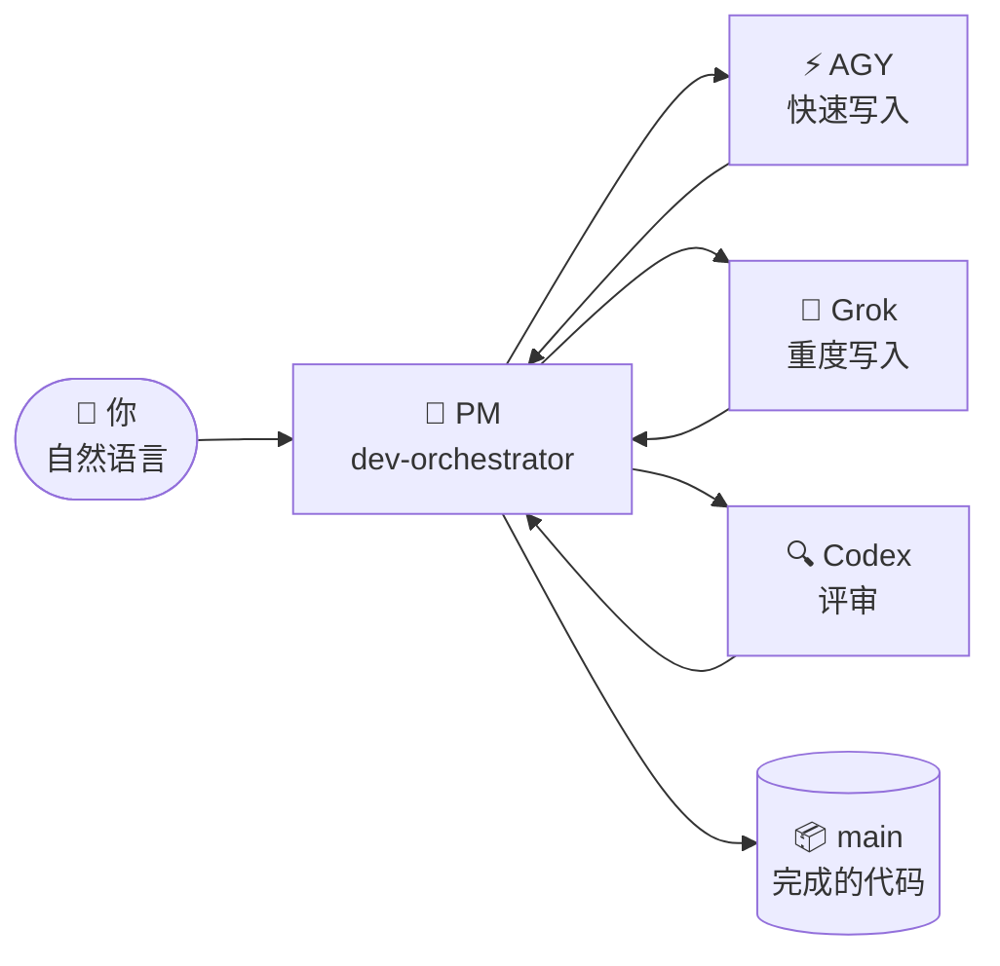

# 🐣 新手指南 —— Claude Lane Stack

> **你不需要是多智能体专家。**
> 本页把这套系统讲成一座小工厂：你只跟一位经理对话，经理分派工人，完成的工作落到 `main` 分支上 —— 替你完成，不用你插手。

**其他语言：** [English](BEGINNER.md) · [Русский](BEGINNER.ru.md) · [日本語](BEGINNER.ja.md) · [Español](BEGINNER.es.md) · [Deutsch](BEGINNER.de.md) · [Français](BEGINNER.fr.md) · [한국어](BEGINNER.ko.md) · [Português](BEGINNER.pt-BR.md)

---

## 🎯 你眼前看到的（60 秒读懂）

| 日常生活 | 在这个项目里 |
|---------------|-----------------|
| 🧑‍💼 你拥有一间作坊 | 你 —— 人类 |
| 📋 你雇了一位**项目经理** | Claude Code 智能体 `dev-orchestrator` |
| 👷 PM 雇来施工工和质检员 | 其他 AI 工具：AGY、Grok、Codex |
| 🗂️ 工作靠**任务卡**流转，而不是靠喊 | `.agents/runs/` 里的文件 |
| 📦 成品进仓库 | Git 分支 **`main`** |



**编排（Orchestration）** 说白了就是：PM 决定谁干什么、检查结果，并把完成的代码合并进 `main`。
你**不用**开五个聊天窗口，也**不用**手动合并分支。

> [!NOTE]
> 只有 **Claude Code 是必需的**。AGY、Grok 和 Codex 都是可选的工人 —— 这套工具会检测你有什么，然后随之适配。

---

## 🗺️ 旅程

三个站点，按你自己的节奏走。没有计时器，也没有“第 1 天 / 第 2 天” —— 每个站点在它的清单全部通过时就算完成。

| 站点 | 会发生什么 | 多久一次 |
|---------|--------------|-----------|
| 🏗️ [**1. 安装工厂**](#-第-1-站安装工厂) | 工具落到 `~/.agents` | 每台电脑一次 |
| 🔌 [**2. 接入你的项目**](#-第-2-站接入你的项目) | 检测工人，写入项目文档 | 每个仓库一次 |
| 🚀 [**3. 第一个任务**](#-第-3-站你的第一个任务) | PM 为你做点小东西 | 之后每天 |

此外还有两个你之后会遇到的情况：[休息之后回归](#-休息之后回归) 和 [当某件事看起来卡住了](#-当某件事看起来卡住了)。

---

## 🏗️ 第 1 站：安装工厂

*每台电脑一次。*

> [!IMPORTANT]
> 前置条件：已安装 [Claude Code](https://docs.anthropic.com/en/docs/claude-code) 并至少登录过一次。Codex / AGY / Grok 都是**可选的** —— 尽管跳过它们。

```bash
# 1. 下载这套工具
git clone https://github.com/VKirill/claude-lane-stack.git
cd claude-lane-stack

# 2. 把智能体、技能和工具装进 ~/.agents
./install.sh

# 3. 让这些工具在终端里可见
export PATH="$HOME/.agents/bin:$PATH"
```

> [!TIP]
> 把 `export PATH=...` 这一行加进你的 `~/.bashrc`（或 `~/.zshrc`）一次 —— 之后每个新终端都能直接用。

**第 1 站清单 —— 满足以下条件即完成：**

- [ ] `./install.sh` 无错误地跑完了
- [ ] `agents-doctor` 打印出一份报告（任何报告都行），而不是 “command not found”

<details>
<summary>🚑 <b>排障：「agents-doctor: command not found」</b></summary>

你的终端还看不到 `~/.agents/bin`。要么打开一个**新**终端，要么运行：

```bash
export PATH="$HOME/.agents/bin:$PATH"
```

要一劳永逸地解决：

```bash
echo 'export PATH="$HOME/.agents/bin:$PATH"' >> ~/.bashrc
```

</details>

---

## 🔌 第 2 站：接入你的项目

*每个仓库一次 —— 是你的应用，不是这套工具的仓库。*

```bash
# 1. 进入你的项目
cd ~/projects/my-app

# 2. 检测你有哪些 AI CLI → 写出一份路由档案
agents-doctor --apply .

# 3. 启动 PM
claude --agent dev-orchestrator
```

然后，**在 Claude 聊天里**，一条命令：

```text
/project-onboard
```

Codex（如果没有 Codex，就由 Claude 自己）会写出这个项目的“护照”：`CLAUDE.md`、初始文档、记忆文件。等它跑完 —— 这在每个仓库里只做一次。

**这份档案是什么意思** —— 无非是“这里有哪些工人可用”：

| 档案 | 你装了 | 谁写代码 | 谁评审 |
|---------|-------------------|-----------------|-------------|
| `full` | AGY + Grok + Codex | AGY / Grok | Codex |
| `claude-codex` | 只有 Codex | Codex | Codex |
| `claude-only` | 只有 Claude Code | Claude 子智能体 | Claude 子智能体 |

**第 2 站清单 —— 满足以下条件即完成：**

- [ ] `agents-doctor --apply .` 打印出了一个档案名（例如 `full` 或 `claude-only`）
- [ ] 执行 `/project-onboard` 之后，项目根目录下存在 `CLAUDE.md`

> [!NOTE]
> 档案“差一点”不是问题。`claude-only` 也能好好干活 —— 只是慢一些，用一个大脑而不是三个。

---

## 🚀 第 3 站：你的第一个任务

*同一个文件夹、同一条命令，每个工作会话都一样：*

```bash
claude --agent dev-orchestrator
```

现在，用自然语言说出一个**小而具体**的目标：

> *「给 README 加一个安装章节」*
> *「修掉定价页上的拼写错误」*
> *「Добавь тёмную тему в настройки」* —— 任何语言都行

**PM 干活时你会看到什么：**

| 你注意到 | 含义 | 你要动手吗？ |
|-----------|---------|-------------|
| `.agents/runs/` 下冒出文件 | 给工人的任务卡 —— 车间现场 | 不用，纯属好奇 |
| PM 提到 “worktree” | 隔离副本，让工人不撞车 | 不用 |
| PM 报告 检查 / 评审 | 合并前的质量关卡 | 不用 |
| PM 说 **完成，已合并到 `main`** | 你的成果正式生效 | ✅ 去看看应用 |

**第 3 站清单 —— 满足以下条件即完成：**

- [ ] 改动已经在 `main` 上，而你从没输入过 `git merge`

> [!WARNING]
> 如果 PM 竟然要求**你**去合并分支 —— 那就有问题了。合并是 PM 的工作（`wt-merge-main`）。说一句 *「你自己合并，那是你的活」*。

---

## 🌅 休息之后回归

新的聊天窗口 = PM 忘掉了昨天的对话。**代码和任务历史是安全的** —— 只有聊天记忆没了。那个时刻叫作*冷启动*，它有一张速查表：

```bash
cd ~/projects/my-app
claude --agent dev-orchestrator
```

然后在聊天里：

```text
/resume-project
```

你会得到一份简短的 **现在 / 受阻 / 下一步** 概览，然后继续用自然语言往下走。

> [!TIP]
> `/resume-project` 是一条*“欢迎回来”*命令，**不是**安装步骤。在某个项目上的第一次会话不需要它 —— 那时还没有什么可恢复的。

---

## 🧯 当某件事看起来卡住了

长时间没动静？工人可能会停滞 —— 这套工具正是为此准备了工具。

| 对 PM 说 | 会发生什么 |
|---------------|--------------|
| *「它卡住了，检查一下工人」* | PM 运行 `lane-stall-check`，找出沉默的工人 |
| *「把看板给我看看」* | PM 运行 `run-board` —— 任务记分板 |
| *「重启那个任务」* | PM 在同一张任务卡上重新派发工人 |

还是觉得奇怪？直接问 PM：*「用大白话说说你现在在干什么」*。它会照做。

---

## 💬 该对 PM 说什么 —— 速查表

| 你说 | PM 做 |
|---------|-------------|
| `/project-onboard` | 一次性的仓库护照（CLAUDE.md + 文档） |
| *「给设置加个深色模式」* | 规划 → 任务卡 → 工人 → 检查 → 合并到 `main` |
| *「只做规划，先别写代码」* | 在 `docs/plans/` 下写一份计划 —— 什么都不合并 |
| *「把这个计划落地」* | 把计划提升为 `.agents/runs/` 下真正的任务卡 |
| `/resume-project` | 休息之后的 现在 / 受阻 / 下一步 |
| *「它卡住了」* | 停滞检查、重新派发 |

**最好避免：** 自己管理 git 分支 · 为同一个功能开五个 Claude 窗口 · 在运行过程中悄悄改动某个工人所属的文件（先告诉 PM）。

---

## 📖 术语表

<details>
<summary><b>你会遇到的每个术语，用大白话解释</b>（点击展开）</summary>

| 术语 | 通俗含义 | 什么时候要在意 |
|------|----------------|---------------|
| **Agent（智能体）** | 一个能用工具读写代码的 AI | 一直 —— 活是它们干的 |
| **PM / orchestrator（编排者）** | 那个“老板”智能体（`dev-orchestrator`） | 你主要跟它对话 |
| **Lane（车道）** | 一种工人类型：快速写入 / 重度写入 / 评审 | 配置会挑选 AGY、Grok 还是 Codex |
| **Claude Code** | Anthropic 的终端编码应用 | **必需** —— PM 就跑在它上面 |
| **AGY** | Google Antigravity CLI | 可选的快速写入工人 |
| **Grok** | xAI CLI | 可选的重度写入工人 |
| **Codex** | OpenAI CLI | 可选的评审员 + 上手引导 |
| **Task card / contract（任务卡 / 契约）** | 小小的 YAML 文件：目标、允许的文件、检查项 | PM 写它们；工人遵守它们 |
| **`.agents/runs/`** | 存放进行中任务的文件夹 —— 车间现场 | 真正开始干活时才出现 |
| **`docs/plans/`** | 策略笔记（调研、长期计划） | 还不是代码 —— 说一句 *「落地」* |
| **`main`** | 正式的 git 分支 | 每个成功任务的归宿 |
| **Worktree** | 供并行工作的隔离仓库副本 | PM 的小把戏，让工人不打架 |
| **Merge（合并）** | 把完成的工作折进 `main` | **PM 的活，永远不该是你的** |
| **Onboard（上手引导）** | 首次为项目生成护照 | 每个仓库一次 |
| **Cold start（冷启动）** | 新聊天，记忆为空 | `/resume-project` 来搞定 |

</details>

---

## ❓ 常见问题

<details>
<summary><b>AGY + Grok + Codex 我全都得装吗？</b></summary>

不用。只有 **Claude Code** 是必需的。`agents-doctor` 会检测有什么，并写出相匹配的档案 —— 工厂会缩小或扩大以适配你。

</details>

<details>
<summary><b>如果我把一切都关掉，工作保存在哪？</b></summary>

代码 —— 在磁盘上和 git 里（每次成功后进 `main`）。任务历史 —— 在 `.agents/runs/` 里。只有**聊天记忆**会消失；`/resume-project` 几秒钟就能重建上下文。

</details>

<details>
<summary><b><code>docs/plans/</code> 里有个大计划，却没有代码。是 bug 吗？</b></summary>

不是 —— 那是一份**策略文档**（调研、SEO 计划、架构）。只有当计划变成任务卡，代码工作才开始。说一句 *「把它落地」*，PM 就会在 `.agents/runs/` 下创建一个运行。

</details>

<details>
<summary><b>工厂运行时我能自己改代码吗？</b></summary>

能，但要小心。最佳做法：告诉 PM 你动了什么，这样它的任务卡就不会和你的手撞车。

</details>

<details>
<summary><b>这跟单纯……用 Claude Code 有什么区别？</b></summary>

单纯的 Claude Code 是一个聊天里的一个工人。Lane Stack 加上了一层**经理**：带文件所有权的任务卡、来自不同厂商的并行工人、独立的评审车道，以及自动合并到 `main`。你谈策略，它跑后勤。

</details>

<details>
<summary><b>我的代码会被送到什么不寻常的地方吗？</b></summary>

每个 CLI（Claude / AGY / Grok / Codex）都跟它自己的厂商通信，跟单独使用时完全一样。这套工具不增加任何额外服务器。密钥不该出现在任务文件里 —— 见 [SECURITY.md](../SECURITY.md)。

</details>

---

## 🧭 下一步去哪

| 你想要 | 阅读 |
|----------|------|
| 带全局视角的首页 | [README](../README.zh-CN.md) |
| 单人编排的规则（为什么你从不合并） | [SOLO-ORCHESTRATION.md](SOLO-ORCHESTRATION.md) |
| 任务卡里面有什么 | [FILE-CONTRACT.md](FILE-CONTRACT.md) |
| 谁写代码、谁评审 | [ROUTING.md](ROUTING.md) |
| 安全钩子 | [HOOKS.md](HOOKS.md) |
| 项目记忆（PROGRESS / LESSONS） | [PROJECT-MEMORY.md](PROJECT-MEMORY.md) |

> 🏭 在本页任何地方卡住了？打开 PM 聊天问一句：*「用大白话解释一下这个」*。教会你**本来就是**它工作的一部分。
